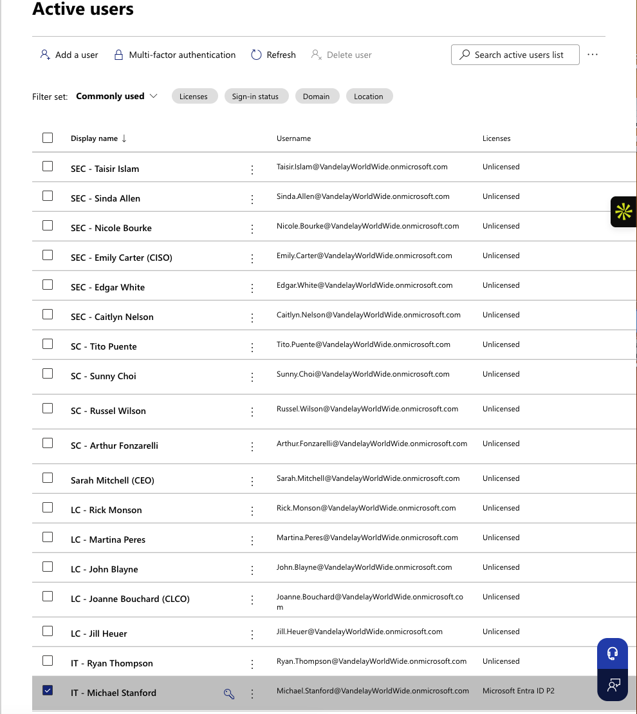
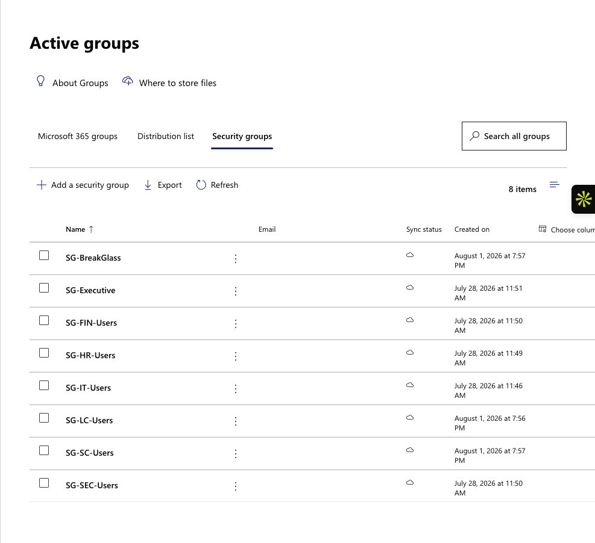
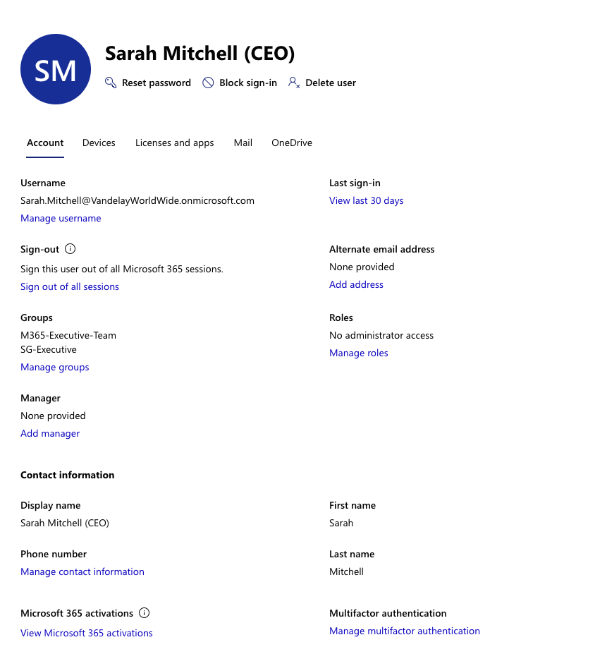
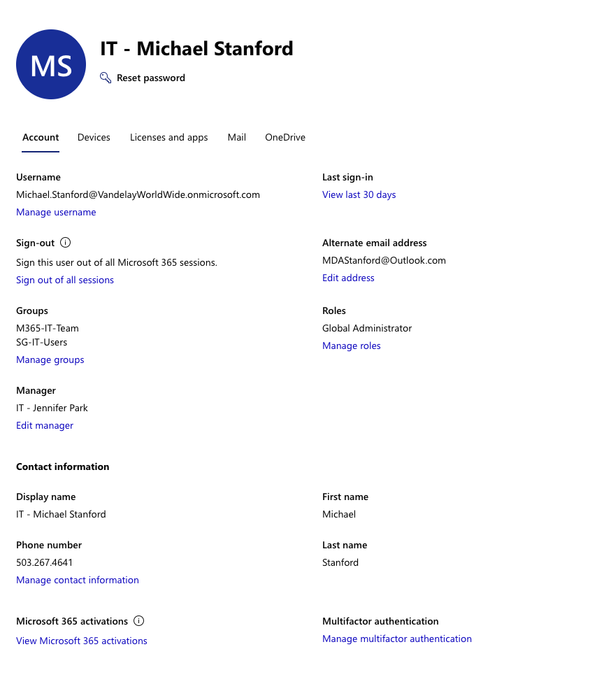
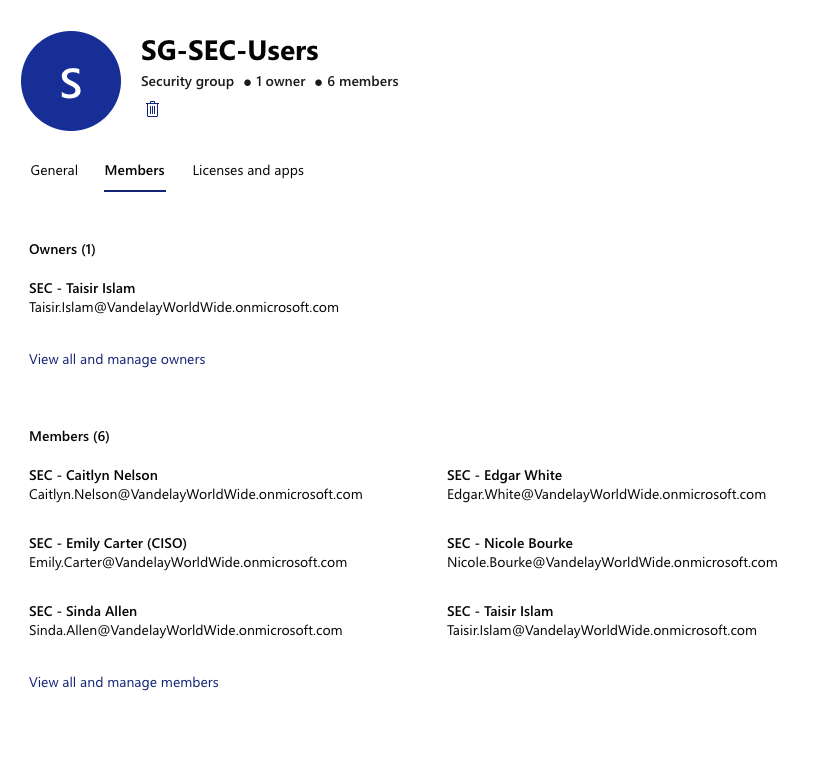

# Lab 01 — Building Vandelay Health's Identity Foundation

**Vandelay Health** is a fictional healthcare technology company headquartered in Santa Monica, California and the company behind the **Ninja Sleeper** — an ultra-light, compact and virtually noiseless CPAP system designed for travelers who need to sleep comfortably in flight without disturbing fellow passengers.

The technology behind the Ninja Sleeper began as a **federal government contract project**, developed to provide military personnel in the field with a quiet and highly portable sleep-apnea solution. Vandelay Health later adapted the technology for the commercial market, incorporating as much of the original proprietary intellectual property as possible into the consumer Ninja Sleeper platform.

---

## Business Scenario

As Vandelay Health expands the commercial business surrounding the Ninja Sleeper, the company needs a structured workforce identity environment capable of supporting employees across multiple departments while protecting access to sensitive company resources and proprietary product information.

Before more advanced IAM controls can be introduced, Vandelay must establish a reliable identity baseline: employees need accurate organizational identities, departments need appropriate security and collaboration groups, executives must receive business access without unnecessary administrative privilege, and IAM must maintain separate administrative and emergency-access identities.

This lab establishes that foundation in Microsoft Entra ID and creates the identity structure used by subsequent Vandelay Health IAM scenarios.

---

## IAM Requirements

To establish Vandelay Health's initial identity environment, IAM needed to:

- Establish a realistic workforce identity population.
- Organize employees according to their business functions and reporting relationships.
- Create departmental security groups for access management.
- Establish separate Microsoft 365 groups for collaboration.
- Maintain accurate identity attributes for future lifecycle and governance decisions.
- Ensure executive identities do not receive administrative privilege simply because of organizational seniority.
- Separate day-to-day administrative access from emergency tenant access.
- Establish a dedicated Break Glass identity for tenant recovery.
- Document and validate the baseline environment for future IAM controls.

- ---

## Implementation

### 1. Establish the Microsoft Entra ID Tenant

The Vandelay Health Microsoft Entra ID tenant was established as the company's cloud identity environment. The tenant provides the foundation for workforce identities, group-based access, Microsoft 365 collaboration, administrative roles, and the governance controls introduced in later labs.

The baseline environment contains **39 user identities and 15 groups**, with Microsoft Entra ID P2 licensing available for advanced identity governance and privileged-access capabilities.

---

### 2. Build the Workforce Identity Population

Vandelay employees were created as individual workforce identities representing executive leadership and functional teams across IT, Finance, Human Resources, Information Security, Legal/Compliance, and Supply Chain.

User profiles include organizational information that provides business context for each identity and supports later access, lifecycle, and governance decisions.

---

### 3. Establish Department-Based Access Groups

Departmental security groups were created to organize access according to business function rather than assigning permissions independently to individual employees.

The group structure includes dedicated security groups for Executive, Finance, Human Resources, IT, Legal/Compliance, Supply Chain, and Information Security.

---

### 4. Separate Collaboration from Security Access

Microsoft 365 groups were established separately from the departmental security-group structure.

This allows Vandelay to distinguish **collaboration membership** from **authorization-oriented security membership**, providing a clearer foundation for managing different types of access as the organization grows.

---

### 5. Separate Executive Access from Administrative Privilege

Vandelay Health's CEO, Sarah Mitchell, requires broad business access as the company's senior executive, but her position does not create a business need for administrative control of the identity environment.

Her identity is assigned to the appropriate Executive security and Microsoft 365 groups without receiving an administrative role. This establishes a basic least-privilege principle: **organizational authority does not automatically justify technical privilege**.

---

### 6. Establish a Dedicated IAM Administrative Identity

Administrative responsibilities are performed through a separate IAM administrative identity rather than through an executive or ordinary workforce account.

The IAM administrative identity holds the Global Administrator role and provides the privileged access required to configure and manage the Vandelay Health Microsoft Entra environment.

---

### 7. Establish Emergency Administrative Access

A dedicated `BREAK GLASS` identity was created to provide emergency Global Administrator access if normal administrative access becomes unavailable.

The account is separated from routine workforce and administrative identities and placed in the dedicated `SG-BreakGlass` security group. Its purpose is tenant recovery rather than normal administration.

---

### 8. Validate Departmental Group Membership

The Information Security security group was reviewed to confirm that departmental access was structured correctly, including group ownership and membership.

`SG-SEC-Users` contains the designated Information Security identities and demonstrates how Vandelay can manage department-based access through groups rather than maintaining individual access assignments.

---

## Validation

The completed environment was reviewed to confirm that:

- Workforce identities were present and associated with appropriate organizational information.
- Departmental security groups reflected Vandelay's functional structure.
- Microsoft 365 collaboration groups were maintained separately from security groups.
- Executive identities received appropriate business access without unnecessary administrative privilege.
- Administrative privilege was assigned to the dedicated IAM administrative identity.
- Emergency Global Administrator access was maintained through the separate Break Glass identity.
- Group ownership and membership could be verified in Microsoft Entra ID.

The resulting tenant provides a documented identity and access baseline for the more advanced lifecycle, authentication, governance, and privileged-access controls introduced in later Vandelay Health labs.

---

## IAM Controls Demonstrated

- **Identity administration** — establish and maintain a defined workforce identity population.
- **Identity attributes** — associate identities with organizational and business context.
- **Group-based access** — manage access through security groups rather than relying on individual assignments.
- **Collaboration separation** — distinguish Microsoft 365 collaboration membership from security-oriented access.
- **Least privilege** — grant technical privilege according to job requirements rather than organizational seniority.
- **Privileged account separation** — distinguish ordinary workforce identities from administrative identities.
- **Emergency access** — maintain a dedicated Break Glass identity for tenant recovery.
- **Access validation** — verify identity, group, ownership, and privilege assignments after implementation.

---

## Key Takeaway

Before Vandelay Health can automate employee lifecycle events, govern access to Ninja Sleeper intellectual property, protect privileged roles, or control external access, IAM needs a reliable identity foundation.

This lab establishes that foundation by defining **who the users are, where they belong, how access is organized, and which identities are authorized to administer the environment**.

