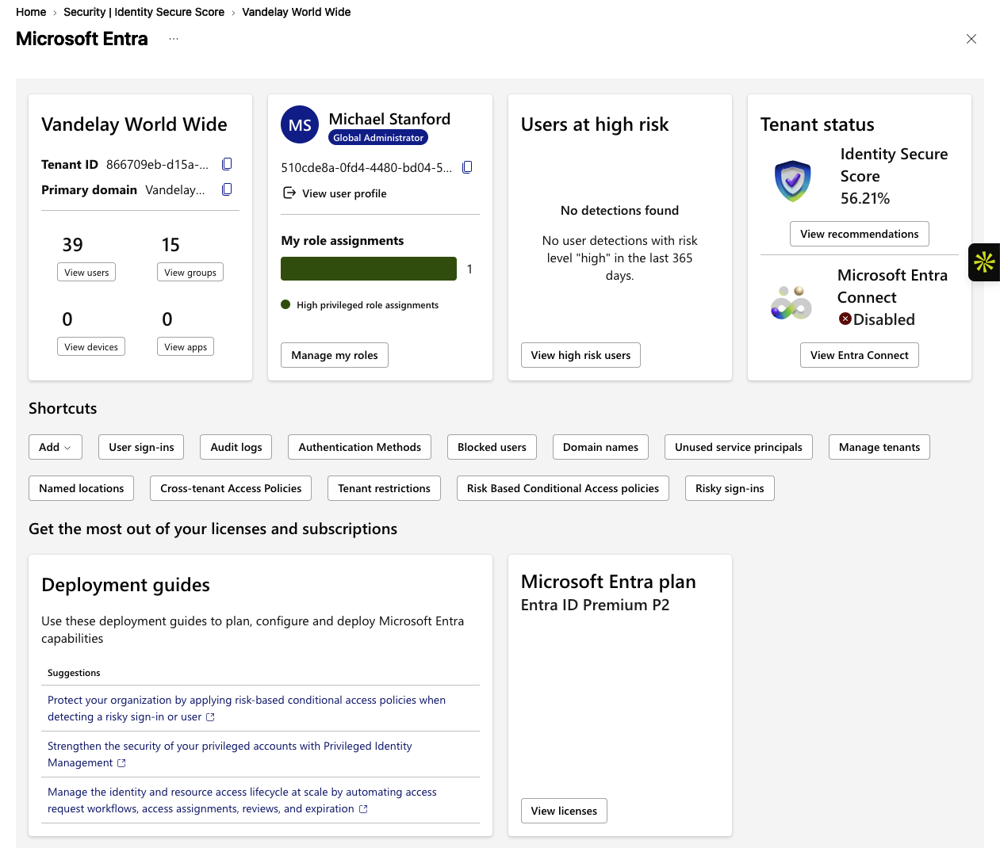
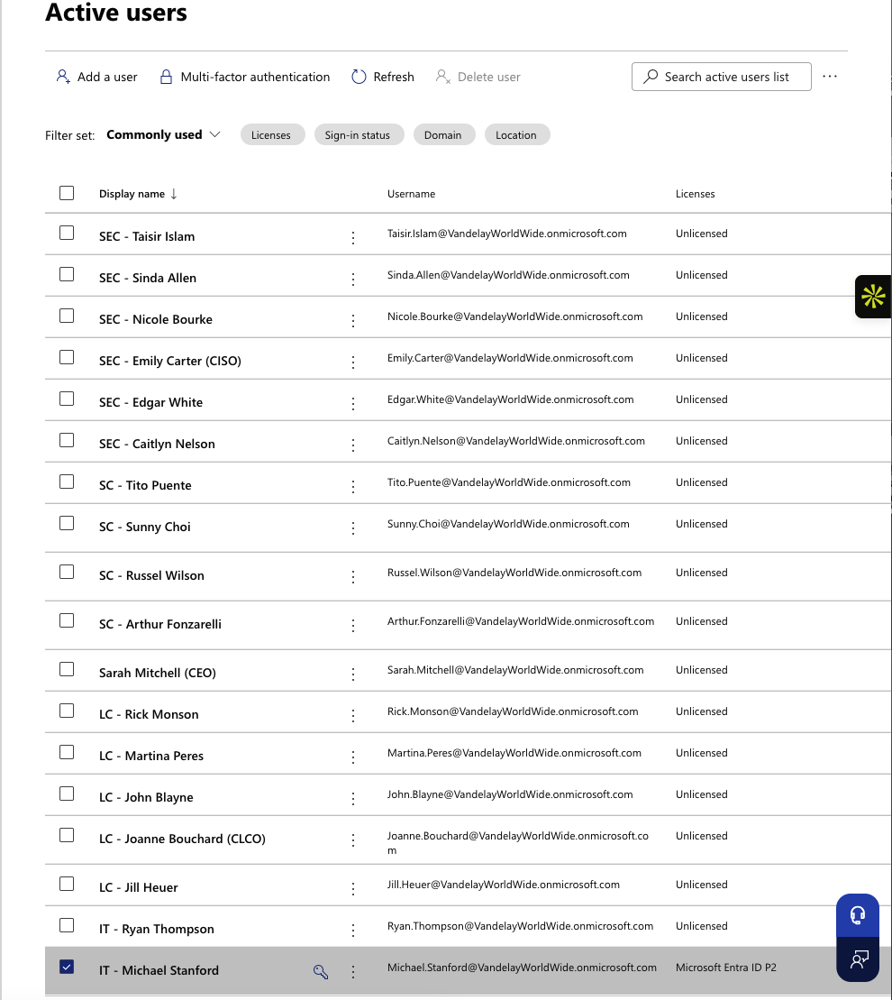
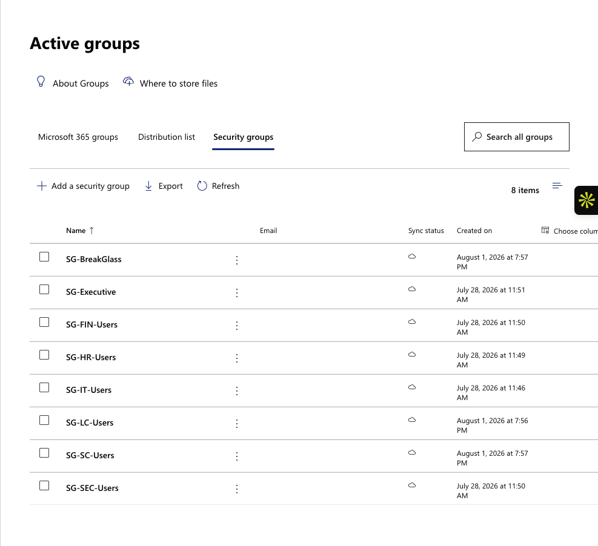
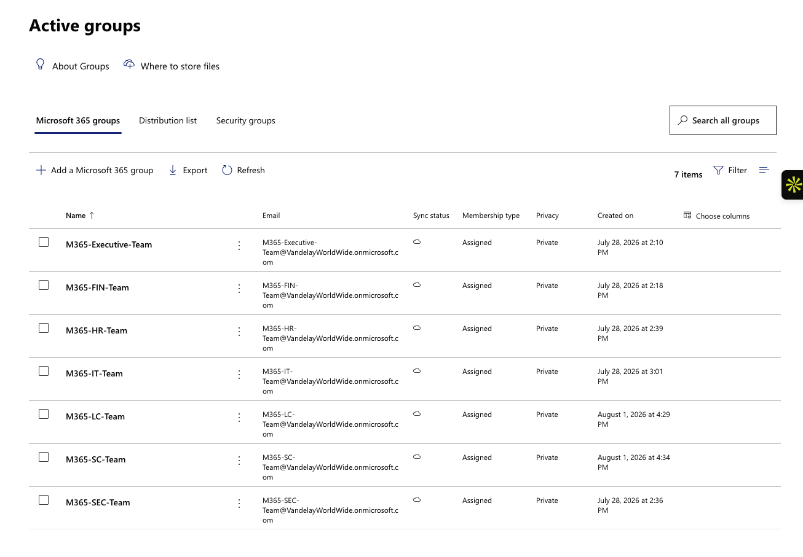
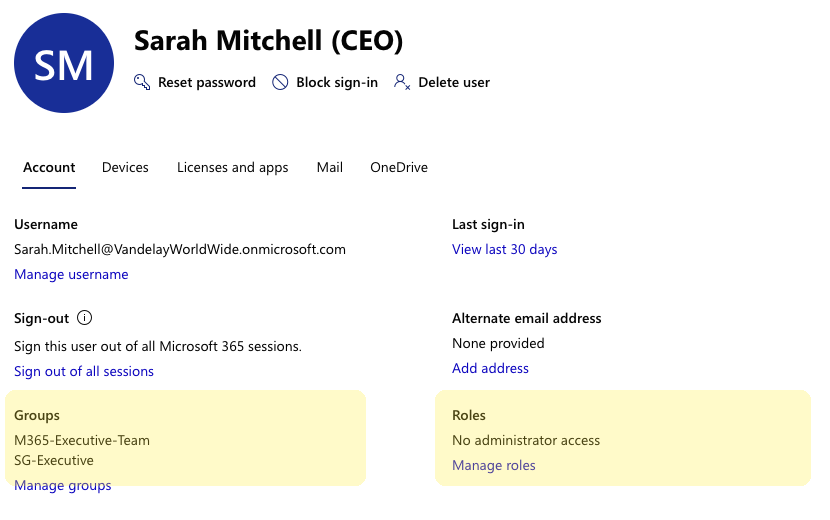
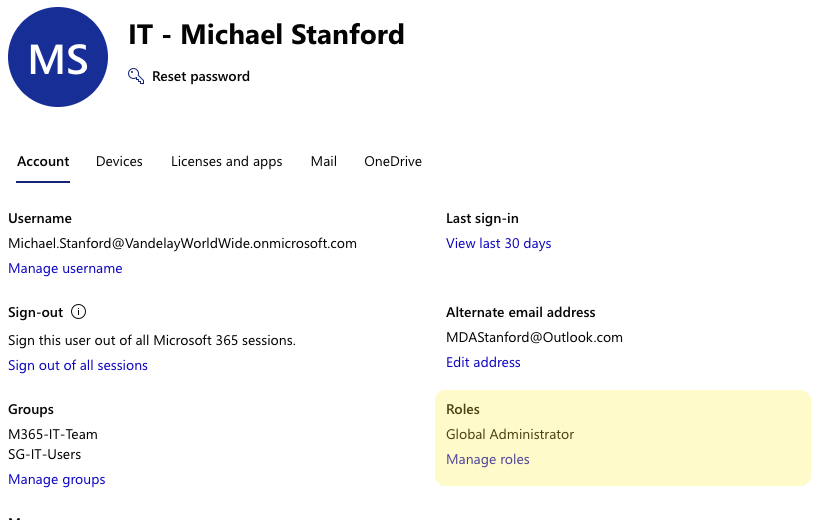
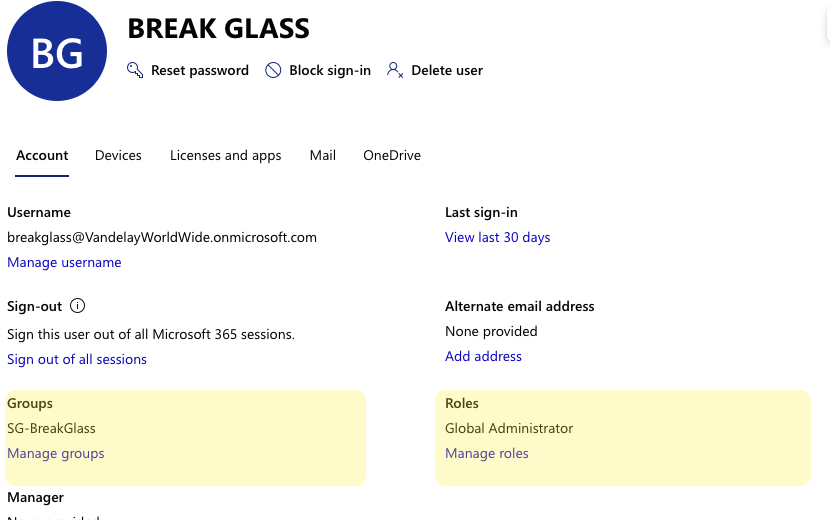
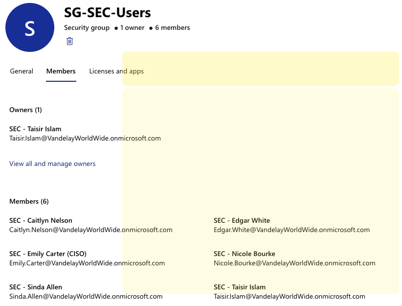

# Lab 01 — Building Vandelay Health's Identity Foundation

**Vandelay Health** is a fictional healthcare technology company headquartered in Santa Monica, California and the company behind the **Ninja Sleeper** — an ultra-light, compact and virtually noiseless CPAP system designed for travelers who need to sleep comfortably in flight without disturbing fellow passengers.

The technology behind the Ninja Sleeper began as a **federal government contract project**, developed to provide military personnel in the field with a quiet and highly portable sleep-apnea solution. Vandelay Health later adapted the technology for the commercial market, incorporating as much of the original proprietary intellectual property as possible into the consumer Ninja Sleeper platform.

---

## Business Scenario

As Vandelay Health expands the commercial business surrounding the Ninja Sleeper, the company needs to establish its workforce identity environment in Microsoft Entra ID.

The first step is creating and organizing employee identities. Users need accurate account information, departments need appropriate security and Microsoft 365 groups, executives need business access without unnecessary administrative privileges, and IAM administrators need separate accounts for administrative and emergency access.

This lab establishes the **identity foundation** that later Vandelay Health IAM scenarios will build upon.

---

## My IAM Requirements

Before I can start implementing more advanced IAM controls, I need to establish the basic Vandelay Health identity environment in Microsoft Entra ID. My initial requirements are to:

- Create the Vandelay Health workforce identities and make sure each user has accurate organizational information.
- Organize employees by department and business function.
- Create security groups that I can use to manage access by department rather than user by user.
- Create separate Microsoft 365 groups for collaboration.
- Maintain identity attributes that I can use later for lifecycle management, dynamic groups, and access governance.
- Keep executive business access separate from administrative privilege.
- Use a dedicated administrative account for privileged IAM work rather than my normal user account.
- Create a separate Break Glass account for emergency tenant access.
- Validate the environment so I know the identity foundation is working before I build additional controls on top of it.

----

## Implementation

### 1. Set Up the Microsoft Entra ID Tenant

I started by setting up Microsoft Entra ID as Vandelay Health's cloud identity environment. This is where I'll manage our users, groups, administrative roles, and the identity controls we'll introduce as the environment grows.

I'm starting with **39 user identities and 15 groups**. The tenant has Microsoft Entra ID P2 licensing, which gives me access to the identity governance and privileged-access features I'll use in later labs.

---

### 2. Build the Workforce Identity Population

I created Entra identities for Vandelay Health employees across our major business teams, including IT, Finance, Human Resources, Information Security, Legal/Compliance, and Supply Chain.

For each employee, I added organizational information such as their department, job title, location, and manager. These details aren't just descriptive—they'll help me make decisions about **who should have access to what**, automate identity changes, and review access as the environment grows.

---

### 3. Organize Access with Security Groups

Rather than managing access one employee at a time, I created security groups based on Vandelay Health's departments. This gives me a simpler way to manage access: when someone joins, changes roles, or leaves, I can update their group membership instead of managing every permission individually.

I created security groups for **Executive, Finance, Human Resources, IT, Legal/Compliance, Supply Chain, and Information Security**.

---

### 4. Separate Collaboration from Security Access

I kept Microsoft 365 groups separate from my security groups because they serve different purposes. I use the security groups to manage access, while the Microsoft 365 groups give employees access to collaboration resources for their teams.

Keeping the two separate makes it easier for me to understand **why someone belongs to a group** and prevents collaboration membership from becoming mixed up with security access.

---

### 5. Keep Executive Access Separate from Admin Access

Sarah Mitchell is Vandelay Health's CEO, so she needs broad access to company resources—but being CEO doesn't mean she needs administrative control over our identity environment.

I added Sarah to the appropriate **Executive security and Microsoft 365 groups**, but I did not assign her an Entra administrative role. This is a straightforward example of **least privilege: give someone the access they need to do their job, but no more than they need.**

---

### 6. Use a Separate Account for IAM Administration

For my day-to-day work, I use my regular Vandelay Health account. When I need to perform administrative work in Entra, I use a **separate IAM administrator account** instead.

I assigned the administrative account the **Global Administrator** role so I could configure and manage the Vandelay Health Entra environment. Keeping my normal account separate from my privileged account reduces the amount of time I'm operating with elevated permissions and helps protect administrative access.

---

### 7. Create an Emergency Access Account

I created a separate **Break Glass account** for situations where my normal administrative access isn't available. This account gives me an emergency way to regain administrative control of the Vandelay Health tenant.

I assigned the account the **Global Administrator** role and placed it in the dedicated `SG-BreakGlass` security group. I don't use this account for normal administrative work—it's there specifically for emergency access and tenant recovery.

---

### 8. Check My Security Group Membership

After creating the departmental groups, I checked `SG-SEC-Users` to make sure the Information Security team was set up correctly. I reviewed both the **group owner and its members** rather than assuming the group was correct just because I had created it.

This gives me a simple validation step: **the right people are in the group, the group has an owner, and I know who is responsible for it.**

---

## Validation

Before moving on, I reviewed the environment to make sure the identity foundation I built was working the way I intended.

I confirmed that:

- Employees had the correct identity and organizational information.
- Security groups matched Vandelay Health's departments.
- Microsoft 365 collaboration groups were separate from security groups.
- Sarah Mitchell had the business access she needed without an administrative role.
- My IAM administrator account had the required administrative access.
- The Break Glass account was available for emergency administrative access.
- Security groups had the expected owners and members.

With those checks complete, I had a working identity foundation that I could build on in later labs with **Conditional Access, SSO, access reviews, PIM, lifecycle management, and identity governance**.

---

## IAM Controls Demonstrated

- **Identity administration** — establish and maintain a defined workforce identity population.
- **Identity attributes** — associate identities with organizational and business context.
- **Group-based access** — manage access through security groups rather than relying on individual assignments.
- **Collaboration separation** — distinguish Microsoft 365 collaboration membership from security-oriented access.
- **Least privilege** — grant technical privilege according to job requirements rather than organizational seniority.
- **Privileged account separation** — distinguish ordinary workforce identities from administrative identities.
- **Emergency access** — maintain a dedicated Break Glass identity for tenant recovery.
- **Access validation** — verify identity, group, ownership, and privilege assignments after implementation.

---

## Key Takeaway

Before Vandelay Health can automate employee lifecycle events, govern access to Ninja Sleeper intellectual property, protect privileged roles, or control external access, IAM needs a reliable identity foundation.

This lab establishes that foundation by defining **who the users are, where they belong, how access is organized, and which identities are authorized to administer the environment**.

