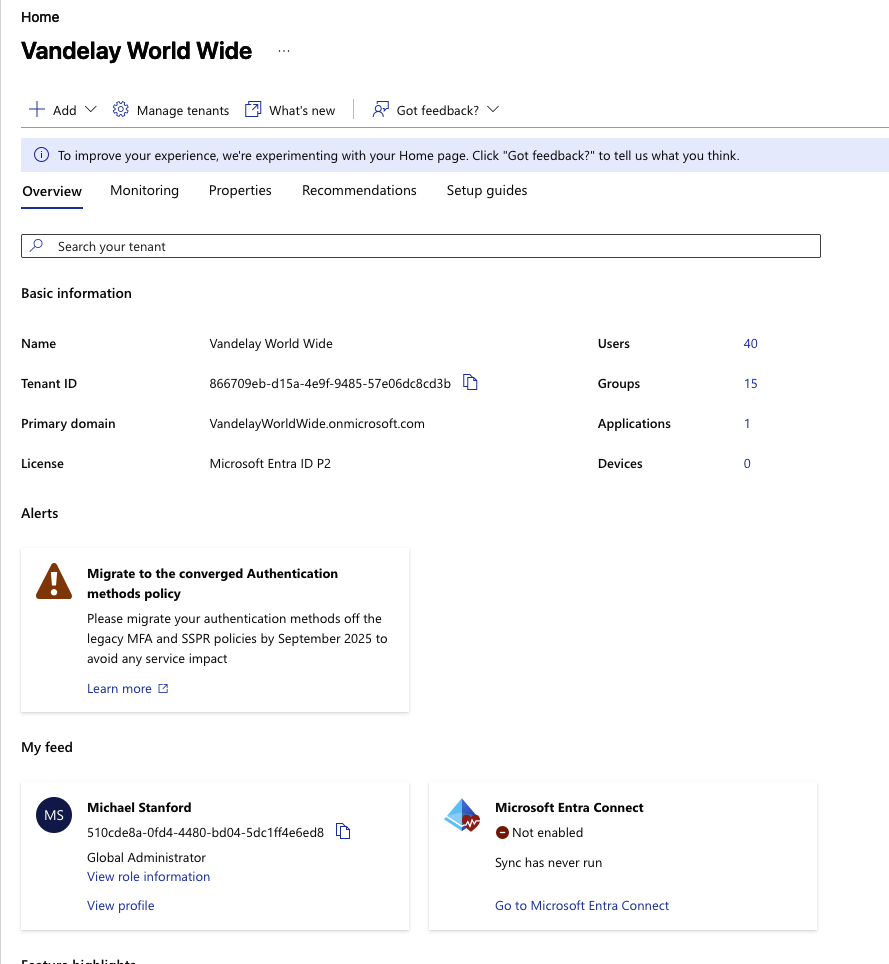
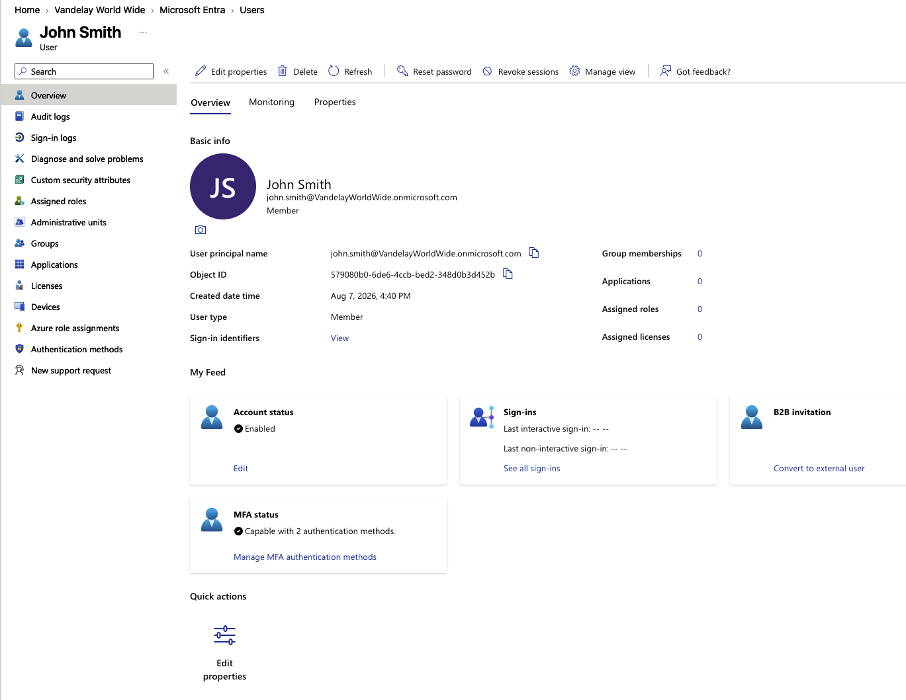
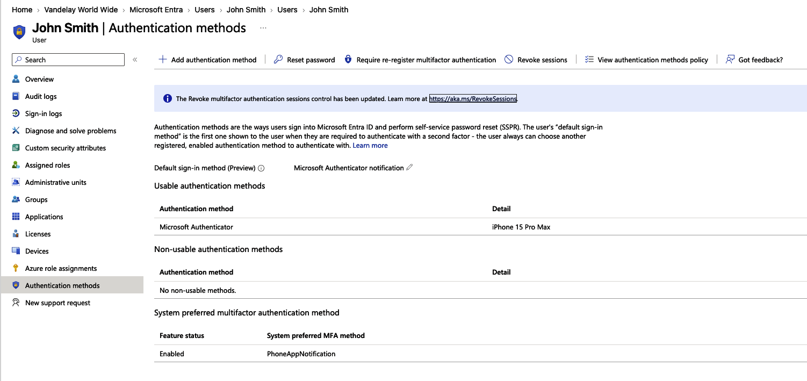
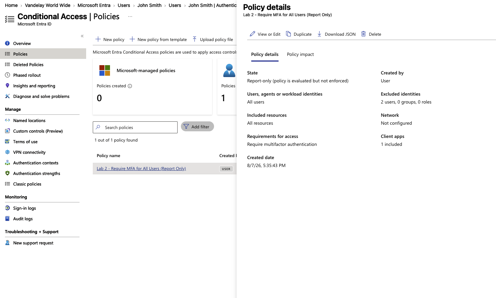
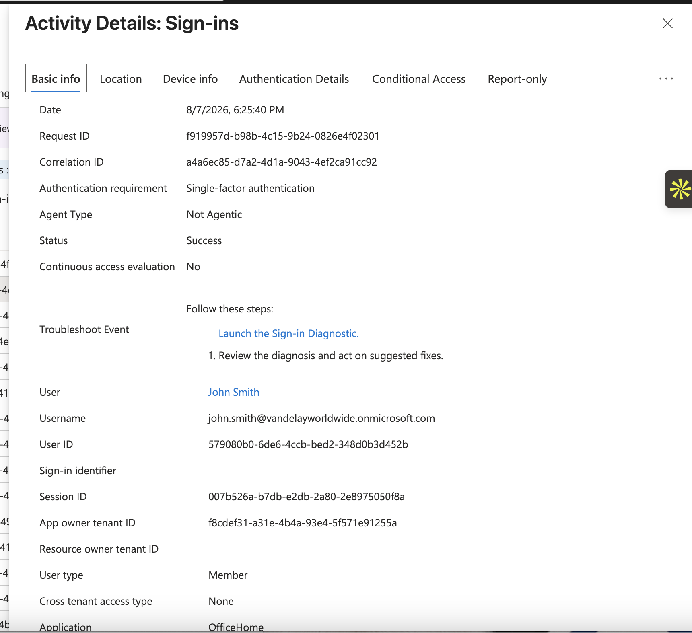

# Lab 2 – Microsoft Entra Conditional Access & Multifactor Authentication

## Overview

This lab demonstrates how to secure Microsoft Entra ID by implementing a Conditional Access policy that requires multifactor authentication (MFA) for all users. A break-glass emergency administrator account was excluded from the policy to prevent administrative lockout. The policy was deployed in Report-only mode to validate its impact before enforcement. MFA registration was completed for a test user, and a successful sign-in was verified through Microsoft Entra sign-in logs.

## Business Scenario

Vandelay World Wide is implementing Microsoft Entra ID security controls to strengthen identity protection for its workforce. The objective of this lab was to deploy Conditional Access using Microsoft best practices by requiring multifactor authentication (MFA) for user sign-ins while excluding a dedicated Break Glass emergency administrator account. The policy was initially configured in Report-only mode to validate its impact before enforcement.

## Objectives

- Configure a Conditional Access policy that requires multifactor authentication (MFA).
- Apply the policy to all users while excluding a dedicated Break Glass administrator account and designated administrative account from policy scope.
- Deploy the policy in Report-only mode to validate policy impact before enforcement.
- Verify user MFA registration.
- Review Microsoft Entra sign-in logs to confirm successful authentication.

## Environment

- Microsoft Entra ID Premium P2
- Microsoft 365 Developer Tenant
- Conditional Access
- Microsoft Authenticator
- Microsoft Entra Sign-in Logs
- Report-only Mode

## Implementation

### 1. Tenant Overview

The lab environment was configured in a Microsoft Entra ID Premium P2 tenant.

### 2. Test User

A test user, John Smith, was used to validate authentication and Conditional Access behavior.

### 3. MFA Authentication Methods

Microsoft Authenticator was configured as an authentication method for the test user.

### 4. Conditional Access Policy

A Conditional Access policy was configured to require multifactor authentication for users while excluding emergency and designated administrative accounts. The policy was deployed in Report-only mode to evaluate its impact before enforcement.

### 5. Sign-in Verification

Microsoft Entra sign-in logs were reviewed to verify a successful authentication event for the test user.

## Skills Demonstrated

- Microsoft Entra ID administration
- Conditional Access policy creation
- Multifactor Authentication (MFA)
- Identity security best practices
- Break Glass account management
- Report-only policy deployment
- Microsoft Authenticator registration
- Microsoft Entra sign-in log analysis
- Security documentation
