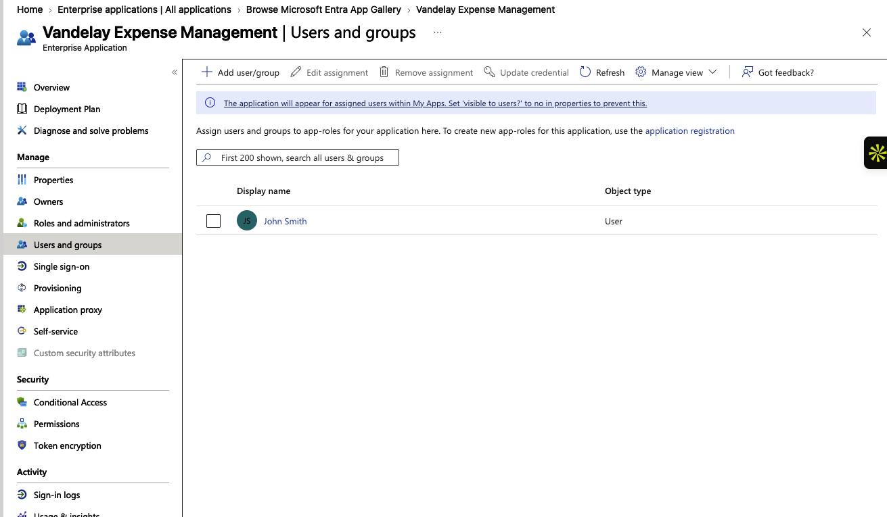
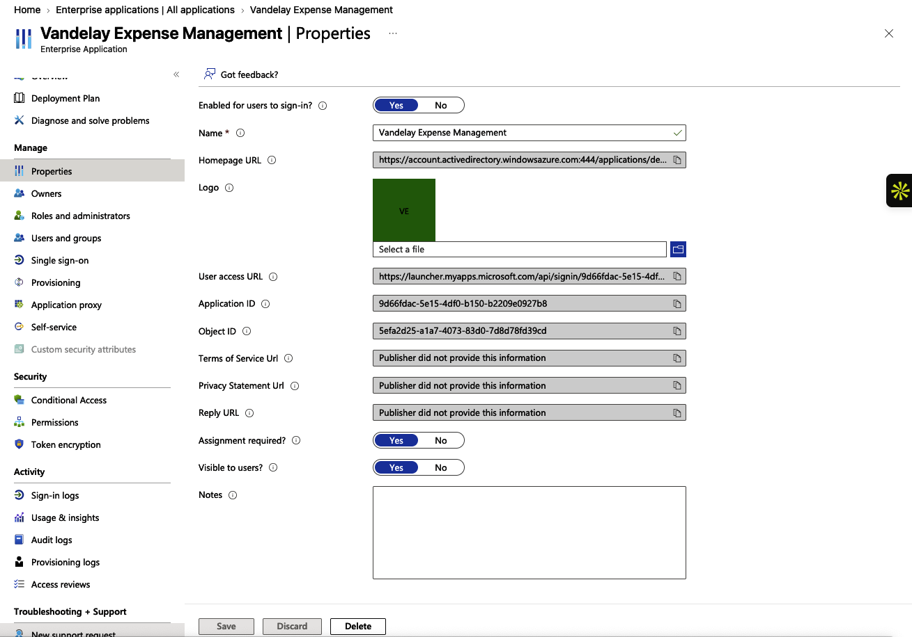
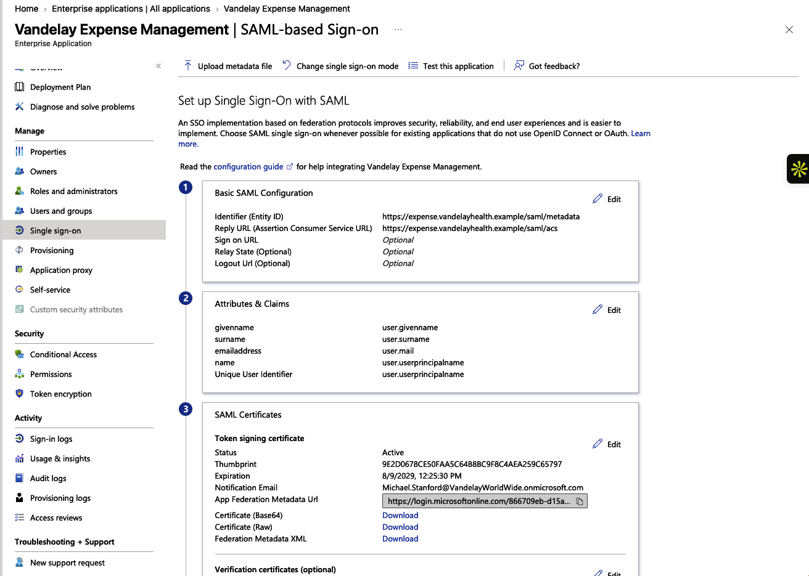
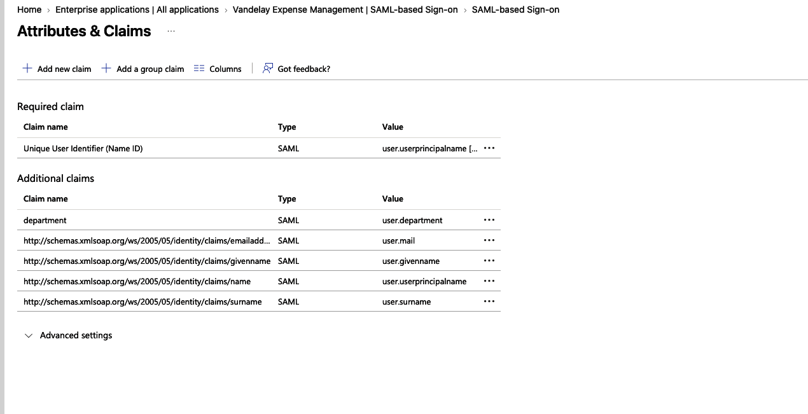
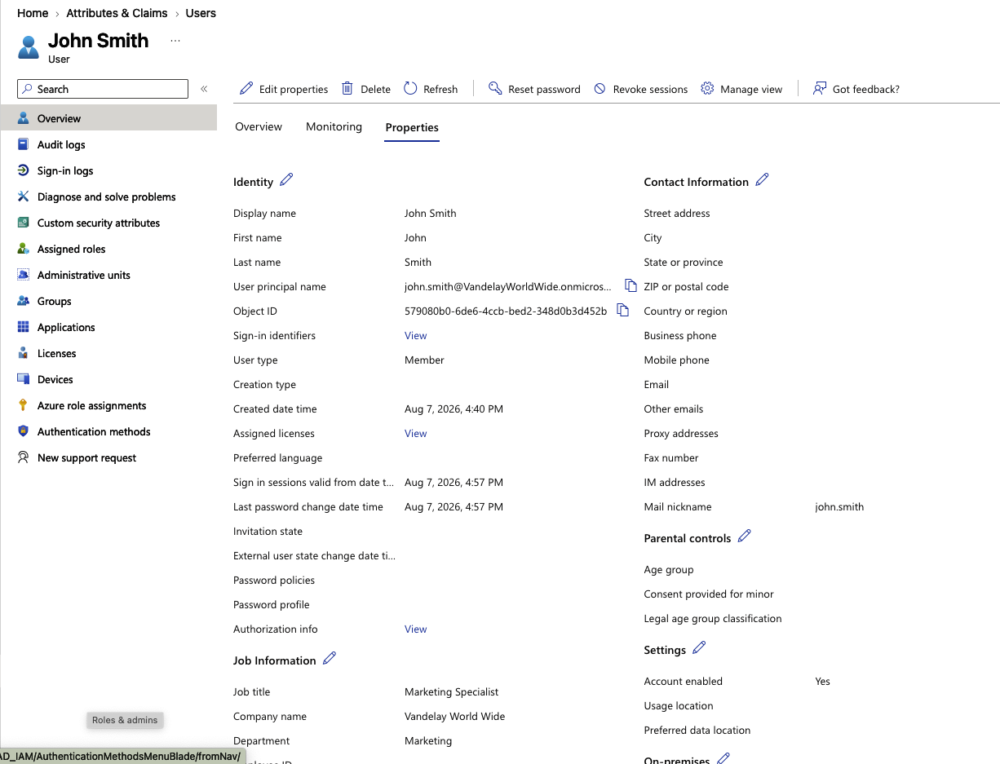
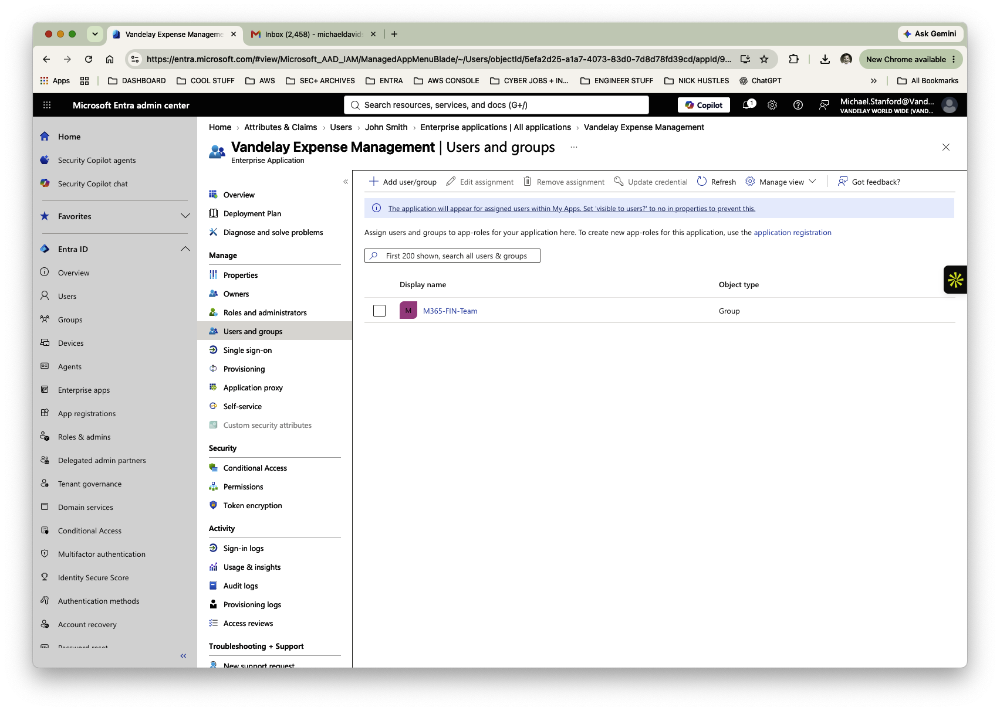
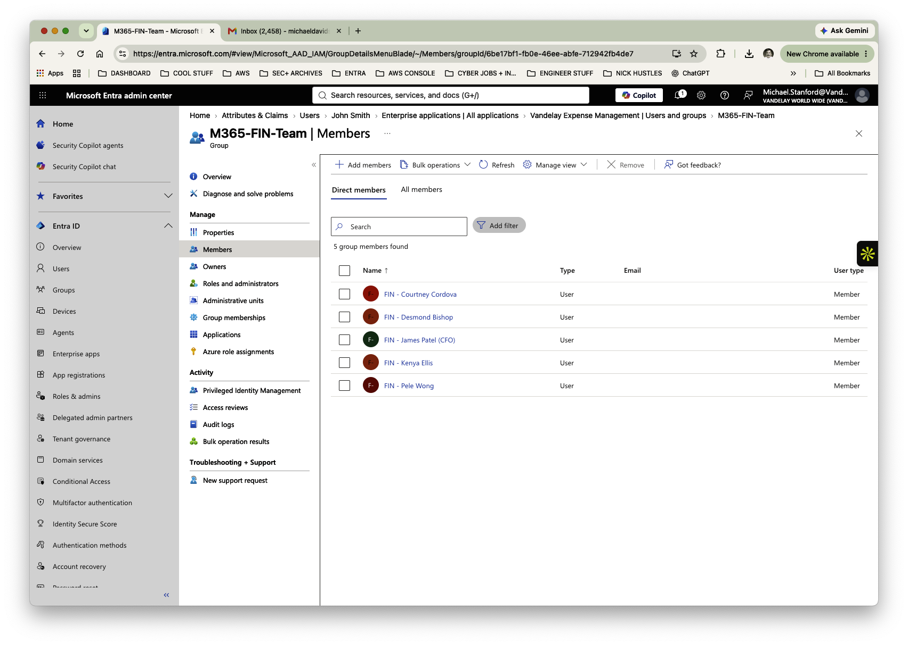

# Lab 03 — Securing Access to Vandelay's Expense Management Application

**Vandelay Health** is a fictional healthcare technology company headquartered in Santa Monica, California and the company behind the **Ninja Sleeper** — an ultra-light, compact and virtually noiseless CPAP system designed for travelers who need to sleep comfortably in flight without disturbing fellow passengers.

The technology behind the Ninja Sleeper began as a **federal government contract project**, developed to provide military personnel in the field with a quiet and highly portable sleep-apnea solution. Vandelay Health later adapted the technology for the commercial market, incorporating as much of the original proprietary intellectual property as possible into the consumer Ninja Sleeper platform.

---

## Business Scenario

Vandelay Health uses **Vandelay Expense Management**, a fictional enterprise application used by employees to manage business expenses.

Rather than maintaining separate application credentials and manually granting access inside the expense system, Vandelay wants Microsoft Entra ID to serve as the centralized identity provider. Employees should authenticate using their existing Vandelay identities, and only users with an approved business need should be able to access the application.

Finance employees represent the primary user population. IAM therefore needs an access model that can scale beyond assigning the application to individual employees one at a time.

---

## IAM Requirements

To provide secure and manageable access to Vandelay Expense Management, IAM needed to:

- Integrate the application with Microsoft Entra ID.
- Require explicit assignment before an identity can access the application.
- Configure SAML-based Single Sign-On (SSO).
- Provide required identity information to the application through SAML claims.
- Map the user's department attribute from Microsoft Entra ID into a SAML claim.
- Validate the relationship between directory attributes and application claims.
- Demonstrate direct user assignment.
- Transition application access to group-based assignment for more scalable administration.
- Validate that Finance group membership supports the intended application-access model.

---

## Implementation

### 1. Integrate Vandelay Expense Management with Microsoft Entra ID

The **Vandelay Expense Management** enterprise application was configured in Microsoft Entra ID, establishing Entra as the centralized identity platform used to manage authentication and application access.

A test user was initially assigned directly to the application to establish and validate the basic access model.

---

### 2. Require Explicit Application Assignment

The application's **Assignment required?** setting was configured as **Yes**.

This prevents unassigned tenant identities from accessing the application simply because they possess a Vandelay account. Access must instead be explicitly granted through an approved user or group assignment.

---

### 3. Configure SAML Single Sign-On

Vandelay Expense Management was configured to use **SAML-based Single Sign-On**.

The SAML configuration included the application's:

- Identifier (Entity ID)
- Reply URL / Assertion Consumer Service (ACS) URL
- Token signing certificate

In this relationship, Microsoft Entra ID acts as the **Identity Provider (IdP)** and provides authentication information to the application through a SAML assertion.

---

### 4. Configure Identity Claims

The SAML configuration was set to provide identity information required by the application.

Standard claims included:

- User Principal Name
- Email address
- Given name
- Surname

A custom **department** claim was also mapped to:

`user.department`

This demonstrates how identity information maintained centrally in Microsoft Entra ID can be supplied to an integrated application during authentication.

---

### 5. Validate the Source Identity Attribute

The test user's Microsoft Entra profile was reviewed to confirm that the **Department** attribute contained a valid value.

Because the SAML department claim references `user.department`, the value maintained in the identity record can be supplied to Vandelay Expense Management as part of the SAML assertion.

This establishes the relationship between **directory identity data and application claims**.

---

### 6. Implement Group-Based Application Access

After demonstrating direct user assignment, application access was assigned to the **M365-FIN-Team** group.

This moves Vandelay toward a more scalable access model: IAM can manage the appropriate Finance population through group membership rather than repeatedly assigning and removing individual users at the application level.

---

### 7. Validate the Access Model

Membership of the Finance group was reviewed to confirm the identities included in the group used for application assignment.

The resulting access path is:

**User Identity → Finance Group Membership → Enterprise Application Assignment**

This creates a centralized and repeatable method of administering access to Vandelay Expense Management.

---

## Validation

The completed configuration was reviewed to confirm that:

- Vandelay Expense Management was represented as an enterprise application in Microsoft Entra ID.
- Explicit assignment was required for application access.
- SAML-based SSO was configured with Microsoft Entra ID acting as the Identity Provider.
- Required identity attributes and claims were configured.
- The custom department claim referenced the user's Microsoft Entra `department` attribute.
- Direct user assignment was demonstrated.
- Group-based application assignment was established for the Finance population.
- Finance group membership could be reviewed to validate the resulting access path.

---

## IAM Controls Demonstrated

- **Federated authentication** — use Microsoft Entra ID as the centralized Identity Provider for an enterprise application.
- **SAML 2.0 Single Sign-On** — provide application authentication through standards-based federation.
- **Explicit assignment** — restrict application access to authorized identities rather than the entire tenant.
- **Identity claims** — provide application-relevant identity information through SAML assertions.
- **Attribute mapping** — connect centrally maintained directory attributes to application identity data.
- **Group-based access** — manage application authorization through group membership.
- **Least privilege** — provide application access only to identities with an approved business need.
- **Access validation** — verify the relationship between identity, group membership, and application assignment.

---

## Key Takeaway

Authentication to an application and authorization to use that application are related but distinct IAM responsibilities.

This lab demonstrates how Vandelay Health can use **Microsoft Entra ID and SAML SSO to centralize authentication while using explicit and group-based assignments to control who is authorized to access an enterprise application**.
