# Lab 05 — Managing Employee Moves and New-Hire Access

**Vandelay Health** is a fictional healthcare technology company headquartered in Santa Monica, California and the company behind the **Ninja Sleeper** — an ultra-light, compact and virtually noiseless CPAP system designed for travelers who need to sleep comfortably in flight without disturbing fellow passengers.

The technology behind the Ninja Sleeper began as a **federal government contract project**, developed to provide military personnel in the field with a quiet and highly portable sleep-apnea solution. Vandelay Health later adapted the technology for the commercial market, incorporating as much of the original proprietary intellectual property as possible into the consumer Ninja Sleeper platform.

---

## Business Scenario

Vandelay Health is undergoing two organizational changes at the same time.

At Santa Monica headquarters, the Travel function is being separated from Human Resources and established as an independent department. Tuba Aksoy is promoted from Travel Coordinator to Director - Travel, while Suzi Tarkanian remains a Travel Coordinator and begins reporting to Tuba.

Because both employees already work for Vandelay, IAM should not create new identities. Their existing identities must instead follow them through the organizational change, with job information, reporting relationships, and access updated to reflect their new responsibilities.

At the same time, Vandelay is opening a new **Innovation Center in Toronto, Ontario**, requiring six new employees to be onboarded into the company's Microsoft Entra environment.

IAM must support both changes while maintaining accurate identity data, appropriate access, clear business ownership, and least privilege.

---

## IAM Requirements

To support the organizational changes, IAM needed to:

- Preserve existing identities during employee moves rather than creating replacement accounts.
- Update job titles, departments, office locations, and manager relationships to reflect current business roles.
- Reassess access when employees move between organizational functions.
- Establish dedicated security and collaboration groups for the new Travel department.
- Provision six new workforce identities for the Toronto Innovation Center.
- Maintain consistent organizational and geographic attributes for the Toronto workforce.
- Establish appropriate manager relationships for new employees.
- Create baseline security and Microsoft 365 collaboration groups for the Innovation Center.
- Assign business ownership of access groups to appropriate stakeholders.
- Provision baseline access according to employee role and location.
- Validate identity attributes and group memberships after provisioning.

---

## Implementation

### 1. Process Tuba Aksoy's Mover Event

Before the organizational change, Tuba Aksoy was a Travel Coordinator within Human Resources and reported to the CHRO.

Following the creation of the independent Travel department, her existing identity was updated to reflect her promotion and new organizational position:

- **Job title:** `Director - Travel`
- **Department:** `Travel`
- **Office location:** `Santa Monica`
- **Manager:** `Rebecca Lewis (CHRO)`

The existing account was retained. IAM changed the identity information associated with Tuba's new role rather than creating a new identity.

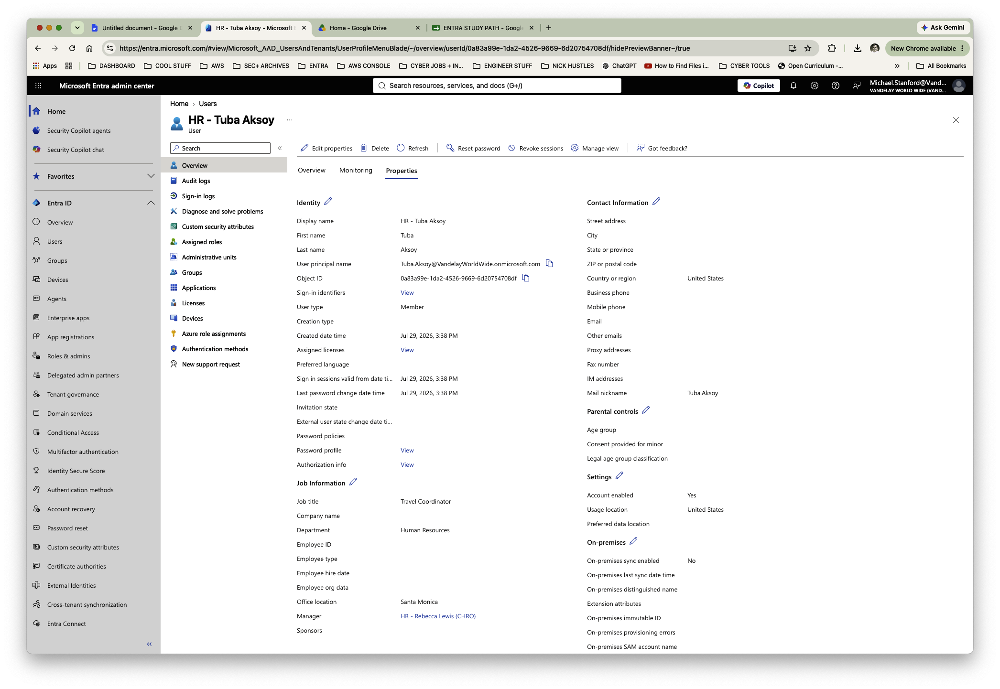

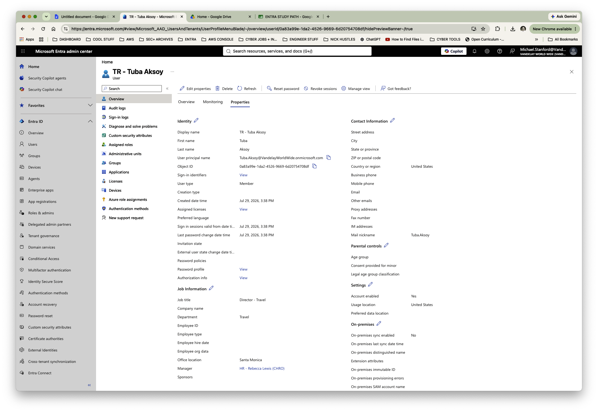

---

### 2. Process Suzi Tarkanian's Mover Event

Suzi Tarkanian also moved from Human Resources into the newly independent Travel department.

Her role remained Travel Coordinator, but her department and reporting relationship changed:

- **Job title:** `Travel Coordinator`
- **Department:** `Travel`
- **Office location:** `Santa Monica`
- **Manager:** `Tuba Aksoy`

This demonstrates an important lifecycle principle: an employee does not need to change jobs completely for IAM-relevant identity information and access requirements to change.

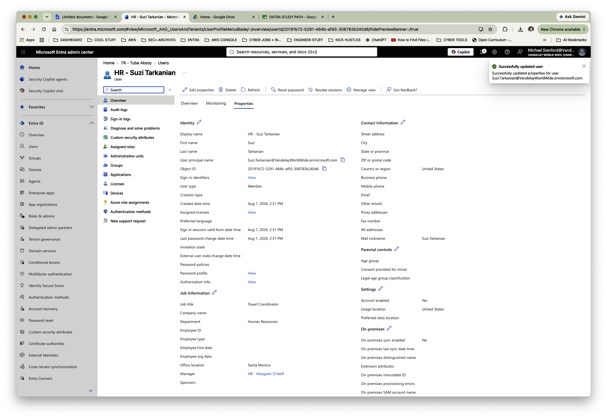

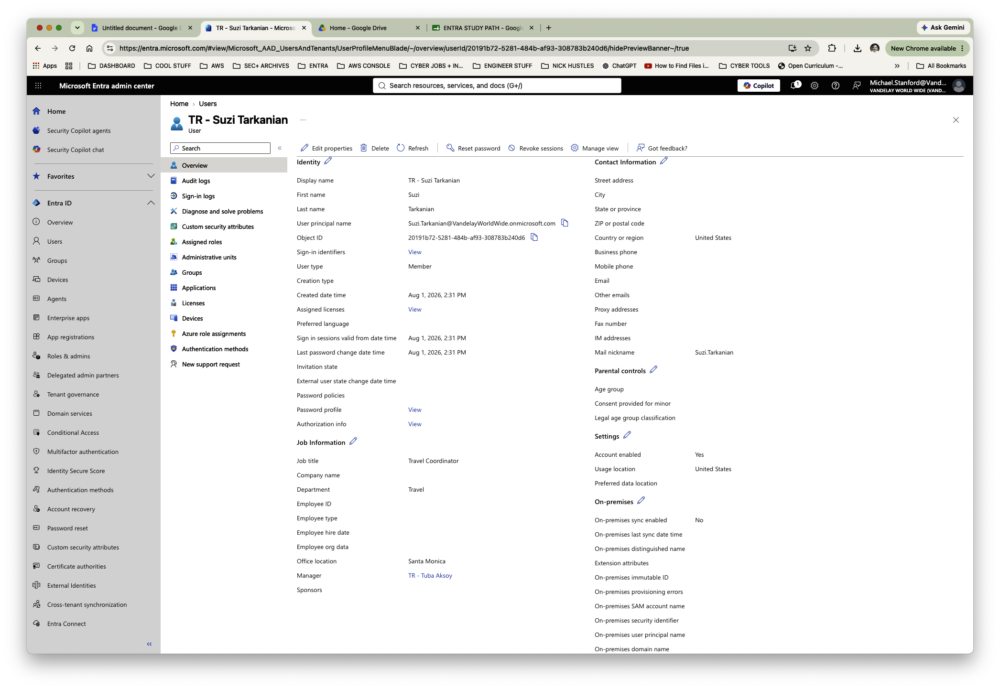

---

### 3. Establish the Travel Access Structure

The new department required its own access and collaboration structure rather than continuing to rely on Human Resources groups.

IAM created:

- `SG-TR-Users` — security and access assignments
- `M365-TR-Team` — Microsoft 365 collaboration

This separates Travel from its former HR access structure and provides reusable groups for future Travel employees.

**Business change → identity update → reporting change → access reassessment → new departmental access**

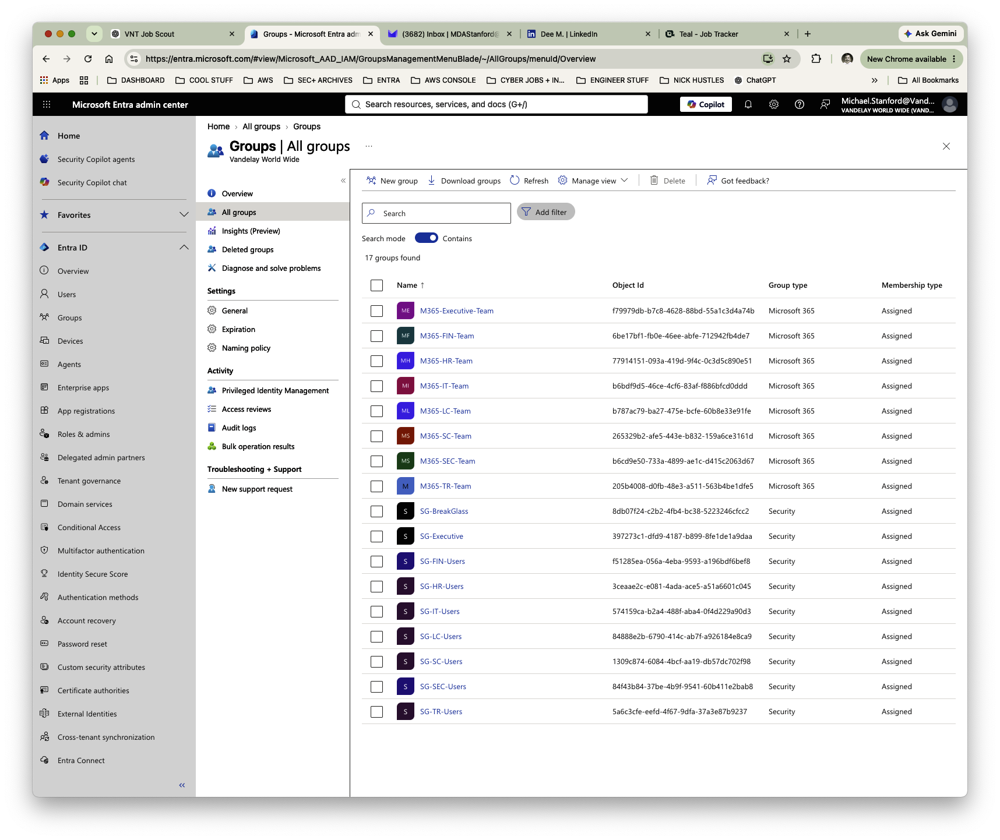

---

### 4. Onboard the Toronto Innovation Center

Vandelay Health simultaneously opened a new Innovation Center in Toronto, Ontario.

Six new workforce identities were created for the location. Each identity was established with business and organizational information including job title, department, office location, geographic information, manager relationship, and account status.

A local leadership structure was also established so the identities reflected how the new organization actually operates rather than existing as disconnected user accounts.

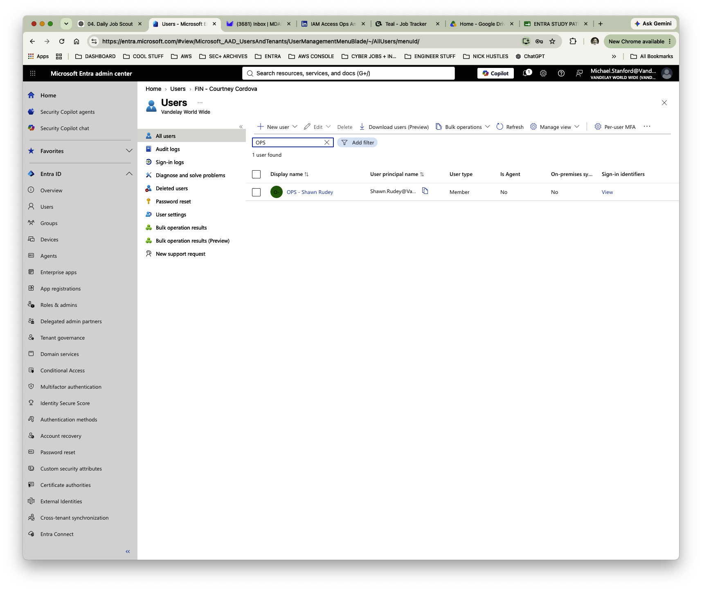

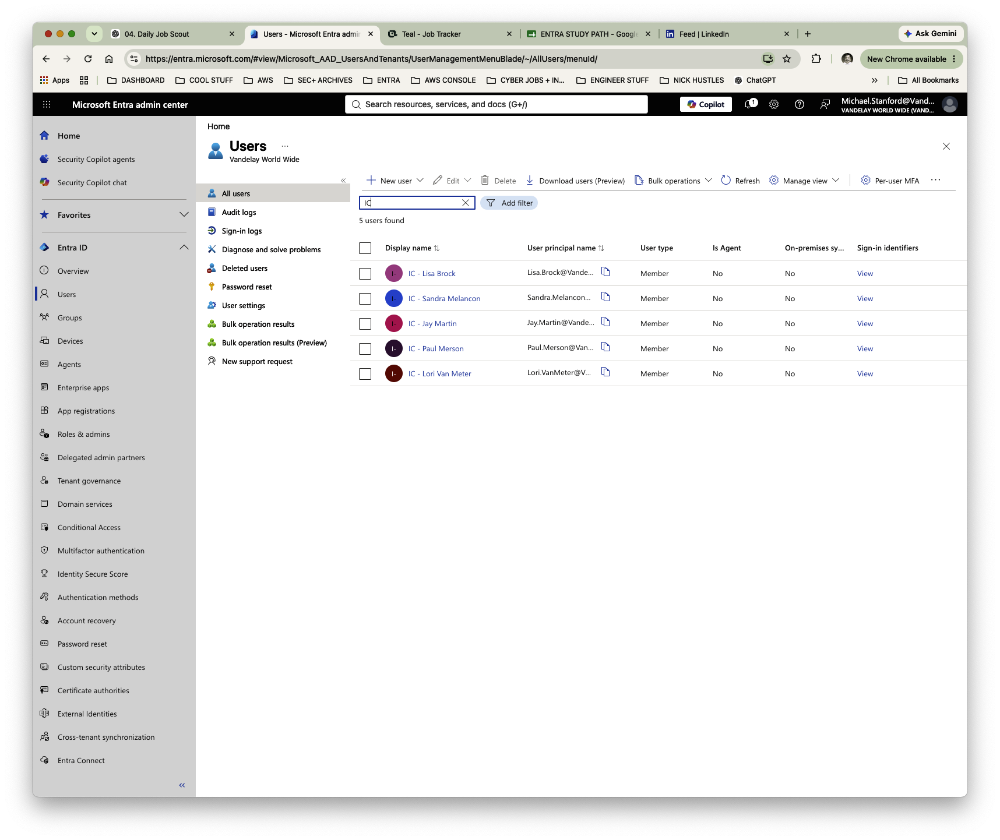

---

### 5. Establish Toronto Baseline Access

Two groups were created to provide the Innovation Center workforce with baseline access:

- `SG-IC-Users` — security and application access
- `M365-IC-Team` — collaboration and Microsoft 365 resources

The two group types serve different purposes:

**Security Groups manage authorization; Microsoft 365 Groups support collaboration.**

Appropriate business owners were assigned rather than leaving unnecessary standing ownership with the IAM administrator.

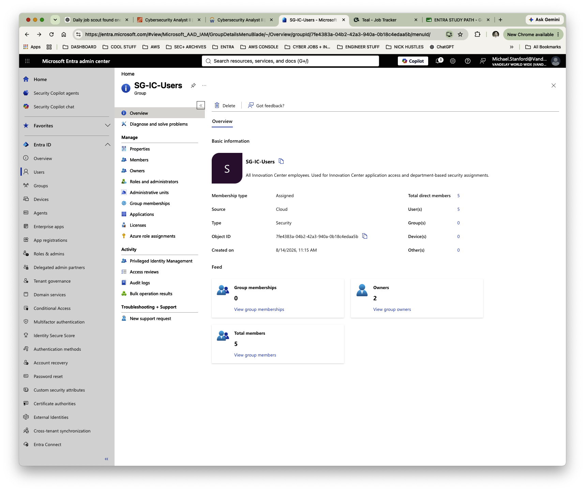

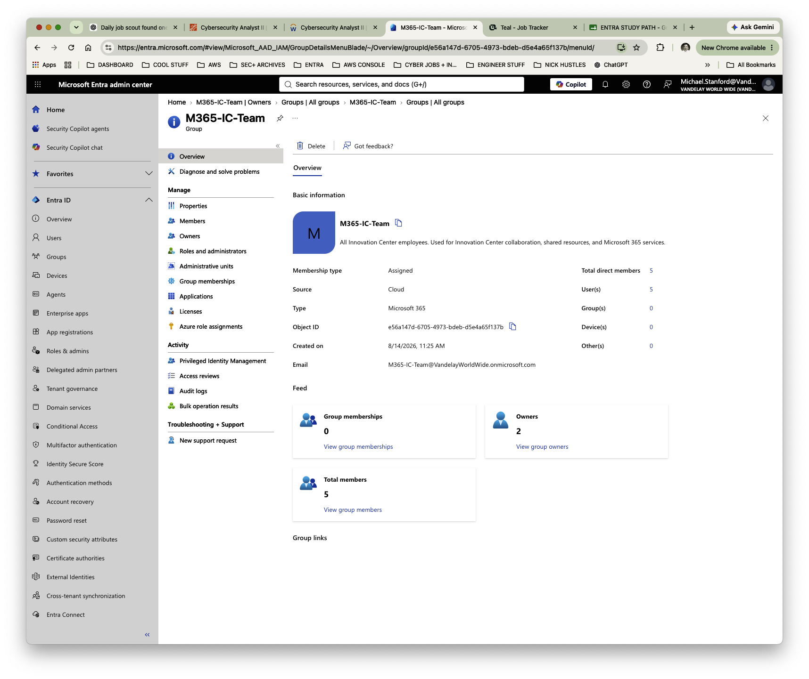

---

### 6. Validate a Toronto Joiner

Jay Martin, Senior Innovation Designer, was selected as the representative joiner for post-provisioning validation.

His identity was reviewed to confirm:

- **Job title:** `Senior Innovation Designer`
- **Department:** `Innovation Center`
- **Office location:** `Toronto`
- **Employee type:** `Employee`
- **Manager:** `Lori Van Meter`
- **Account enabled:** `Yes`

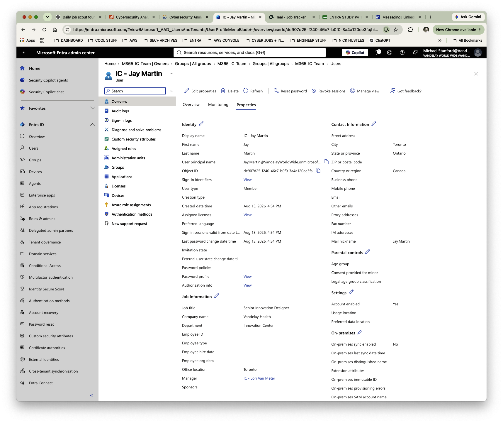

Jay's group memberships were then independently reviewed. His account contained the expected baseline memberships:

- `SG-IC-Users`
- `M365-IC-Team`

No unrelated group memberships were present.

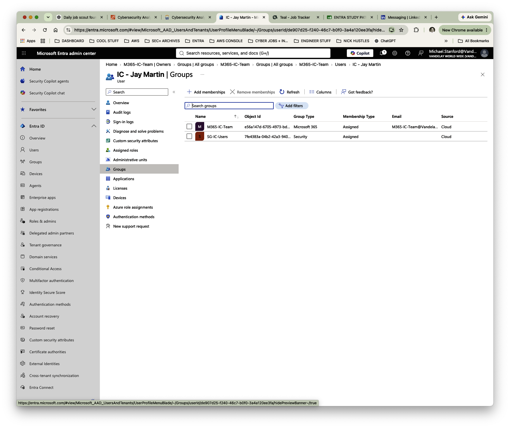

The resulting joiner process can be summarized as:

**Joiner request → identity creation → attribute assignment → manager relationship → baseline access provisioning → access validation**

---

## Validation

The completed lifecycle changes were reviewed to confirm that:

- Tuba and Suzi retained their existing identities during the organizational move.
- Their identity attributes and reporting relationships reflected their new business positions.
- A dedicated access structure existed for the new Travel department.
- Six Toronto workforce identities were provisioned.
- Toronto identities contained appropriate organizational and location information.
- Security and Microsoft 365 groups were established for the Innovation Center.
- Appropriate business ownership was assigned to the access groups.
- Jay Martin's identity contained the expected business attributes.
- Jay received the expected baseline access without unrelated group memberships.

---

## IAM Controls Demonstrated

- **Joiner-Mover-Leaver (JML) lifecycle management** — align identities and access with changes in the employment lifecycle.
- **Mover administration** — preserve an employee's identity while updating organizational context and access.
- **Joiner provisioning** — establish new workforce identities with consistent business attributes and baseline access.
- **Identity data quality** — maintain accurate titles, departments, locations, employee types, and manager relationships.
- **Access reassessment** — reconsider existing access when an employee's organizational role changes.
- **Group-based access** — provide repeatable departmental access through security and Microsoft 365 groups.
- **Business ownership** — assign responsibility for access structures to appropriate business stakeholders.
- **Least privilege** — provide access appropriate to current responsibilities rather than allowing historical access to accumulate.
- **Post-provisioning validation** — independently verify identity attributes and resulting group memberships.

---

## Key Takeaway

Identity lifecycle management is not simply creating and disabling accounts. **An identity must continue to reflect the person's current relationship with the business.**

This lab demonstrates how Vandelay Health can manage both sides of organizational change: **existing employees moving into new roles and new employees joining a growing organization**, while keeping identity data, reporting relationships, access, and business ownership aligned.
