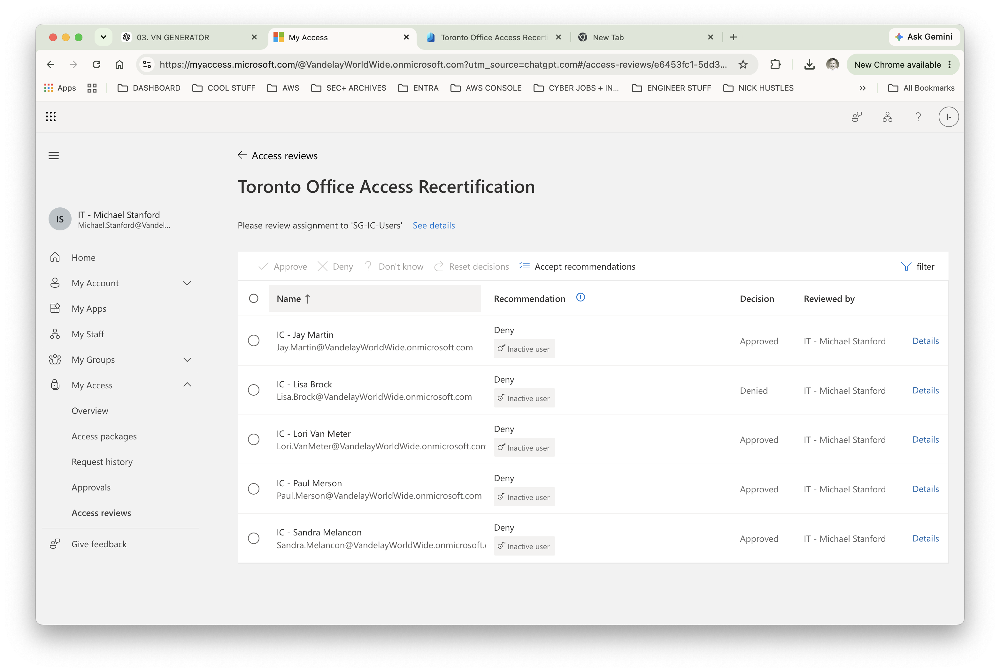
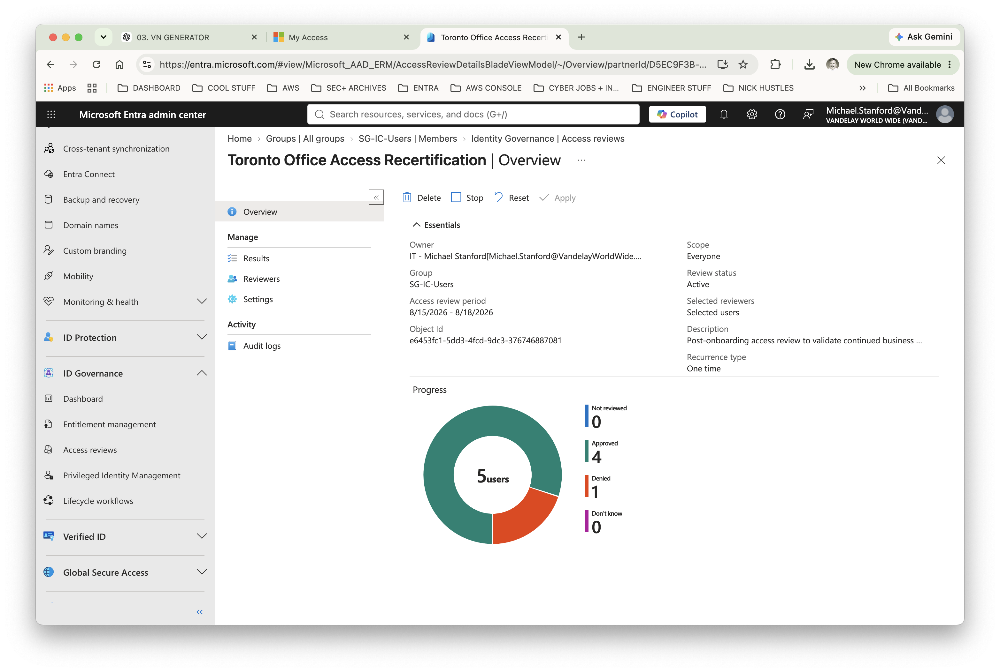

# Lab 06 — Reviewing and Recertifying Employee Access

**Vandelay Health** is a fictional healthcare technology company headquartered in Santa Monica, California and the company behind the **Ninja Sleeper** — an ultra-light, compact and virtually noiseless CPAP system designed for travelers who need to sleep comfortably in flight without disturbing fellow passengers.

The technology behind the Ninja Sleeper began as a **federal government contract project**, developed to provide military personnel in the field with a quiet and highly portable sleep-apnea solution. Vandelay Health later adapted the technology for the commercial market, incorporating as much of the original proprietary intellectual property as possible into the consumer Ninja Sleeper platform.

---

## Business Scenario

Following the expansion of Vandelay Health's Toronto Innovation Center, IAM needs to confirm that employees who received Toronto access still have a legitimate business requirement for it.

During the review, **Lisa Brock is identified as being on an extended leave of absence to provide end-of-life care for an elderly family member**. Her return date is currently undetermined.

Lisa remains a Vandelay Health employee, so disabling or deleting her identity would be inappropriate. However, because she is not actively working, she does not currently require access associated with the Toronto Innovation Center.

Rather than removing the entitlement through an undocumented administrative change, Vandelay will use **Microsoft Entra Access Reviews** to formally recertify the Toronto access population, document reviewer decisions, remove access that is no longer justified, and retain evidence of the governance process.

---

## IAM Requirements

To perform the Toronto access recertification, IAM needed to:

- Review membership in `SG-IC-Users`.
- Establish accountable reviewers for access certification.
- Provide a fallback reviewer if the resource owner is unavailable.
- Evaluate each user's continued business need for access.
- Use sign-in activity as decision support without allowing telemetry to replace business judgment.
- Require reviewer justification for certification decisions.
- Retain access for employees with a continuing business requirement.
- Remove Lisa Brock's Toronto entitlement while retaining her underlying workforce identity.
- Apply certification results to the governed resource.
- Verify that denied access was actually removed.
- Preserve audit evidence of the review and remediation process.

---

## Implementation

### 1. Configure the Access Review

A resource-based Microsoft Entra Access Review was created to recertify membership in `SG-IC-Users`.

The review was configured with:

- **Review scope:** All users
- **Reviewer model:** Resource owner
- **Fallback reviewer:** Configured
- **Review duration:** 3 days
- **Review recurrence:** One time
- **Auto-apply results:** Enabled
- **No reviewer response:** No change
- **30-day sign-in inactivity decision helper:** Enabled
- **Reviewer justification:** Required
- **Email notifications:** Enabled
- **Reminders:** Enabled

The reviewer was instructed to evaluate each employee's continued business requirement for Toronto access.

---

### 2. Establish the Initial Certification State

Microsoft Entra identified five identities within the scope of the review.

The initial state was:

- **5 users requiring review**
- **0 approved**
- **0 denied**
- **5 not reviewed**

This established the starting point against which completion and remediation could later be validated.

---

### 3. Establish Reviewer Accountability

The review was designed around **resource-owner accountability**, with the owner of the governed access responsible for determining whether membership remained appropriate.

During implementation, an available resource owner was not present to perform the review.

Rather than abandoning the governance model or allowing the review to stall, the configured fallback reviewer was used to continue the certification process through Microsoft My Access.

This exposed an important operational issue: access governance depends not only on technology, but also on clearly established ownership and escalation paths.

---

### 4. Review the Access Population

The five members of `SG-IC-Users` were presented individually for certification through Microsoft My Access.

Microsoft Entra also displayed sign-in activity as a decision helper. Because the lab identities lacked recent sign-in activity, Entra recommended **Deny** based on inactivity.

Those recommendations were treated as **decision-support signals rather than automatic decisions**.

Business context remained the determining factor in whether each employee should retain access.

---

### 5. Record Certification Decisions

After reviewing the five identities, the following decisions were recorded:

| User | Decision |
| --- | --- |
| Jay Martin | Approved |
| Lisa Brock | **Denied** |
| Lori Van Meter | Approved |
| Paul Merson | Approved |
| Sandra Melancon | Approved |

The four employees with an ongoing business requirement were approved despite the inactivity recommendation.

Lisa Brock's Toronto access was denied because she is on extended leave providing end-of-life care for an elderly family member and does not currently require the entitlement.

Her Microsoft Entra identity remained intact because she remains a Vandelay Health employee.

This distinction is fundamental to identity governance: **a temporary change in an employee's circumstances may require an access change without requiring termination of the underlying identity**.

Reviewer justification was recorded as part of the certification process, preserving an auditable business rationale for the access decision.

---

### 6. Validate the Completed Review

The Microsoft Entra administrative view was reviewed after certification to confirm that the entire population had been evaluated.

Final results:

- **5 users reviewed**
- **4 approved**
- **1 denied**
- **0 not reviewed**
- **0 don't know**

This confirmed that no certification decisions remained outstanding.

---

### 7. Review the Audit Evidence

Microsoft Entra audit logs were reviewed to confirm that the access-review activity was recorded by the identity governance platform.

The audit trail provides traceability for:

- Reviewer accountability
- Control validation
- Compliance review
- Investigation of access changes
- Internal and external audit evidence

This provides evidence that the certification occurred through Vandelay's formal identity governance process rather than through an undocumented manual access change.

---

### 8. Verify Access Remediation

Because **Auto apply results to resource** was enabled, the denied certification decision was applied to `SG-IC-Users`.

The group's membership was independently reviewed after remediation.

Four members remained:

- Jay Martin
- Lori Van Meter
- Paul Merson
- Sandra Melancon

Lisa Brock was no longer a member.

Her underlying Microsoft Entra identity remained intact because she was still associated with Vandelay Health.

---

## Validation

The completed governance process confirmed that:

- All five identities received a certification decision.
- Four employees retained access based on continuing business need.
- Lisa Brock's Toronto entitlement was denied.
- Lisa's underlying workforce identity was retained.
- Automated inactivity recommendations did not override documented business context.
- Reviewer justification was captured.
- No certification decisions remained outstanding.
- The denied entitlement was automatically remediated.
- Lisa was independently confirmed as removed from `SG-IC-Users`.
- Microsoft Entra retained audit evidence of the governance activity.

The end-to-end control can be summarized as:

**Identify access → Assign accountability → Review business need → Certify access → Document decisions → Remediate unnecessary access → Verify the outcome**

---

## IAM Controls Demonstrated

- **Access Reviews** — periodically evaluate whether existing access remains appropriate.
- **Access recertification** — require an accountable reviewer to approve or deny continued access.
- **Entitlement lifecycle management** — remove access without unnecessarily terminating the underlying identity.
- **Reviewer accountability** — associate access decisions with responsible business reviewers.
- **Fallback review** — maintain the certification process when the primary resource owner is unavailable.
- **Decision support** — use identity telemetry to inform rather than replace business judgment.
- **Reviewer justification** — document the business rationale supporting access decisions.
- **Automated remediation** — apply denied certification results to the governed resource.
- **Least privilege** — remove access when a current business requirement no longer exists.
- **Audit evidence** — retain traceable records of governance activity.
- **Post-remediation validation** — verify that a governance decision produced the intended access change.

---

## Key Takeaway

Access that was appropriate when it was granted may not remain appropriate indefinitely.

This lab demonstrates how Vandelay Health can use **Microsoft Entra Access Reviews to periodically recertify access, require accountable business decisions, remediate unnecessary entitlements, and retain evidence that the governance control actually worked**.

Lisa Brock's case also demonstrates an important distinction: **identity lifecycle and entitlement lifecycle are related, but they are not the same thing**. Her employment relationship with Vandelay has not ended, but her current need for Toronto access has changed.
