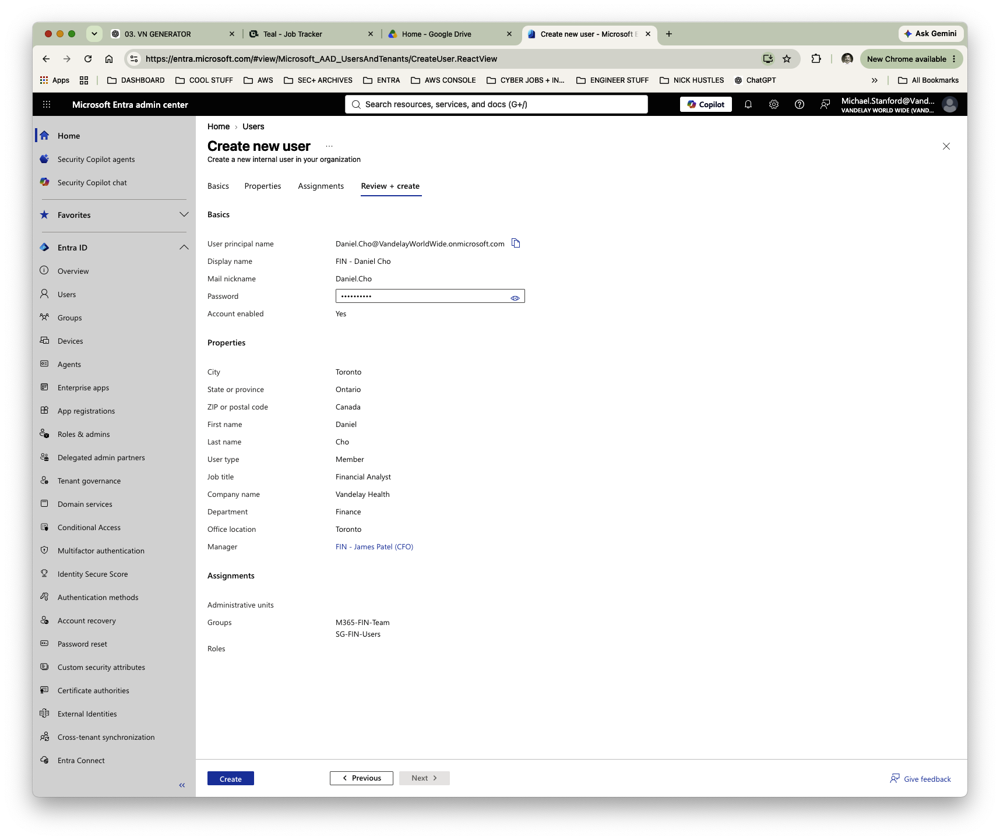
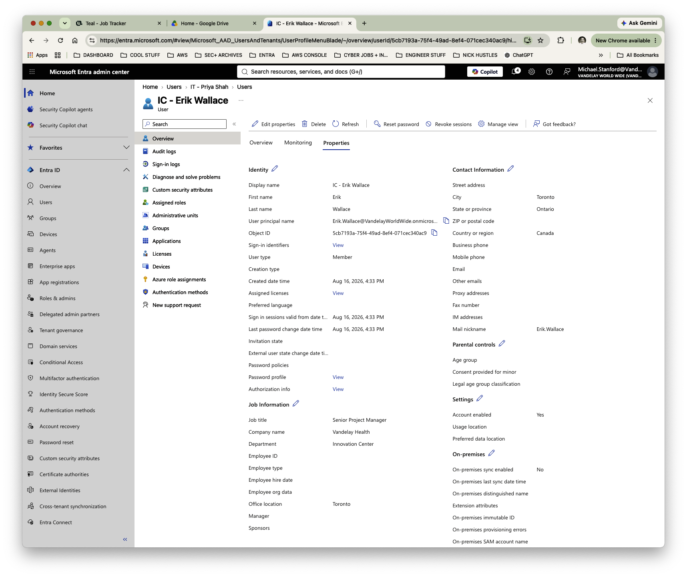
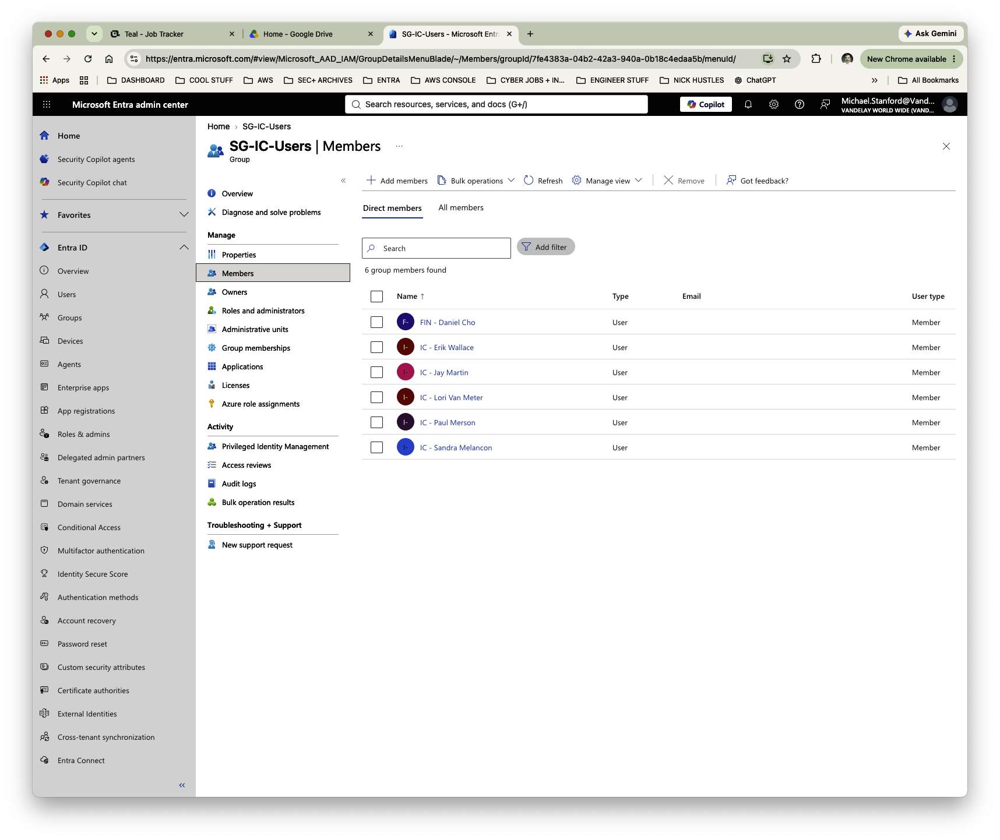
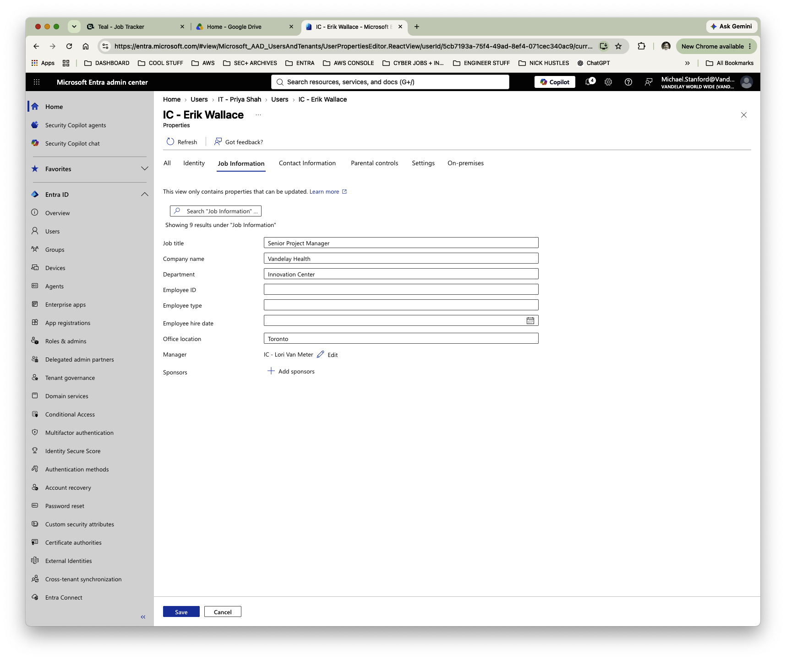
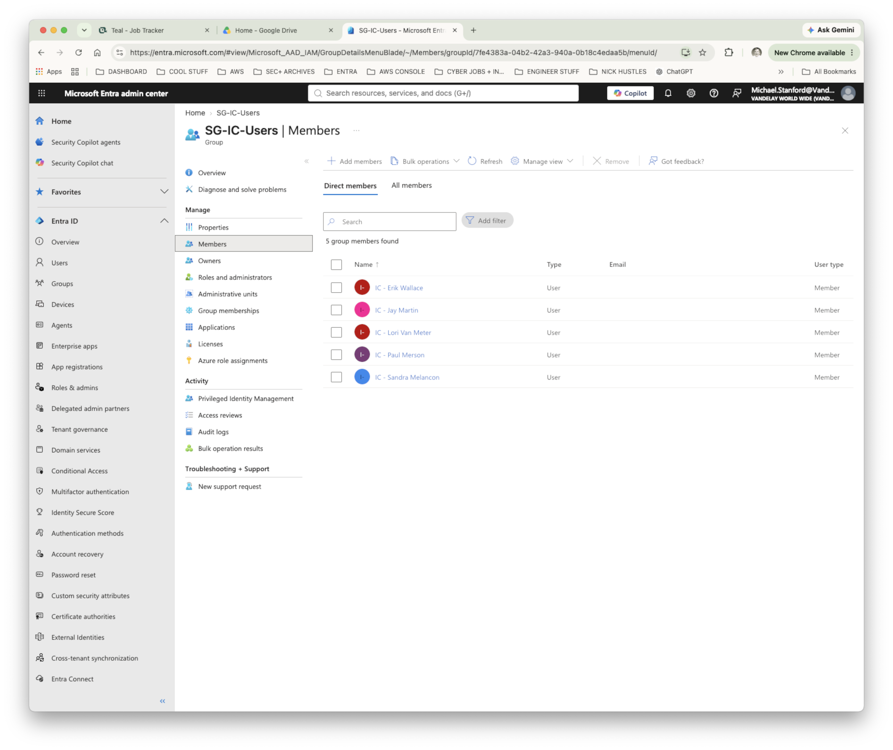

# Lab 07 — Finding and Fixing Access Before Certification

**Vandelay Health** is a fictional healthcare technology company headquartered in Santa Monica, California and the company behind the **Ninja Sleeper** — an ultra-light, compact and virtually noiseless CPAP system designed for travelers who need to sleep comfortably in flight without disturbing fellow passengers.

The technology behind the Ninja Sleeper began as a **federal government contract project**, developed to provide military personnel in the field with a quiet and highly portable sleep-apnea solution. Vandelay Health later adapted the technology for the commercial market, incorporating as much of the original proprietary intellectual property as possible into the consumer Ninja Sleeper platform.

---

## Business Scenario

Vandelay Health is preparing for a periodic User Access Review (UAR). Before asking business reviewers to certify access, IAM needs to determine whether the identity and entitlement data presented to those reviewers is complete and reliable.

During pre-certification validation, IAM identifies two problems.

**Erik Wallace**, a Senior Project Manager in the Toronto Innovation Center, has no manager recorded in his Microsoft Entra identity. Without an accurate manager relationship, reviewer routing and the business context used to evaluate his access may be incomplete.

**Daniel Cho**, a Financial Analyst, appears in the `SG-IC-Users` Innovation Center security group even though his identity attributes place him in Finance. His membership may represent unnecessary access and requires investigation.

The two exceptions illustrate different governance problems: one involves the **quality of the identity data used to make an access decision**, while the other involves the **appropriateness of an entitlement already assigned to a user**.

> **Lab Scope:** This lab manually simulates the data-validation, exception-handling, and remediation activities that support a User Access Review / access certification process. It does not represent execution of a native Microsoft Entra Access Review campaign.

---

## IAM Requirements

Before the certification can proceed, IAM needed to:

- Validate identity information used to support access-review decisions.
- Identify incomplete manager and reviewer-context data.
- Correct identity-data exceptions before certification.
- Compare employee business attributes with existing entitlements.
- Identify access that appears inconsistent with an employee's role or department.
- Investigate exceptions rather than assuming existing access is appropriate.
- Remove access when no documented business requirement supports it.
- Preserve legitimate access for other users during remediation.
- Verify that remediation produced the intended result.
- Retain evidence supporting a defensible certification process.

---

## Implementation

### 1. Establish Daniel Cho's Expected Access

Daniel Cho is provisioned as a **Financial Analyst** in the Finance department.

His identity establishes the business context against which his access can be evaluated:

- **Role:** Financial Analyst
- **Department:** Finance
- **Manager:** James Patel (CFO)
- **Expected Finance access:** `SG-FIN-Users`
- **Expected collaboration access:** `M365-FIN-Team`

This provides a baseline for determining whether Daniel's existing entitlements align with his business responsibilities.

---

### 2. Perform Pre-Certification Identity-Data Validation

Before reviewing entitlements, IAM validates the identity records that will provide reviewers with business context.

Erik Wallace is correctly identified as a **Senior Project Manager** in the **Innovation Center**, but his **Manager** field is blank.

This represents an identity-data quality exception.

Manager information can be important to determining who should review access and to understanding the employee's position within the organization. Allowing incomplete identity information to flow into a certification process can weaken the quality of the resulting access decision.

---

### 3. Remediate the Identity-Data Exception

Erik Wallace's identity record is corrected by assigning **Lori Van Meter** as his manager.

The updated identity now contains the management relationship needed to provide appropriate organizational context for access certification.

---

### 4. Identify an Entitlement Exception

IAM next reviews the membership of `SG-IC-Users`, the security group used for Innovation Center access.

Daniel Cho appears among the group's members.

Because Daniel is a Finance employee, this creates an inconsistency between his **business identity** and his **assigned entitlement**.

The membership is therefore treated as an exception requiring investigation rather than being automatically accepted simply because the access already exists.

---

### 5. Validate Business Need

Daniel's Microsoft Entra identity is reviewed to determine whether his business information provides a justification for Innovation Center access.

His identity confirms:

- **Job title:** Financial Analyst
- **Department:** Finance
- **Office location:** Toronto
- **Manager:** James Patel (CFO)

The fact that Daniel works in Toronto does not by itself justify membership in an Innovation Center security group.

His identity information provides no documented business basis for the additional entitlement.

---

### 6. Remediate and Verify Inappropriate Access

Daniel Cho is removed from `SG-IC-Users`.

IAM then reviews the group membership again rather than assuming the administrative change completed successfully.

Daniel is no longer present, while the five legitimate Innovation Center members retain their access.

This confirms that the inappropriate entitlement was removed without disrupting valid access for the rest of the group.

---

## Findings and Remediation Summary

| Finding | Governance Risk | Action | Result |
| --- | --- | --- | --- |
| Erik Wallace had no manager assigned | Reviewer routing and business context may be incomplete | Assigned Lori Van Meter as manager | Identity data corrected |
| Daniel Cho was in `SG-IC-Users` despite belonging to Finance | Excess or inappropriate access | Validated business context and removed IC membership | Entitlement remediated |
| Legitimate IC users needed to retain access | Over-remediation could disrupt legitimate business access | Revalidated group membership after removal | Five legitimate members remained |

---

## Validation

The completed pre-certification review confirmed that:

- Erik Wallace's missing manager relationship was identified.
- Lori Van Meter was assigned as Erik's manager.
- Daniel Cho's expected Finance access was established from his business identity.
- Daniel was identified as an exception in `SG-IC-Users`.
- His identity attributes were reviewed before making an access decision.
- No documented business requirement supported the Innovation Center entitlement.
- Daniel was removed from `SG-IC-Users`.
- His legitimate Finance access was preserved.
- Five legitimate Innovation Center members retained their access after remediation.
- The resulting identity and entitlement state was independently verified.

The control process can be summarized as:

**Define scope → Validate identity data → Validate entitlement data → Identify exceptions → Determine business need → Remediate inappropriate access → Verify remediation → Retain evidence**

---

## IAM Controls Demonstrated

- **Access certification data validation** — verify the information used to support access decisions before certification begins.
- **Identity data quality** — maintain accurate organizational and manager information.
- **Entitlement validation** — compare assigned access with the employee's current business context.
- **Exception handling** — investigate inconsistent access rather than automatically accepting existing assignments.
- **Reviewer readiness** — ensure identity information can support appropriate review and accountability.
- **Least privilege** — remove access that lacks a documented business requirement.
- **Access remediation** — correct an inappropriate entitlement after validation.
- **Preservation of legitimate access** — avoid disrupting appropriate access while correcting an exception.
- **Remediation verification** — independently confirm that the intended access change occurred.
- **Evidence collection** — document the data-validation and remediation process supporting certification.

---

## Governance and Audit Relevance

A certification is only as reliable as the information presented to the reviewer.

Incomplete manager relationships, inaccurate organizational attributes, or incorrect entitlement data can result in inappropriate approvals, incorrect reviewer assignments, and weak audit evidence.

This workflow demonstrates activities that can support periodic User Access Reviews and access certifications in regulated environments by emphasizing:

- Data completeness and accuracy
- Reviewer accountability
- Least privilege
- Exception investigation
- Access remediation
- Remediation verification
- Evidence retention

These control concepts can be relevant in environments subject to frameworks and assurance programs such as **SOX, SOC 1, SOC 2, HITRUST, and PCI DSS**, depending on the systems, data, and compliance requirements in scope.

---

## Key Takeaway

Access certification should not begin with a reviewer blindly clicking **Approve** or **Deny**.

A defensible process begins by making sure the reviewer can trust the identity and entitlement information being presented.

This lab demonstrates how Vandelay Health can **validate identity data, identify access that conflicts with an employee's business context, investigate the exception, remediate unjustified access, preserve legitimate access, and verify the resulting change before certification**.
