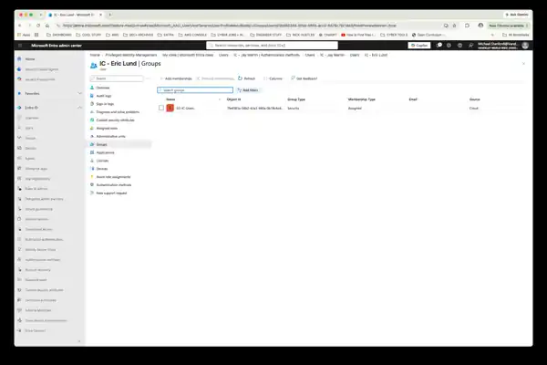
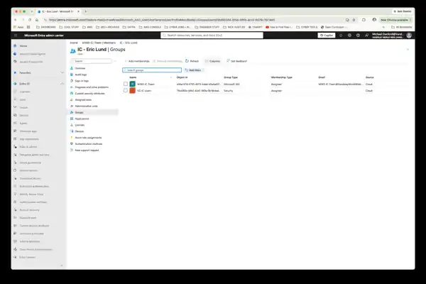
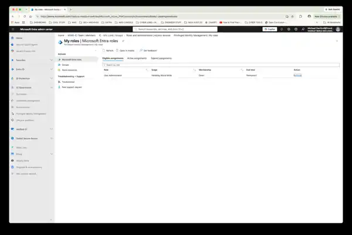
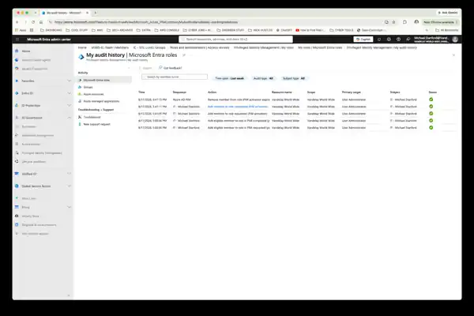

# Lab 08 — Using Just-in-Time Privilege to Resolve an Access Incident

**Vandelay Health** is a fictional healthcare technology company headquartered in Santa Monica, California and the company behind the **Ninja Sleeper** — an ultra-light, compact and virtually noiseless CPAP system designed for travelers who need to sleep comfortably in flight without disturbing fellow passengers.

The technology behind the Ninja Sleeper began as a **federal government contract project**, developed to provide military personnel in the field with a quiet and highly portable sleep-apnea solution. Vandelay Health later adapted the technology for the commercial market, incorporating as much of the original proprietary intellectual property as possible into the consumer Ninja Sleeper platform.

---

## Business Scenario

A newly onboarded Toronto Innovation Center employee, **Eric Lund**, can successfully sign in to his Vandelay Health account but cannot access the Innovation Center's Microsoft 365 collaboration resources.

The issue is recorded as:

**INC-2026-0817 — Toronto Innovation Center User Access Provisioning Issue**

Initial review indicates that Eric's identity is active and authentication is working, suggesting that the problem involves authorization or provisioning rather than sign-in.

Resolving the incident requires administrative capabilities. However, the IAM administrator does not maintain standing **User Administrator** privilege.

Instead, Vandelay uses **Microsoft Entra Privileged Identity Management (PIM)** to make the administrator eligible for the role and activate it only when elevated access is required.

The privileged-access workflow is:

**Incident → Investigate → Activate JIT Privilege → Remediate → Verify → Privilege Expires → Audit**

---

## IAM Requirements

To resolve the incident while maintaining least privilege, IAM needed to:

- Determine whether Eric's problem involved authentication, identity configuration, or missing access.
- Review his existing group memberships before making changes.
- Avoid maintaining standing User Administrator privilege.
- Establish eligibility for the User Administrator role through Microsoft Entra PIM.
- Activate the role only when privileged access was required.
- Associate the activation with a documented incident and business justification.
- Limit elevated privilege to a defined activation window.
- Remediate only the missing entitlement.
- Validate Eric's resulting access after remediation.
- Confirm that the administrative role returned to a non-active state after expiration.
- Review PIM audit history for evidence of the privileged-access lifecycle.

---

## Implementation

### 1. Establish the Privileged-Access Baseline

Before configuring PIM eligibility, the IAM administrator did not have an eligible User Administrator assignment.

This established the initial privileged-access state before introducing the just-in-time administrative model.

---

### 2. Configure User Administrator Eligibility

The IAM administrator was configured as **eligible** for the Microsoft Entra **User Administrator** role through Privileged Identity Management.

The role was not assigned as permanently active.

Eligibility means the administrator can request activation when an authorized operational need arises without retaining the role's privileges continuously.

---

### 3. Activate Privilege for the Incident

User Administrator was activated through PIM for **one hour** to support the Toronto access incident.

The activation included the incident-specific justification:

> INC-2026-0817 — Temporary User Administrator access required to remediate Toronto Innovation Center user account provisioning issue.

The activation created a defined relationship between the privileged access and the operational reason for which it was required.

---

### 4. Investigate Eric Lund's Existing Access

Before changing Eric's account, his existing group memberships were reviewed.

Eric already belonged to:

- `SG-IC-Users`

However, his expected Microsoft 365 collaboration entitlement was missing:

- `M365-IC-Team`

Because Eric could already authenticate successfully and possessed the expected Innovation Center security-group membership, the investigation identified a **partial provisioning failure** rather than a broader account or authentication problem.

---

### 5. Remediate the Missing Entitlement

Using the temporarily activated User Administrator role, Eric Lund was added to `M365-IC-Team`.

The remediation was deliberately limited to the identified access gap rather than broadly reprovisioning the user or changing unrelated identity configuration.

Eric's expected Innovation Center baseline became:

- `SG-IC-Users`
- `M365-IC-Team`

This restored the missing collaboration entitlement while preserving his existing valid access.

---

### 6. Verify the Remediation

Eric's group memberships were reviewed again after the change.

The resulting identity showed both required Innovation Center groups:

- `SG-IC-Users`
- `M365-IC-Team`

This independently confirmed that the missing entitlement had been provisioned successfully.

---

### 7. Confirm Privilege Expiration

After the one-hour activation window ended, the User Administrator role was no longer active.

The administrator returned to an **eligible but non-active** state.

This demonstrates an important privileged-access principle:

**Permanent eligibility does not equal permanent privilege.**

The administrator retains the ability to request the role when a legitimate need occurs without possessing its elevated permissions during normal operations.

---

### 8. Review the Privileged-Access Audit Trail

Microsoft Entra PIM audit history was reviewed to validate the privileged-access lifecycle.

The history documented:

1. User Administrator eligibility request and completion
2. PIM activation request
3. Successful User Administrator activation
4. Automatic removal when the activation expired

This provides evidence that elevated access was obtained through a controlled, time-bound process rather than through a permanent active role assignment.

---

## Validation

The completed incident workflow confirmed that:

- Eric Lund's identity was active and authentication was not the source of the problem.
- `SG-IC-Users` was already assigned.
- `M365-IC-Team` was identified as the missing entitlement.
- The IAM administrator did not require permanently active User Administrator access.
- User Administrator eligibility was established through Microsoft Entra PIM.
- The role was activated for a one-hour window with an incident-specific justification.
- Remediation was limited to the missing entitlement.
- Eric's resulting group memberships were independently verified.
- The User Administrator activation expired after the defined window.
- The administrator returned to an eligible but non-active state.
- PIM retained evidence of eligibility, activation, and expiration.

The end-to-end privileged-access workflow can be summarized as:

**Incident → Investigate → Activate JIT Privilege → Remediate → Verify → Privilege Expires → Audit**

---

## IAM Controls Demonstrated

- **Privileged Identity Management (PIM)** — govern access to elevated Microsoft Entra roles.
- **Just-in-Time (JIT) access** — activate administrative privilege only when a legitimate operational need occurs.
- **Role eligibility** — separate the ability to request privilege from continuously possessing that privilege.
- **Time-bound privilege** — automatically limit elevated access to a defined activation window.
- **Least privilege** — use the administrative role required for the task rather than broader standing access.
- **Incident-based administration** — associate elevated access with a documented operational requirement.
- **Privileged-access justification** — record the reason elevated permissions were requested.
- **Access investigation** — validate the existing identity and entitlement state before making changes.
- **Targeted remediation** — correct only the access problem identified during investigation.
- **Post-remediation validation** — independently confirm that the intended entitlement was provisioned.
- **Automatic privilege expiration** — return the administrator to a non-active state after the authorized window.
- **Audit evidence** — retain a traceable history of privileged-role eligibility, activation, and expiration.

---

## Key Takeaway

Administrative privilege should exist **when it is needed, for as long as it is needed — not simply because an administrator might need it someday**.

This lab demonstrates how Vandelay Health can use **Microsoft Entra Privileged Identity Management to separate role eligibility from active privilege, provide just-in-time administrative access for a legitimate support incident, automatically remove that privilege afterward, and retain evidence of the privileged-access lifecycle**.

Eric Lund's incident also demonstrates that privileged access should not lead to unnecessarily broad changes. IAM first identified the specific provisioning failure, activated the privilege required to correct it, remediated only the missing entitlement, and verified the result.
