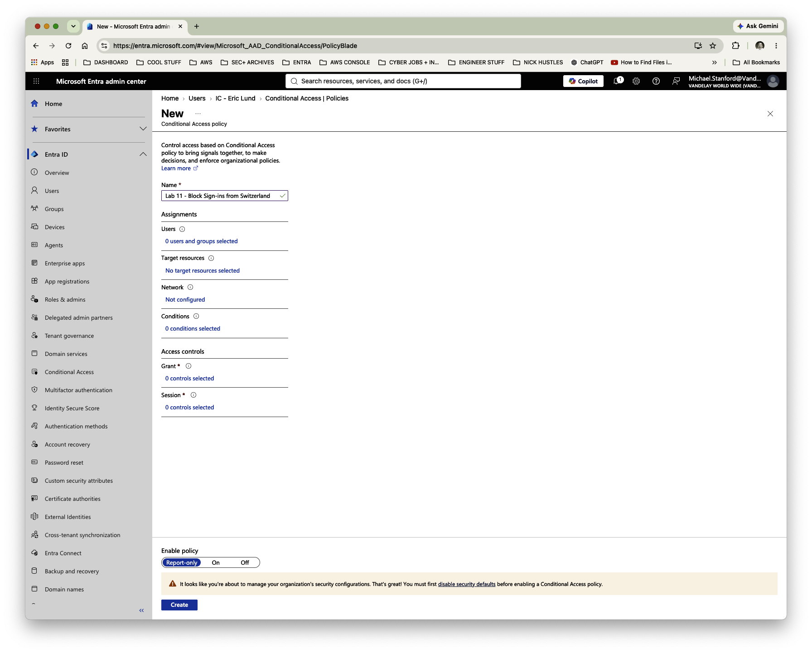
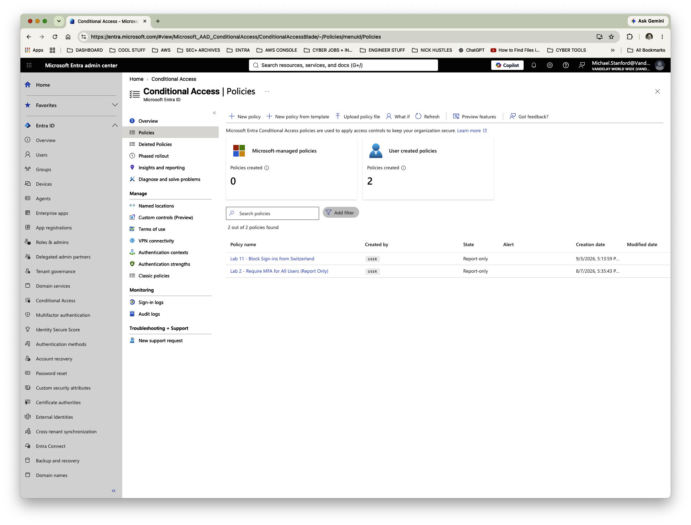
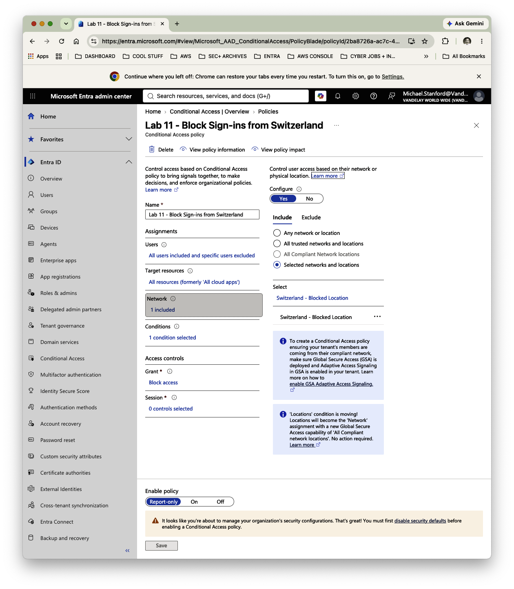
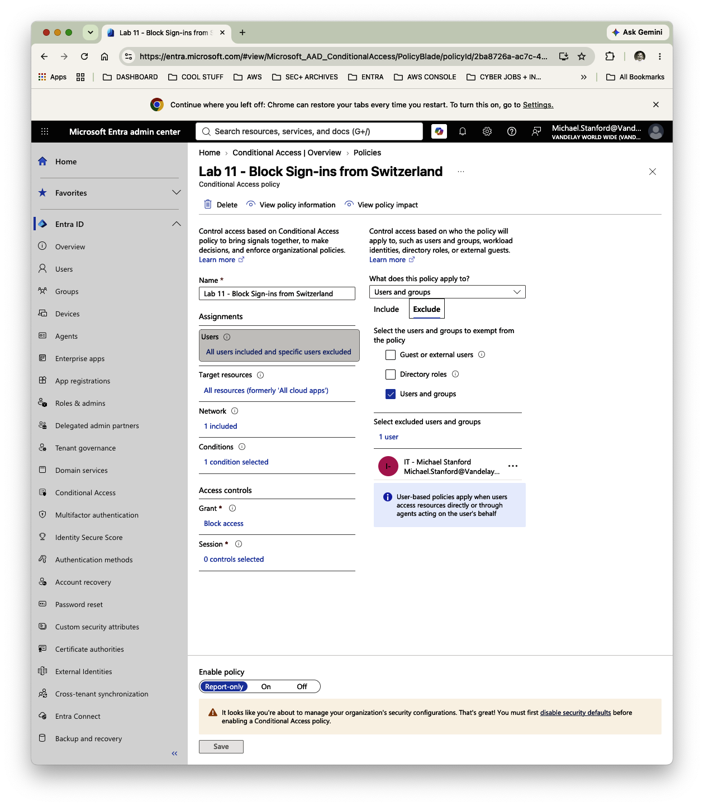
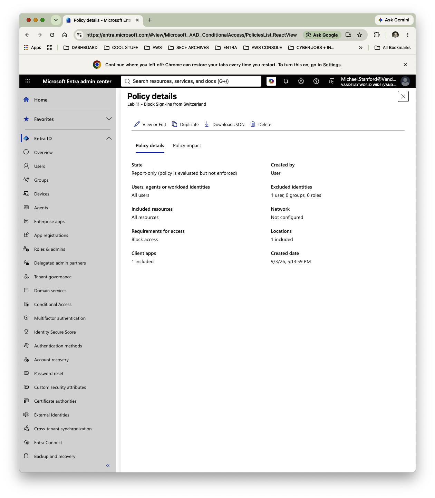

# Lab 11 — Protecting Vandelay's Intellectual Property with Geographic Access Controls

**Vandelay Health** is a fictional healthcare technology company headquartered in Santa Monica, California and the company behind the **Ninja Sleeper** — an ultra-light, compact and virtually noiseless CPAP system designed for travelers who need to sleep comfortably in flight without disturbing fellow passengers.

The technology behind the Ninja Sleeper began as a **federal government contract project**, developed to provide military personnel in the field with a quiet and highly portable sleep-apnea solution. Vandelay Health later adapted the technology for the commercial market, incorporating as much of the original proprietary intellectual property as possible into the consumer Ninja Sleeper platform.

---

## Business Scenario

The proprietary technology behind the Ninja Sleeper is one of Vandelay Health's most valuable corporate assets.

Vandelay's primary fictional competitor, **Newman GmbH**, operates from Switzerland. As part of a broader effort to reduce the risk of unauthorized access, intellectual-property theft, and digital piracy, Vandelay's security team establishes Switzerland as a restricted sign-in geography.

The security requirement is straightforward:

**Vandelay identities should not be permitted to access corporate resources when sign-in activity originates from Switzerland.**

Rather than modifying individual accounts, IAM will implement the requirement through a centralized Microsoft Entra Conditional Access policy.

The workflow is:

**Business risk → Geographic restriction → Named location → Conditional Access policy → Staged deployment → Validation**

---

## IAM Requirements

IAM needed to:

- Define Switzerland as a named geographic location.
- Apply the restriction across Vandelay's user population.
- Protect all resources covered by Conditional Access.
- Block access when the geographic condition is met.
- Preserve administrative access during testing.
- Validate the policy before enabling enforcement.

---

## Implementation

### 1. Define Switzerland as a Named Location

A Microsoft Entra named location was created:

**`Switzerland - Blocked Location`**

Switzerland was selected as the country associated with the location, providing the geographic condition used by the Conditional Access policy.

---

### 2. Create the Conditional Access Policy

A Conditional Access policy was created:

**`Lab 11 - Block Sign-ins from Switzerland`**

The policy was configured with:

- **Users:** All users
- **Target resources:** All resources
- **Network/location:** `Switzerland - Blocked Location`
- **Grant control:** Block access

This translates Vandelay's business requirement into a centralized identity control rather than requiring changes to individual user accounts.

---

### 3. Configure the Geographic Restriction

The policy evaluates the location associated with a sign-in attempt.

For covered identities, the intended control logic is:

**Vandelay identity → Sign-in originates from Switzerland → Corporate resource requested → Block access**

The policy does **not** attempt to identify Newman GmbH or determine whether a particular user is associated with the competitor. Vandelay has instead designated Switzerland as a restricted geography based on its fictional business-risk assessment.

---

### 4. Protect Administrative Access

Because the policy targets **All users**, the Vandelay administrator account was explicitly excluded during testing.

This provides a safeguard against accidentally locking IAM out of the environment while validating an organization-wide Conditional Access policy.

The resulting scope is:

**All users → Exclude designated administrator**

---

### 5. Deploy in Report-Only Mode

The policy was deployed in:

**Report-only**

rather than immediately being turned on.

Report-only allows Microsoft Entra to evaluate how the Conditional Access policy would apply without actually enforcing the access denial.

This creates a safer deployment process:

**Configure → Observe → Validate → Enforce**

The completed policy shows the all-user scope, all-resource scope, geographic condition, Block access control, and Report-only deployment.

---

## Validation

The completed configuration confirmed that:

- Switzerland was defined as a named location.
- The policy targeted all Vandelay users.
- All resources were included.
- The Switzerland named location was included as the network condition.
- The configured grant control was **Block access**.
- A designated administrator was excluded as a lockout safeguard.
- The policy was placed in **Report-only** mode for evaluation.

Because the policy remains in Report-only mode, this lab demonstrates **policy configuration and impact evaluation**, not an enforced denial of a Swiss sign-in.

Following successful validation, the policy could be changed from:

**Report-only → On**

to enforce the restriction.

---

## IAM Controls Demonstrated

- **Microsoft Entra Conditional Access**
- **Named locations**
- **Geographic access controls**
- **Organization-wide policy scoping**
- **All-resource protection**
- **Block-access controls**
- **Administrative lockout protection**
- **Security exception management**
- **Report-only policy testing**
- **Staged security deployment**
- **Policy validation**
- **Business risk translated into IAM controls**

---

## Key Takeaway

Conditional Access allows IAM to turn a business-security requirement into a centralized access policy.

In this lab, Vandelay Health identified a geographic risk to its proprietary Ninja Sleeper technology and translated that requirement into a Microsoft Entra Conditional Access policy covering the workforce and corporate resources.

Just as importantly, the control was **not immediately enforced**. An administrative safety exclusion and Report-only deployment allowed IAM to evaluate the policy before potentially affecting users.

The resulting process is:

**Identify risk → Define scope → Configure control → Protect administration → Test impact → Validate → Enforce**
