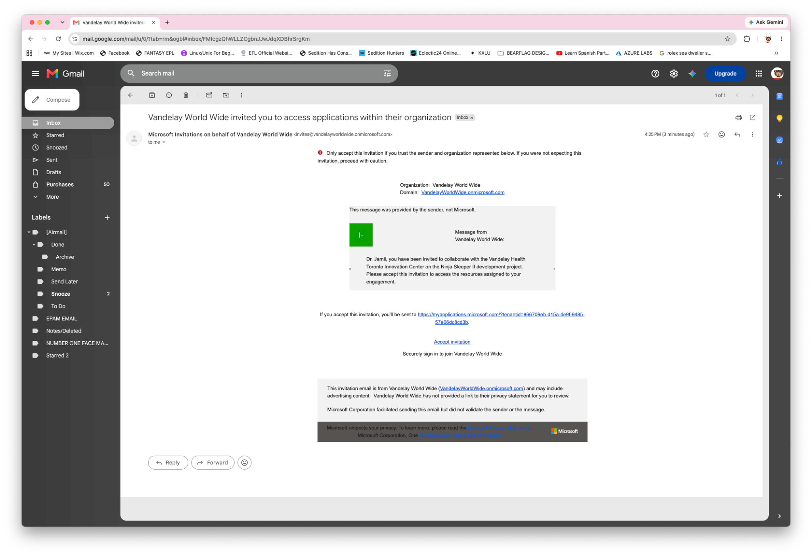
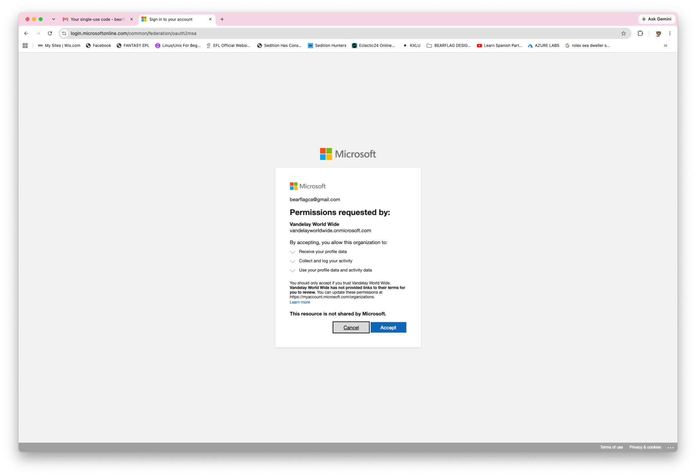
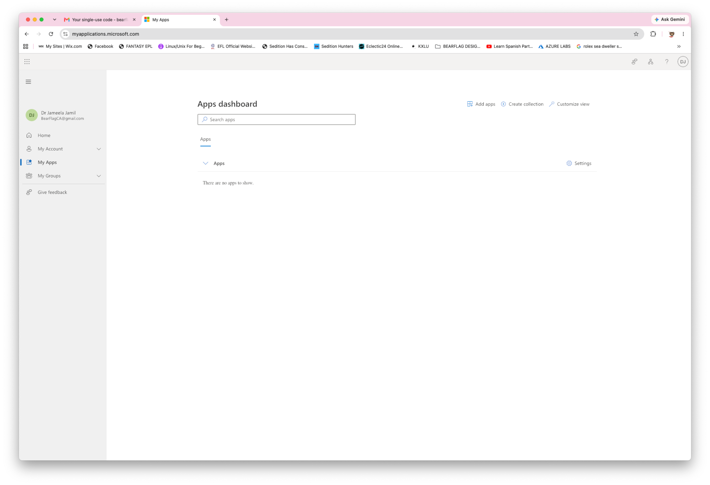
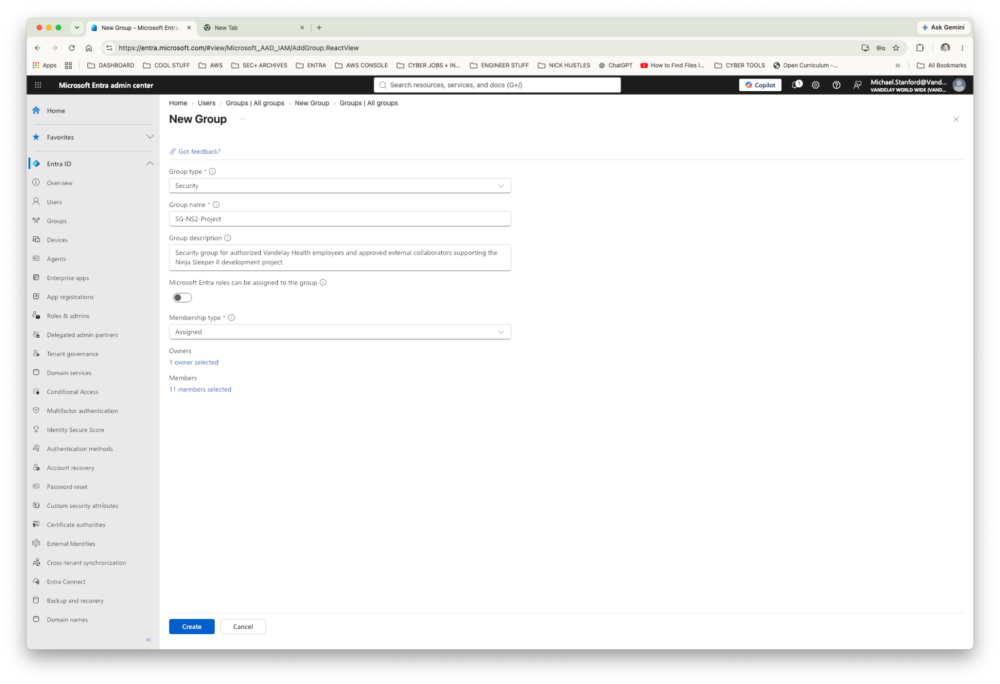
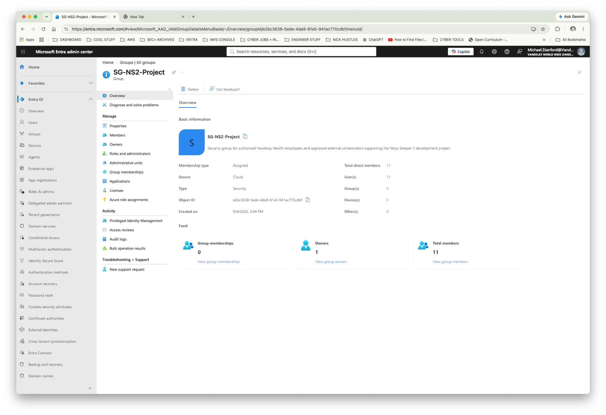
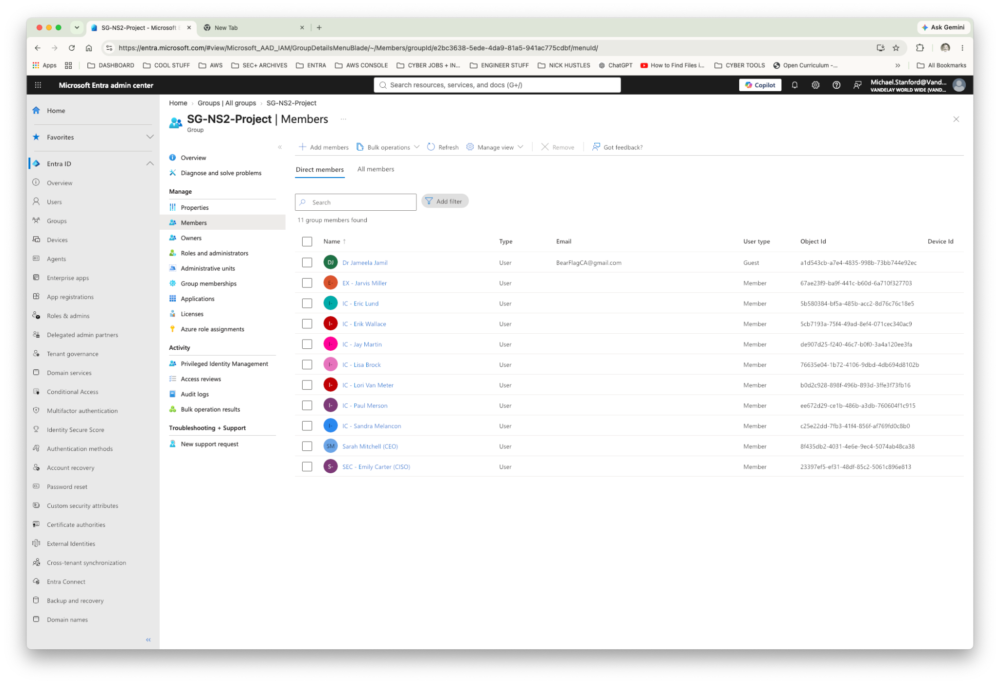
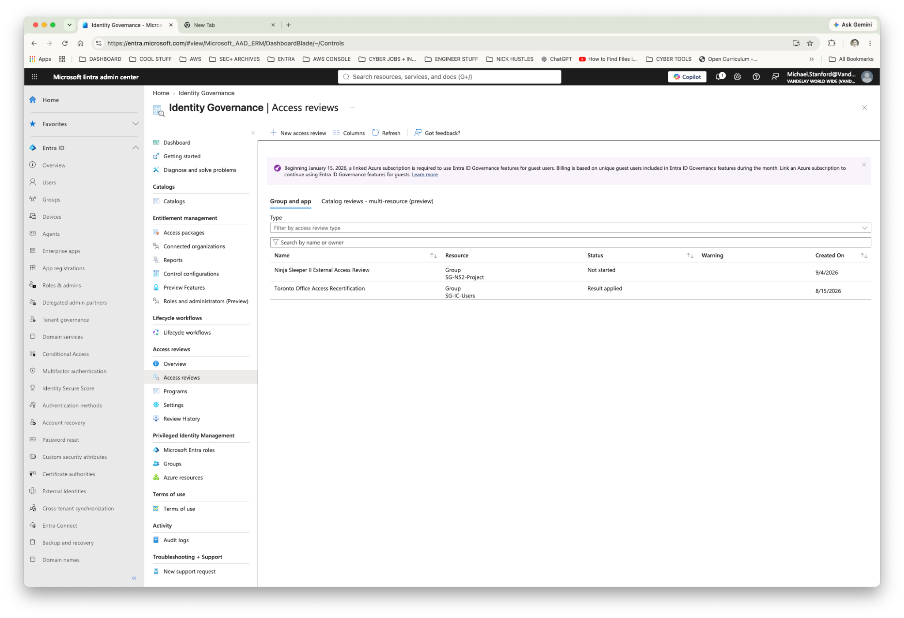
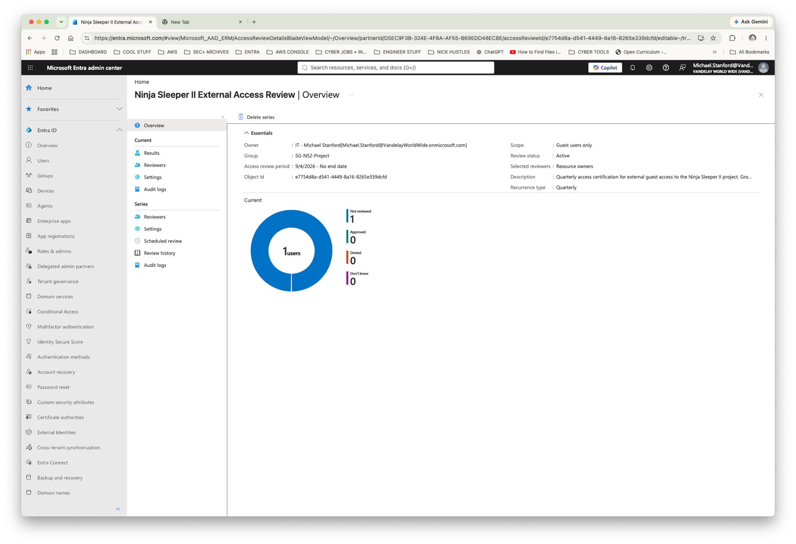

# Lab 12 — Governing External Consultant Access

**Vandelay Health** is a fictional healthcare technology company headquartered in Santa Monica, California and the company behind the **Ninja Sleeper** — an ultra-light, compact and virtually noiseless CPAP system designed for travelers who need to sleep comfortably in flight without disturbing fellow passengers.

The technology behind the Ninja Sleeper began as a **federal government contract project**, developed to provide military personnel in the field with a quiet and highly portable sleep-apnea solution. Vandelay Health later adapted the technology for the commercial market, incorporating as much of the original proprietary intellectual property as possible into the consumer Ninja Sleeper platform.

---

## Business Scenario

Vandelay Health is developing the **Ninja Sleeper II**, the next generation of its proprietary CPAP platform. The new product is being developed by the Toronto Innovation Center with participation from selected company leadership.

To support the project, Vandelay retained **Dr. Jameela Jamil**, an external medical industrial designer based in Edmonton, Alberta.

Dr. Jamil needs to collaborate with the project team, but she is **not a Vandelay employee**. IAM therefore needs to provide the access required for her engagement without creating an internal employee identity or giving her the broader access associated with Vandelay's workforce.

Her access must also have an accountable business owner and be periodically reviewed so that project access does not remain indefinitely after the business need ends.

The resulting lifecycle is:

**External identity → B2B authentication → Scoped authorization → Business ownership → Access certification → Retain or remove access**

---

## IAM Requirements

IAM needed to:

- Maintain Dr. Jamil as an external identity rather than an internal employee.
- Allow her to authenticate using Microsoft Entra B2B collaboration.
- Provide no project access merely because authentication succeeds.
- Grant access specifically to the Ninja Sleeper II project.
- Avoid placing her in broader Toronto Innovation Center employee access.
- Assign an internal business owner responsible for her access.
- Periodically certify whether the external access remains necessary.
- Support removal of project access when it is no longer justified.

---

## Implementation

### 1. Invite the External Consultant

Dr. Jamil was invited to the Vandelay tenant through **Microsoft Entra B2B collaboration**.

Her identity was configured as an external **Guest** rather than an internal Member account.

Relevant identity information included:

- **Name:** Dr. Jameela Jamil
- **Company:** Jamil Industrial Design
- **Job Title:** Medical Industrial Designer
- **Department:** Innovation Center
- **Employee Type:** Consultant/Contractor
- **Office Location:** Edmonton
- **Sponsor:** Lori Van Meter
- **User Type:** Guest

Lori Van Meter serves as the internal sponsor responsible for the business relationship and continued need for access.

---

### 2. Redeem the B2B Invitation

Dr. Jamil redeemed the invitation using her existing external identity.

During redemption, Microsoft presented the organizational consent requirements associated with accessing the Vandelay tenant.

After successful authentication, Dr. Jamil reached the Microsoft 365 My Apps environment.

No Vandelay applications or project resources were automatically available to her.

This demonstrates an important IAM distinction:

**Authentication does not equal authorization.**

Dr. Jamil had established a trusted external identity with Vandelay, but she still required explicit authorization before receiving access to the Ninja Sleeper II project.

---

### 3. Grant Least-Privilege Project Access

Rather than adding Dr. Jamil to an existing Toronto Innovation Center employee group, IAM created a dedicated security group:

**`SG-NS2-Project`**

The group provides an explicit authorization boundary for employees and approved external collaborators working on Ninja Sleeper II.

The completed group contained **11 authorized project participants** and a designated resource owner.

Membership included the Toronto project team, selected Vandelay leadership, and Dr. Jamil.

Vandelay employees appear as **Members**, while Dr. Jamil remains clearly identifiable as a **Guest**.

The access model is therefore:

**Project need → Explicit project-group membership**

rather than:

**Works with Toronto IC → Receives general Toronto IC access**

---

### 4. Establish Business Ownership

External access should not become solely an IAM responsibility once it has been provisioned.

Lori Van Meter owns the Ninja Sleeper II project group and serves as the internal business owner responsible for determining whether Dr. Jamil continues to require project access.

This keeps the access decision with the person responsible for the underlying business relationship.

---

### 5. Create a Recurring External Access Review

A Microsoft Entra Access Review was created:

**`Ninja Sleeper II External Access Review`**

The review was configured with:

- **Resource:** `SG-NS2-Project`
- **Scope:** Guest users only
- **Reviewer:** Resource owner
- **Recurrence:** Quarterly
- **Review window:** 14 days
- **Justification:** Required
- **Notifications and reminders:** Enabled

Because the review targets **Guest users only**, Vandelay can specifically govern external project access without requiring the internal project team to be recertified through this particular review.

The active review identified one external identity requiring certification.

---

### 6. Certify or Remove External Access

The active review presented Dr. Jamil's access to the resource owner for certification.

Entra can provide decision-support information, but the business owner remains responsible for determining whether a legitimate business requirement still exists.

The review was also configured so that a denied decision can remove the guest user's membership from the project group.

This creates a continuing governance cycle:

**Grant → Review → Justify → Retain or remove**

External access therefore does not have to remain indefinitely simply because it was appropriate when the consultant was first onboarded.

---

## Validation

The completed implementation confirmed that:

- Dr. Jamil was represented as an external **Guest** identity.
- She authenticated using her external identity through Entra B2B.
- Successful authentication did not automatically provide project access.
- Ninja Sleeper II access was separated into a dedicated security group.
- Dr. Jamil received project-specific access rather than general Toronto IC access.
- An internal business owner was accountable for the resource.
- A quarterly Access Review targeted external guests.
- The active review identified Dr. Jamil for certification.
- Review decisions could affect her actual project-group membership.

The end-to-end control is:

**External consultant → B2B invitation → Guest authentication → No default access → Project authorization → Business-owner review → Retain or remove**

---

## IAM Controls Demonstrated

- **Microsoft Entra B2B collaboration**
- **External identity lifecycle management**
- **Guest identity administration**
- **Authentication and authorization separation**
- **Least privilege**
- **Project-based authorization**
- **Security-group administration**
- **Business sponsorship**
- **Resource ownership**
- **Microsoft Entra Access Reviews**
- **Guest-only access certification**
- **Recurring access reviews**
- **Access remediation**
- **External identity governance**

---

## Key Takeaway

External collaboration requires more than creating a guest account.

IAM must determine **how the external user authenticates, what the user is authorized to access, who owns that access, how long the business need remains valid, and what happens when the access is no longer justified**.

In this lab, Dr. Jamil remained an external identity, received only Ninja Sleeper II project access, and was placed under recurring business-owner certification with the ability to remove that authorization when it is no longer required.

The result is a governed external-access lifecycle:

**Establish identity → Grant least-privilege access → Assign accountability → Periodically certify → Retain or remove**
