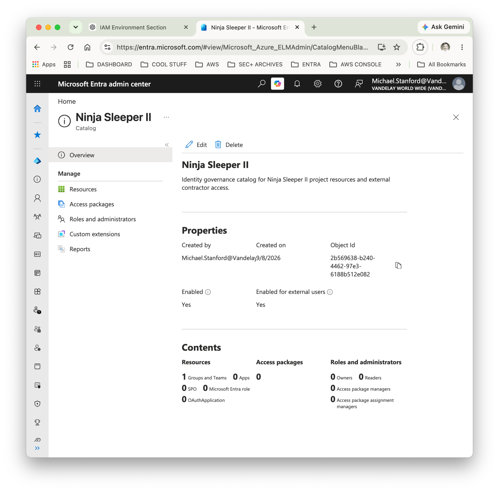
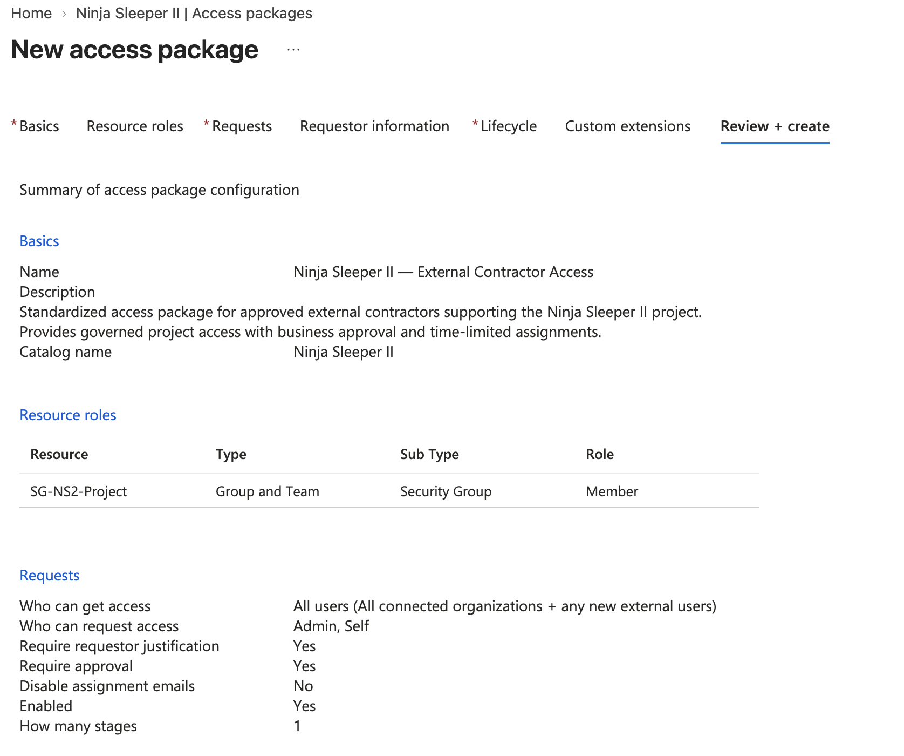
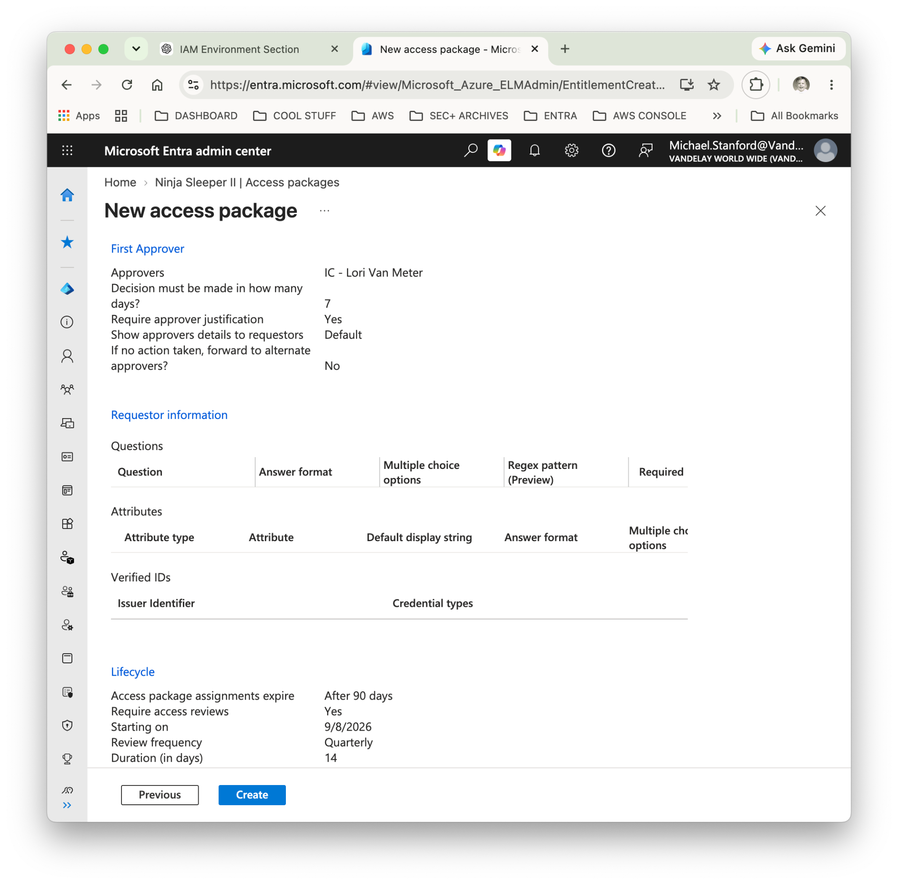
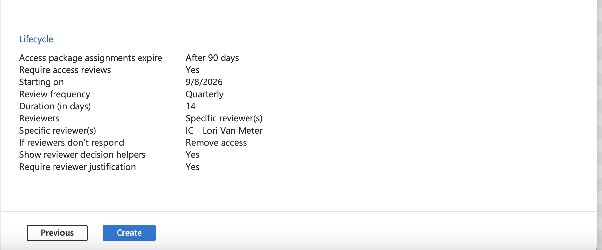
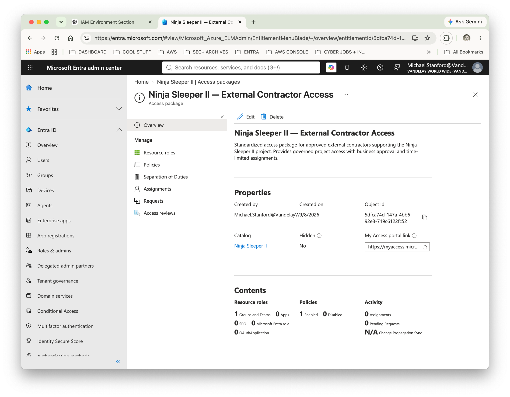
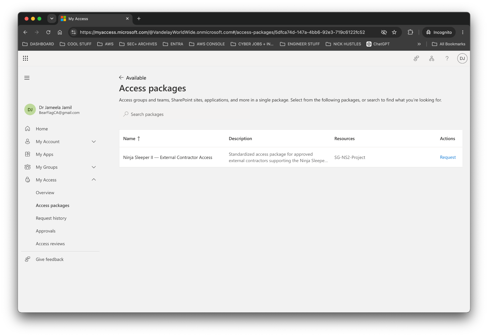

# Lab 13 — Entitlement Management & Access Packages

**Vandelay Health** is a fictional healthcare technology company headquartered in Santa Monica, California and the company behind the **Ninja Sleeper** — an ultra-light, compact and virtually noiseless CPAP system designed for travelers who need to sleep comfortably in flight without disturbing fellow passengers.

The technology behind the Ninja Sleeper began as a **federal government contract project**, developed to provide military personnel in the field with a quiet and highly portable sleep-apnea solution. Vandelay Health later adapted the technology for the commercial market, incorporating as much of the original proprietary intellectual property as possible into the consumer Ninja Sleeper platform.

## Business Scenario

Vandelay Health is expanding development of the **Ninja Sleeper II** and expects to engage additional external specialists during the project.

In Lab 12, access for external consultant **Dr. Jameela Jamil** was governed individually through Microsoft Entra B2B, group-based authorization, and recurring access reviews. While appropriate for an individual engagement, manually configuring each future contractor would create an inconsistent and difficult-to-scale access process.

IAM was therefore asked to create a standardized contractor-access model that could be reused for future Ninja Sleeper II engagements.

## IAM Requirements

The solution needed to:

- Provide a standardized method for requesting Ninja Sleeper II project access.
- Limit project authorization to the existing **SG-NS2-Project** security group.
- Allow external users to request access.
- Require a business justification from the requester.
- Require approval from the designated business owner.
- Automatically expire contractor access after a defined period.
- Require recurring access certification.
- Remove access when reviewers fail to certify continued business need.

## Implementation

### 1. Identity Governance Catalog

A dedicated **Ninja Sleeper II** catalog was created in Microsoft Entra Entitlement Management to organize resources and access packages associated with the project.

The existing **SG-NS2-Project** security group was added to the catalog as a governed resource.

### 2. Contractor Access Package

The **Ninja Sleeper II — External Contractor Access** package was created to provide a reusable entitlement for approved external specialists.

Membership in **SG-NS2-Project** was configured as the resource role granted through the package.

The request policy allows external users to request their own access while requiring both a business justification and approval.

### 3. Business Approval

**Lori Van Meter**, the Ninja Sleeper II business sponsor, was configured as the first-stage approver.

Approval decisions must be completed within seven days, and approvers are required to provide justification for their decision.

### 4. Time-Bound Access and Certification

Assignments granted through the access package automatically expire after **90 days**.

Quarterly access reviews were also configured with Lori Van Meter as the designated reviewer. Reviewers must justify their decisions, and the policy is configured to **remove access if the reviewer does not respond**.

### 5. Access Package Deployment

The completed access package was deployed with one governed resource and one enabled policy.

This creates a reusable access model rather than requiring IAM to manually construct authorization for each external contractor.

## Validation

The access package was validated from the perspective of **Dr. Jameela Jamil**, an existing external guest identity.

From the Microsoft My Access portal, Jameela was able to discover **Ninja Sleeper II — External Contractor Access**, view the associated **SG-NS2-Project** resource, and initiate an access request.

The request successfully entered the configured approval workflow and reached **Pending approval**, demonstrating that external users can request the entitlement while access remains subject to business approval.

> The approval itself was not completed during this lab. Validation ended after confirming that the external request successfully entered the configured approval workflow.

## IAM Controls Demonstrated

- Microsoft Entra Entitlement Management
- Identity Governance catalogs
- Access packages
- Group-based authorization
- External identity governance
- Self-service access requests
- Business justification
- Approval workflows
- Time-bound assignments
- Recurring access reviews
- Automated access removal
- Least-privilege access
- Separation of IAM administration from business approval

## Key Takeaway

Lab 12 demonstrated how Vandelay Health could govern access for one external consultant.

Lab 13 extends that model into a **repeatable identity-governance process**.

Instead of manually granting each contractor access to Ninja Sleeper II resources, IAM defines the entitlement once: what access is provided, who may request it, who must approve it, how long it lasts, and how continued access is certified.

This shifts contractor access from individual administration toward **policy-driven access governance**.
