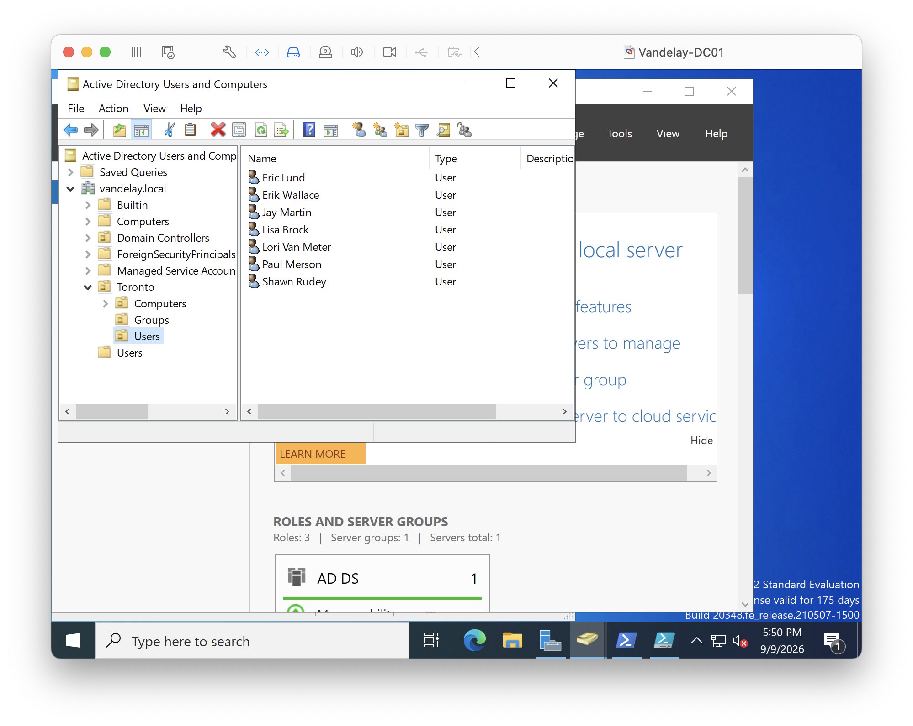
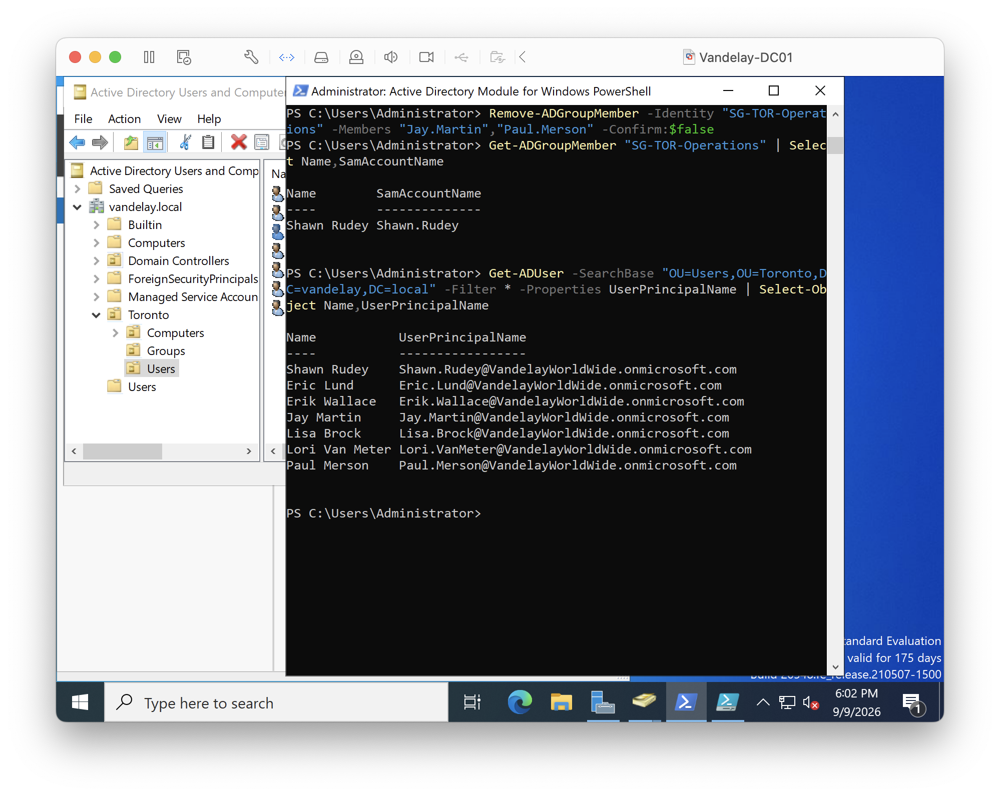
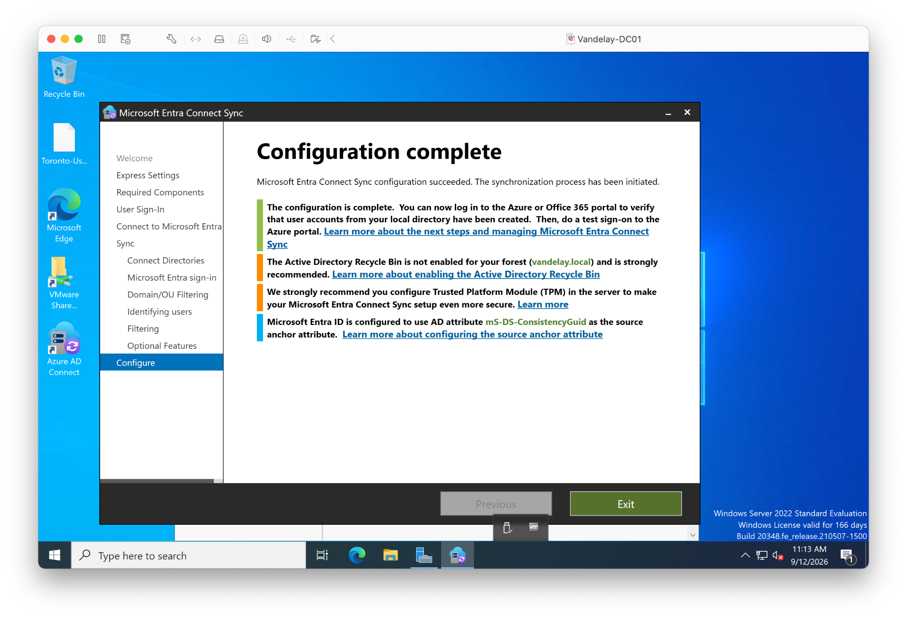
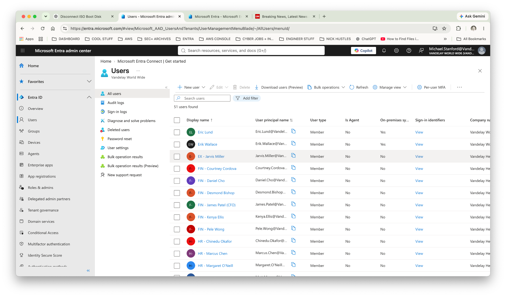
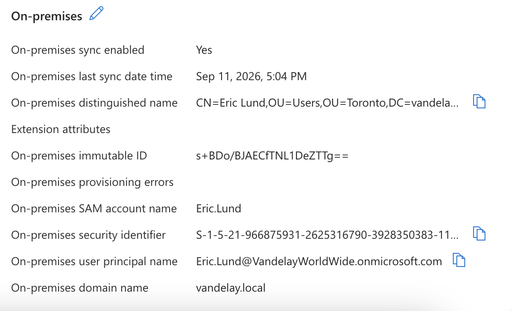
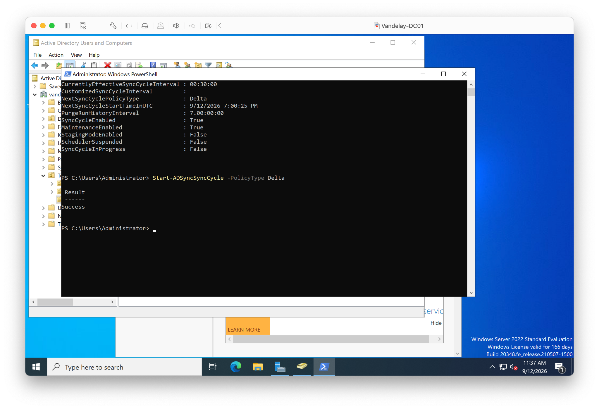

# Lab 14 — Hybrid Identity with Microsoft Entra Connect Sync

## Project Overview

Vandelay Health uses both on-premises Active Directory and Microsoft Entra ID. This lab connects the two environments using **Microsoft Entra Connect Sync** so selected Active Directory identities can synchronize to Entra ID.

The goal was to establish a working hybrid identity path:

**Active Directory (`vandelay.local`) → Microsoft Entra Connect Sync → Microsoft Entra ID**

---

## Business Scenario

The Toronto Innovation Center already had users in the `vandelay.local` Active Directory domain.

Vandelay needed those identities to participate in its Microsoft Entra environment without maintaining completely separate accounts.

The work included:

- Preparing Toronto Active Directory users for synchronization.
- Validating user principal names.
- Installing and configuring Microsoft Entra Connect Sync.
- Enabling Password Hash Synchronization.
- Verifying synchronized identities in Microsoft Entra ID.
- Validating synchronization details.
- Running and confirming a manual delta synchronization.

---

## 1. Validate the Existing Toronto Identities

The Toronto Active Directory users were reviewed before synchronization.



This established the on-premises identities that would be used for the hybrid identity test.

---

## 2. Validate User Principal Names

PowerShell was used to confirm that the Toronto users had UPNs aligned with the Vandelay Microsoft Entra tenant.



This reduced the chance of mismatched identities during synchronization.

---

## 3. Configure Microsoft Entra Connect Sync

Microsoft Entra Connect Sync was installed on `Vandelay-DC01` and configured to connect `vandelay.local` with the Vandelay Microsoft Entra tenant.

Password Hash Synchronization was enabled.



The configuration completed successfully and synchronization was initiated.

---

## 4. Validate Synchronized Users in Microsoft Entra ID

After synchronization, the Microsoft Entra admin center showed synchronized users with **On-premises sync = Yes**.



This confirmed that the cloud identities were now linked to the on-premises Active Directory environment.

---

## 5. Validate the Hybrid Identity Relationship

Eric Lund was used as the primary validation identity.

Microsoft Entra showed:

- **On-premises sync enabled:** Yes
- **On-premises distinguished name:** populated
- **On-premises SAM account name:** `Eric.Lund`
- **On-premises domain name:** `vandelay.local`
- **On-premises immutable ID:** populated
- **On-premises security identifier:** populated



This provided direct evidence that Eric's Microsoft Entra identity was synchronized from Vandelay's on-premises Active Directory.

---

## 6. Run a Manual Delta Synchronization

A manual delta synchronization was started with PowerShell:

```powershell
Start-ADSyncSyncCycle -PolicyType Delta
```

The command returned:

```text
Result
------
Success
```



This confirmed that the synchronization engine was operational and could process changes without waiting for the next scheduled cycle.

---

## Result

Vandelay successfully established a working hybrid identity connection between Active Directory and Microsoft Entra ID.

The completed workflow was:

**Prepare identities → configure Entra Connect → synchronize → validate in Entra → confirm hybrid attributes → run delta sync**

---

## What I Practiced

- Active Directory identity administration
- Microsoft Entra ID
- Microsoft Entra Connect Sync
- Hybrid identity
- Password Hash Synchronization
- UPN validation
- PowerShell
- Delta synchronization
- Post-change validation
- Troubleshooting DNS and synchronization issues

---

*Vandelay Health and the business scenario in this project are fictional and were created for hands-on IAM training.*
