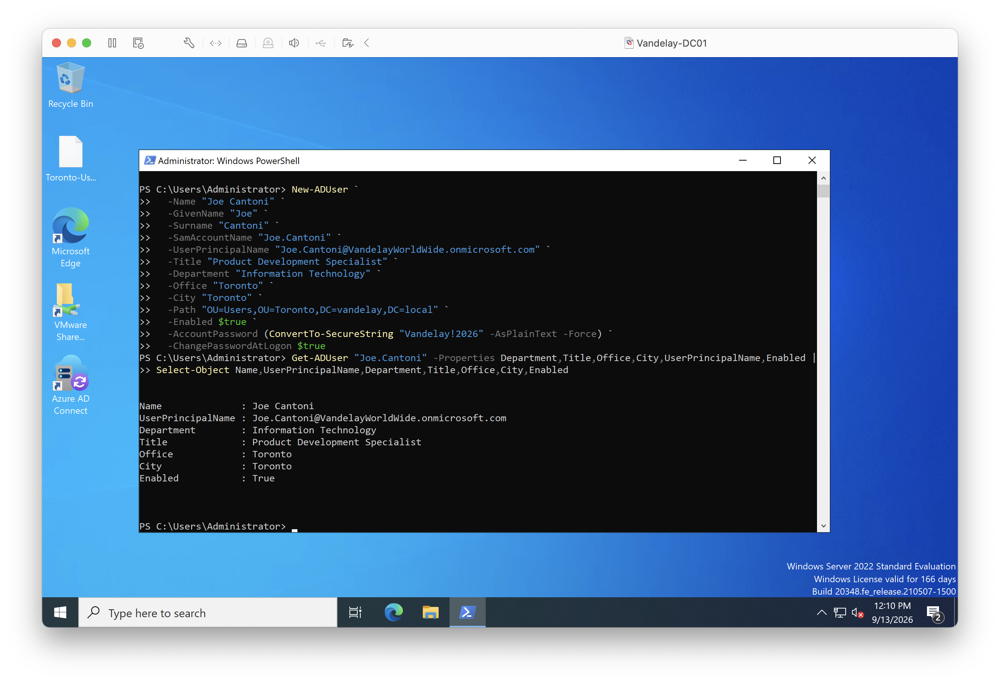
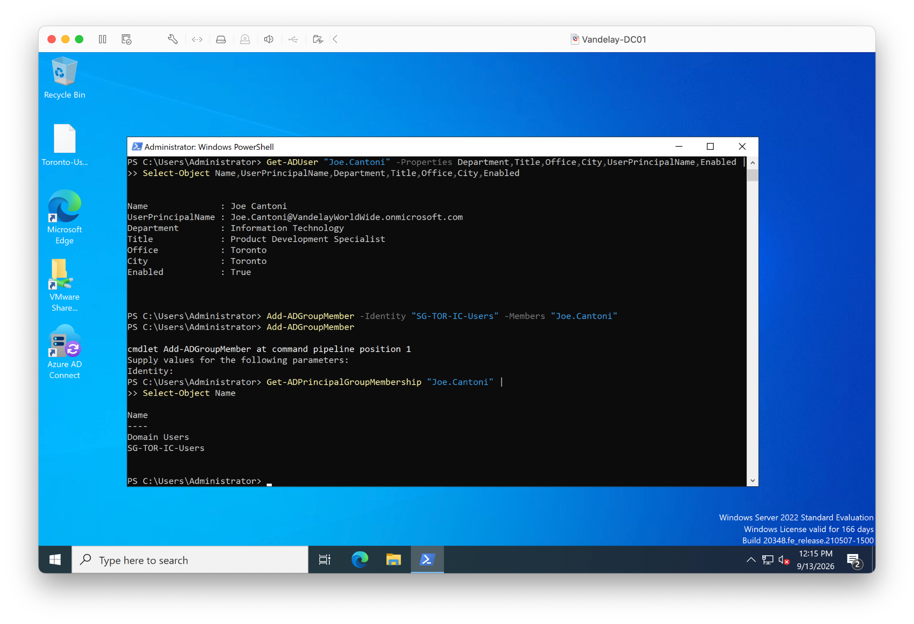
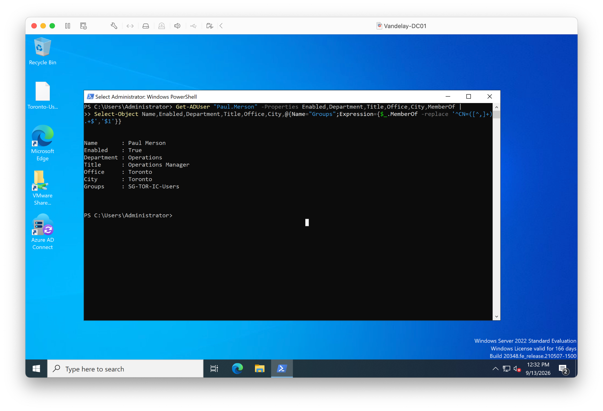
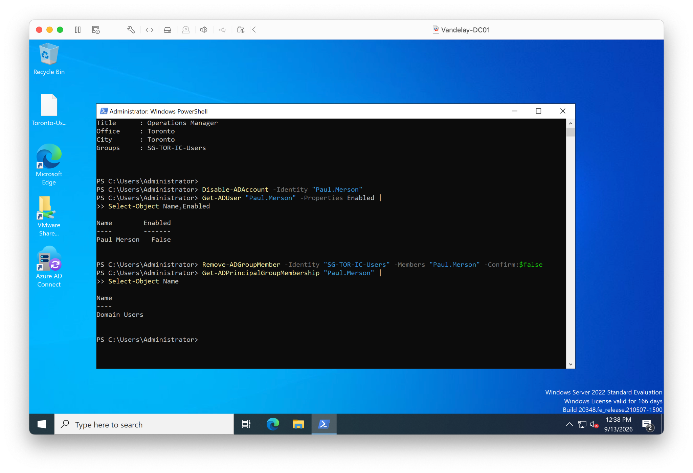

# Lab 15 — Ticket-Driven Identity Lifecycle Operations

## Overview

This lab simulates two HR-driven identity lifecycle tickets at Vandelay Health: onboarding a new employee and terminating access for a departing employee.

The work is performed across on-premises Active Directory and Microsoft Entra ID using the hybrid identity environment established in Lab 14.

---

## Ticket 1 — New Hire Onboarding

**Employee:** Joe Cantoni  
**Location:** Toronto, Ontario  
**Department:** Innovation Center  
**Request:** Provision a corporate identity and standard IC access.

Before creating the account, I reviewed an existing Toronto IC user to confirm the appropriate organizational unit, identity attributes, and standard security-group access.

I then:

- Created Joe Cantoni in Active Directory.
- Configured his UPN and employee attributes.
- Placed the account in the Toronto Users OU.
- Assigned the standard `SG-TOR-IC-Users` security group.
- Validated the account and group membership.
- Ran an Entra Connect delta synchronization.
- Confirmed that Joe appeared in Microsoft Entra ID.

### Validation

The new Active Directory account was validated before access was assigned.

Joe's membership in `SG-TOR-IC-Users` confirmed that the approved IC access had been assigned.

After synchronization, Joe's identity was confirmed in Microsoft Entra ID.

### Resolution

Joe Cantoni's Active Directory identity and standard Toronto IC access were provisioned and validated. The account successfully synchronized to Microsoft Entra ID.

**Ticket status: Closed**

---

## Ticket 2 — Employee Termination

**Employee:** Paul Merson  
**Role:** Operations Manager  
**Location:** Toronto, Ontario  
**Request:** Terminate corporate access immediately.

Paul Merson accepted a position with Newman GmbH, a competitor of Vandelay Health, and is leaving the company subject to his existing non-compete obligations.

HR authorized the termination of his Vandelay access. IAM's responsibility was to execute and validate the access changes; employment and non-compete matters remain with HR and Legal.

Before making changes, I reviewed Paul's account to confirm that it was enabled and identify his existing access.

I then:

- Disabled Paul's Active Directory account.
- Removed his `SG-TOR-IC-Users` group membership.
- Validated that the account was disabled and the IC access had been removed.
- Ran an Entra Connect delta synchronization.
- Confirmed that Paul's account was disabled in Microsoft Entra ID.

### Validation

The pre-termination review confirmed that Paul's account was enabled and had IC group access.

The account was disabled and the assigned IC security-group access was removed.

After synchronization, Microsoft Entra ID showed Paul's account as disabled.

### Resolution

Paul Merson's Active Directory account was disabled, his assigned IC access was removed, and the resulting account state was validated in Microsoft Entra ID.

The identity was retained rather than deleted.

**Ticket status: Closed**

---

## What I Practiced

- Joiner and leaver identity lifecycle operations
- Active Directory user administration
- Security-group access management
- PowerShell identity administration
- Entra Connect delta synchronization
- Microsoft Entra ID validation
- HR-driven IAM ticket handling
- Post-change verification

---

## Environment

- Windows Server Active Directory
- Microsoft Entra ID
- Microsoft Entra Connect
- PowerShell

---

*Vandelay Health, Newman GmbH, and the scenarios in this project are fictional and were created for hands-on IAM training.*
