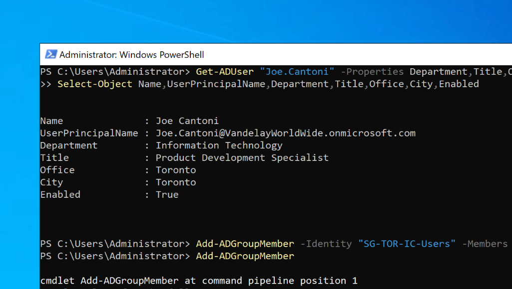
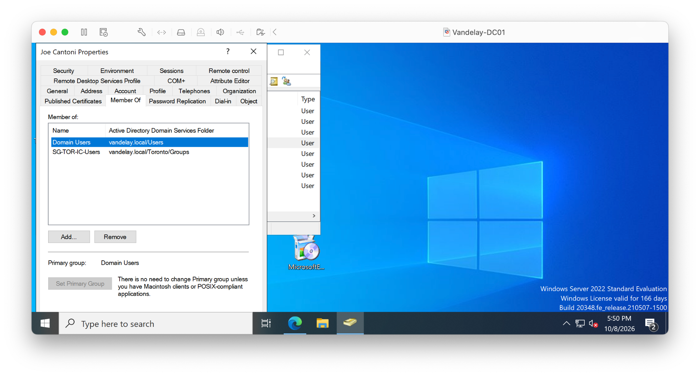
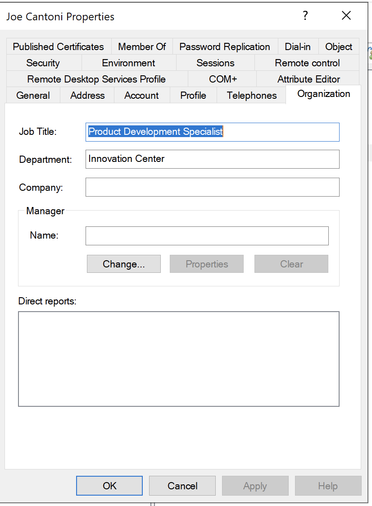
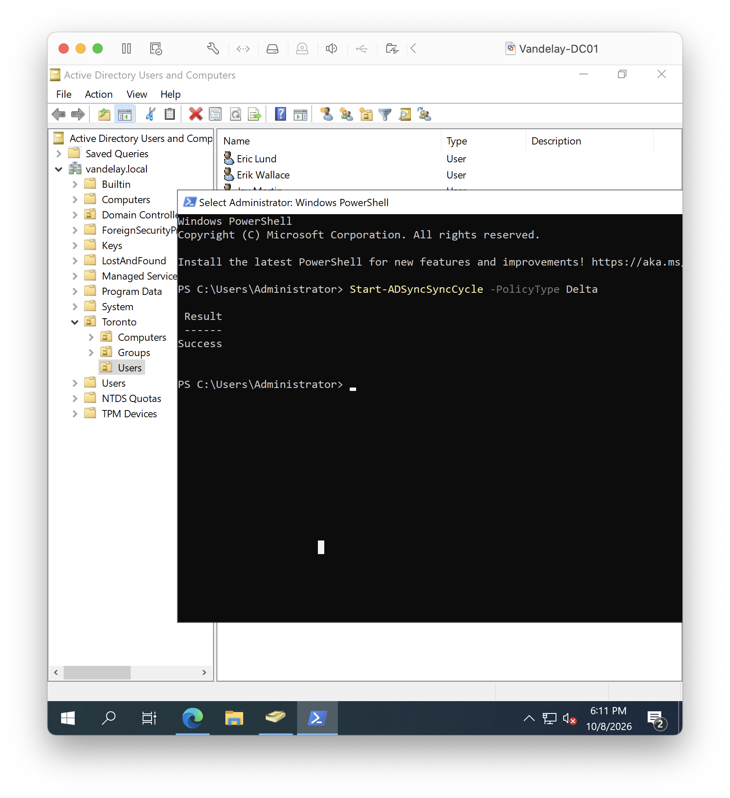
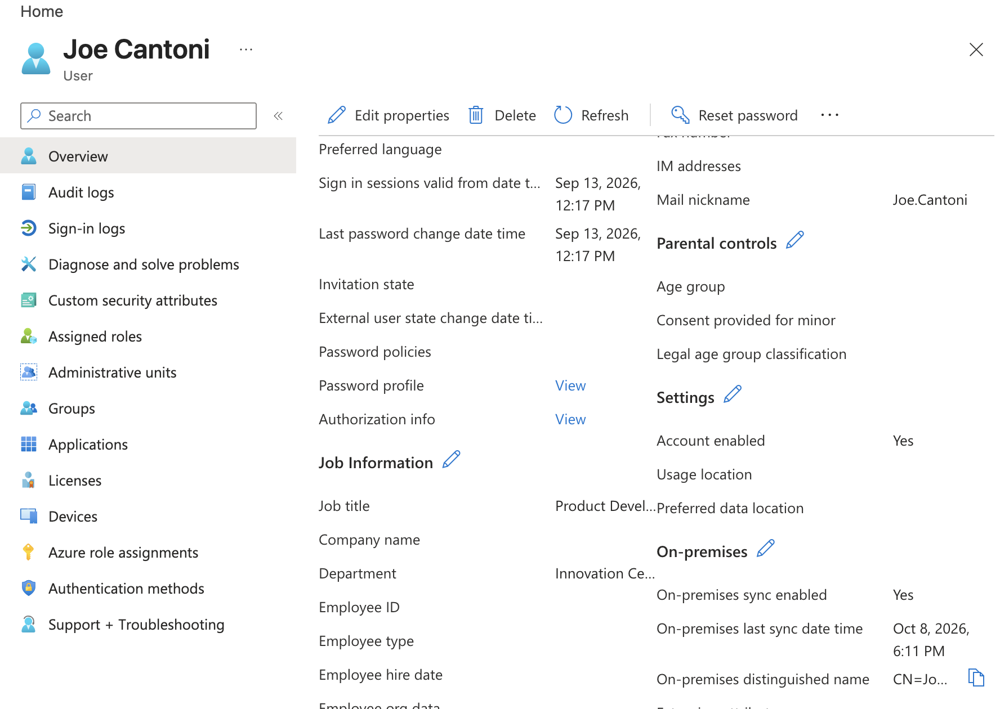
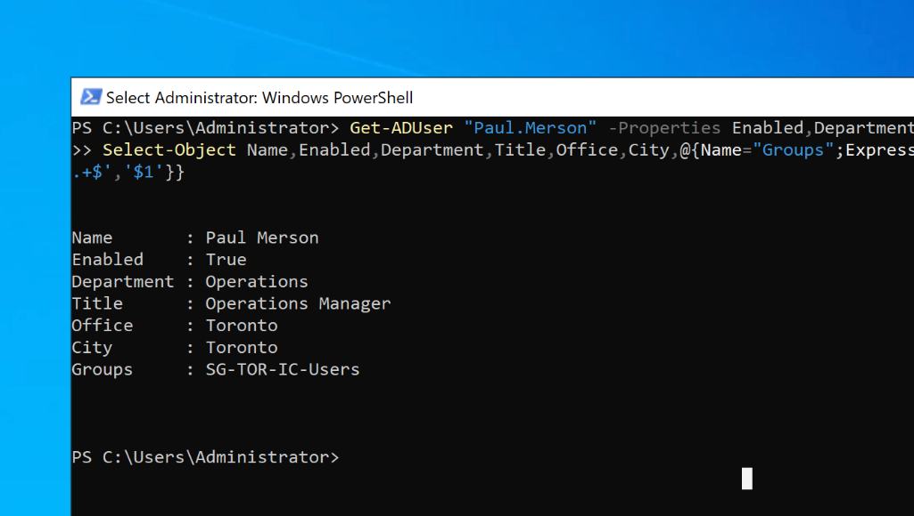
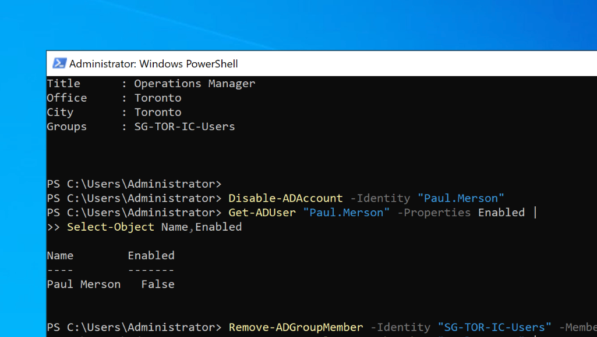
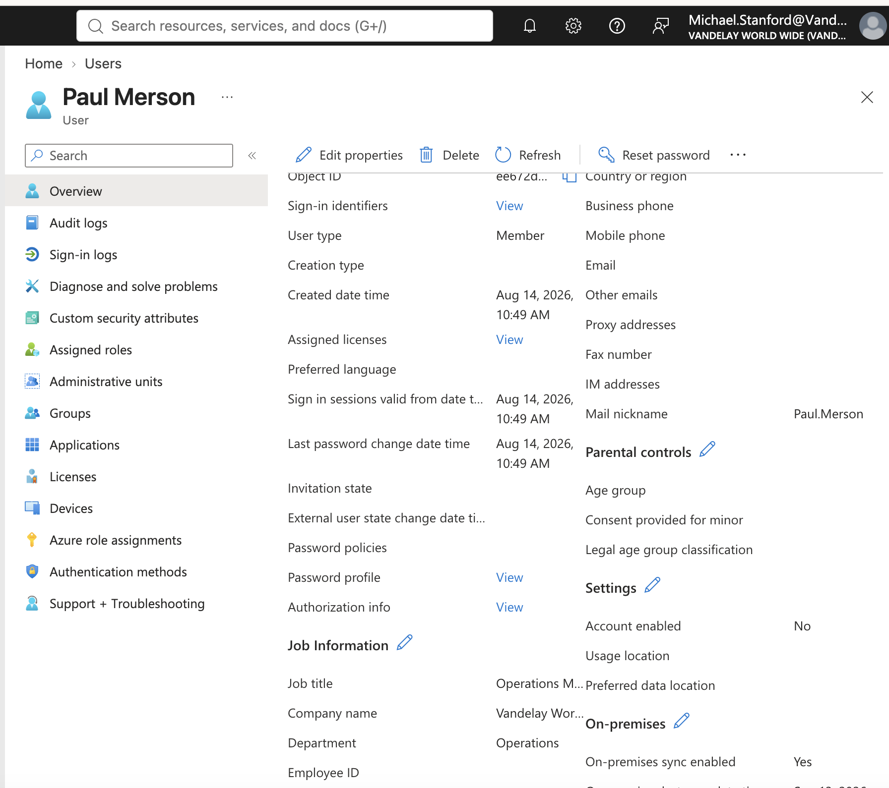

# Lab 15 — Ticket-Driven Identity Lifecycle Operations

**Vandelay Health** is a fictional healthcare technology company headquartered in Santa Monica, California and the company behind the **Ninja Sleeper** — an ultra-light, compact and virtually noiseless CPAP system designed for travelers who need to sleep comfortably in flight without disturbing fellow passengers.

The technology behind the Ninja Sleeper began as a **federal government contract project**, developed to provide military personnel in the field with a quiet and highly portable sleep-apnea solution. Vandelay Health later adapted the technology for the commercial market, incorporating as much of the original proprietary intellectual property as possible into the consumer Ninja Sleeper platform.

---

## Overview

This lab simulates two HR-driven identity lifecycle tickets: onboarding Joe Cantoni and terminating Paul Merson's access across **Active Directory (AD)** and **Microsoft Entra ID**, using the hybrid environment established in Lab 14.

The original account-administration evidence is supplemented by follow-up validation captured on **October 8, 2026**. During that review, Joe's department attribute was corrected from Information Technology to Innovation Center and the updated value was verified in Entra ID.

---

## Ticket 1 — New Hire Onboarding

**Employee:** Joe Cantoni  
**Location:** Toronto, Ontario  
**Department:** Innovation Center  
**Request:** Provision a corporate identity and standard IC access.

I reviewed an existing Toronto IC user to identify the organizational unit (OU), identity attributes, and standard security-group access. I created Joe's AD identity in the Toronto Users OU and assigned `SG-TOR-IC-Users`.

### Validation

The original PowerShell output shows Joe's AD account enabled and its Toronto attributes. It also shows the initial Information Technology department value, which was corrected during the follow-up review.

The October 8 Member Of view confirms membership in `SG-TOR-IC-Users` and Domain Users.

The saved AD properties show **Innovation Center** as Joe's department.

`Start-ADSyncSyncCycle -PolicyType Delta` returned `Success`, confirming that the synchronization request was accepted. The cloud validation below establishes that the updated attribute reached Entra ID.

Joe's Entra properties show **Account enabled: Yes**, **On-premises sync enabled: Yes**, a department displayed as **Innovation Ce…**, and a last synchronization time of October 8, 2026 at 6:11 PM.

### Resolution

Joe's enabled AD identity, assigned IC group membership, corrected department attribute, and synchronized Entra identity are supported by the captured evidence.

**Simulated ticket status: Closed after follow-up validation.**

---

## Ticket 2 — Employee Termination

**Employee:** Paul Merson  
**Role:** Operations Manager  
**Location:** Toronto, Ontario  
**Request:** Terminate corporate access immediately.

In the fictional scenario, HR requested termination of Paul's Vandelay access after he accepted a position with Newman GmbH. Employment and non-compete matters remain with HR and Legal.

I reviewed Paul's existing access, disabled his AD account, and removed his `SG-TOR-IC-Users` membership. I retained the identity rather than deleting it.

### Validation

The original pre-termination output shows Paul's account enabled and membership in `SG-TOR-IC-Users`.

The subsequent output confirms `Enabled = False` and shows the group-removal command.

The October 8 Member Of view shows Domain Users and confirms that `SG-TOR-IC-Users` is absent.

Paul's named Entra properties show **Account enabled: No** and **On-premises sync enabled: Yes**.

### Resolution

Paul's AD account disablement, removal of the specified IC group membership, and disabled Entra account state are supported by the captured evidence.

**Simulated ticket status: Closed after follow-up validation.**

---

## Evidence Scope

The October 8 screenshots validate the account states at the time of review. They do not establish the original ticket completion time, compliance with a termination service-level agreement (SLA), or removal of every possible application entitlement.

The account-creation screenshot containing a plaintext lab password was removed from the current publication. Original screenshots with incomplete results remain in the repository for context; the validation above uses the images that establish each stated outcome.

---

## What I Practiced

- Joiner and leaver identity lifecycle operations
- Active Directory user and security-group administration
- PowerShell identity administration
- Identity attribute correction
- Microsoft Entra Connect delta synchronization
- Microsoft Entra ID account-state validation
- HR-driven IAM ticket handling and post-change verification

---

## Environment

- Windows Server Active Directory
- Microsoft Entra ID
- Microsoft Entra Connect
- PowerShell

---

*Vandelay Health, Newman GmbH, and the scenarios in this project are fictional and were created for hands-on IAM training.*
