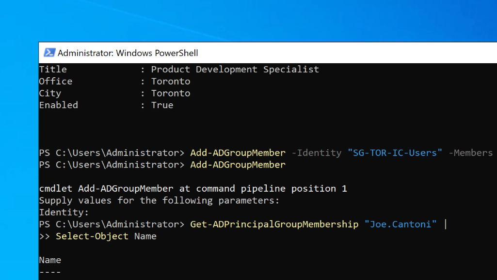
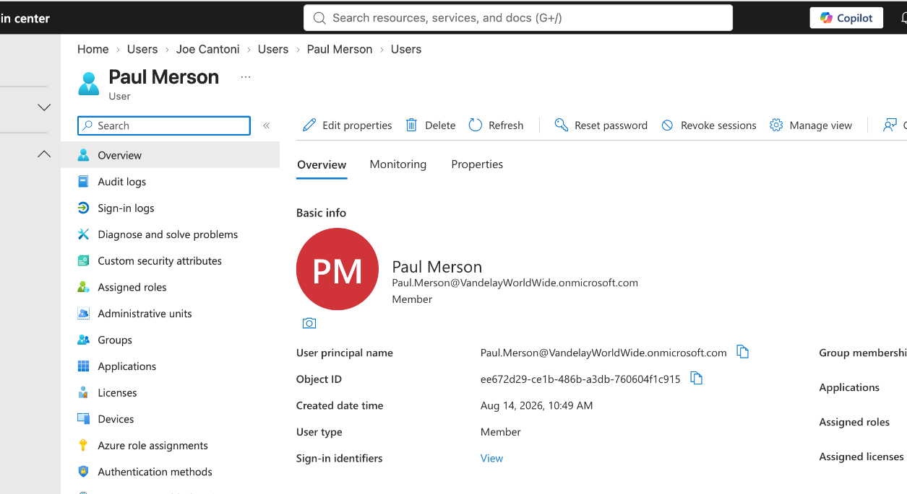

# Lab 15 — Ticket-Driven Identity Lifecycle Operations

**Vandelay Health** is a fictional healthcare technology company headquartered in Santa Monica, California and the company behind the **Ninja Sleeper** — an ultra-light, compact and virtually noiseless CPAP system designed for travelers who need to sleep comfortably in flight without disturbing fellow passengers.

The technology behind the Ninja Sleeper began as a **federal government contract project**, developed to provide military personnel in the field with a quiet and highly portable sleep-apnea solution. Vandelay Health later adapted the technology for the commercial market, incorporating as much of the original proprietary intellectual property as possible into the consumer Ninja Sleeper platform.

---

## Overview

In this lab, I worked two HR-driven identity lifecycle tickets for Vandelay Health: onboarding a new employee and terminating access for a departing employee.

The retained screenshots demonstrate account administration in **Active Directory (AD)**. The intended hybrid workflow also includes group changes, **Microsoft Entra Connect** synchronization, and **Microsoft Entra ID** validation; the screenshots below distinguish visible results from steps still requiring supporting evidence.

This uses the hybrid identity environment I established in Lab 14.

---

## Ticket 1 — New Hire Onboarding

**Employee:** Joe Cantoni  
**Location:** Toronto, Ontario  
**Requested department/access:** Innovation Center  
**Request:** Provision a corporate identity and standard IC access.

Before creating Joe's account, I reviewed an existing Toronto Innovation Center user to confirm the correct **OU, identity attributes, and standard security-group access** for his role.

### Documented actions

- Created Joe's account in **Active Directory**.
- Configured his UPN and employee attributes.
- Placed his account in the Toronto Users OU.
- Entered a group-assignment command for `SG-TOR-IC-Users` and queried group membership.

### Remaining validation

- Capture the completed group-membership results.
- Reconcile the requested Innovation Center department with the account's visible `Information Technology` department attribute.
- Capture synchronization results and Joe's corresponding Entra identity.

### Validation

The account-creation command screenshot has been removed from the current publication because it included a plaintext lab password. The account-validation screenshot below retains evidence of the resulting identity.

The output shows Joe Cantoni's account enabled (`Enabled = True`), with Toronto location attributes. The department is `Information Technology`. A group-assignment command is visible, but completed membership validation is not shown.

The image shows `Get-ADPrincipalGroupMembership` and a result heading, but the group names are outside the captured area. Despite the legacy filename, this image does not show a synchronization result.

### Resolution

Joe Cantoni's enabled Active Directory identity is demonstrated. Final group membership and cloud synchronization outcomes are not established by the retained screenshots.

**Documentation status: Account validation captured; remaining outcomes pending evidence.**

---

## Ticket 2 — Employee Termination

**Employee:** Paul Merson  
**Role:** Operations Manager  
**Location:** Toronto, Ontario  
**Request:** Terminate corporate access immediately.

Paul Merson accepted a position with Newman GmbH, a competitor of Vandelay Health, and is leaving the company subject to his existing non-compete obligations.

HR authorized the termination of his Vandelay access. IAM's responsibility was to execute and validate the access changes; employment and non-compete matters remain with HR and Legal.

Before making changes, I reviewed Paul's account to confirm that it was enabled and identify his existing access.

I then:

- Disabled Paul's Active Directory account.
- Queried and confirmed the disabled Active Directory account state.
- Entered a command to remove `SG-TOR-IC-Users` membership.

Completed group-removal validation, synchronization results, and explicit Entra account-status evidence remain to be captured.

### Validation

The pre-termination review confirmed that Paul's account was enabled and had IC group access.

The output confirms `Enabled = False` for Paul Merson. A group-removal command is visible, but this image does not show the resulting membership.

This overview identifies Paul's Entra account. The visible fields do not establish its enabled/disabled state; the legacy filename is not evidence of disablement.

### Resolution

Paul Merson's Active Directory account disablement is demonstrated by before-and-after output. Final entitlement removal and cloud account disablement require additional evidence.

The identity was retained rather than deleted.

**Documentation status: Active Directory disablement validated; remaining outcomes pending evidence.**

---

## What I Practiced

- Joiner and leaver identity lifecycle operations
- Active Directory user administration
- Security-group access management
- PowerShell identity administration
- Hybrid synchronization and cloud-validation workflow requirements
- HR-driven IAM ticket handling
- Post-change verification

---

## Environment

- Windows Server Active Directory
- Microsoft Entra ID
- Microsoft Entra Connect
- PowerShell

---

*Vandelay Health, Newman GmbH, and the scenarios in this project are fictional and were created for hands-on IAM training.*
