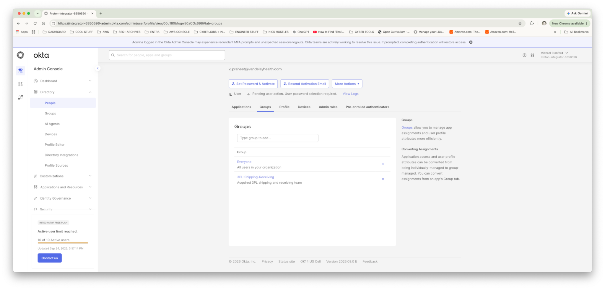
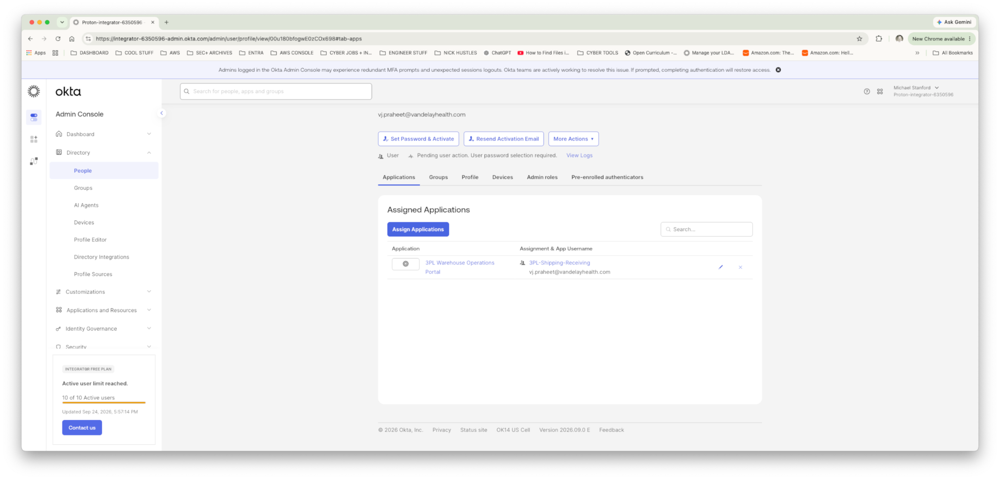
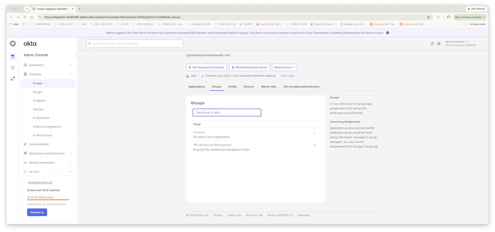
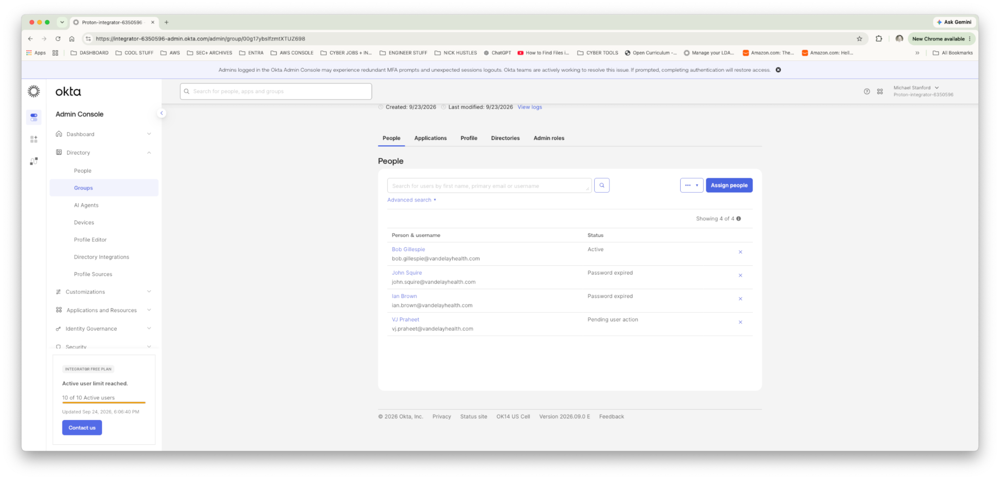
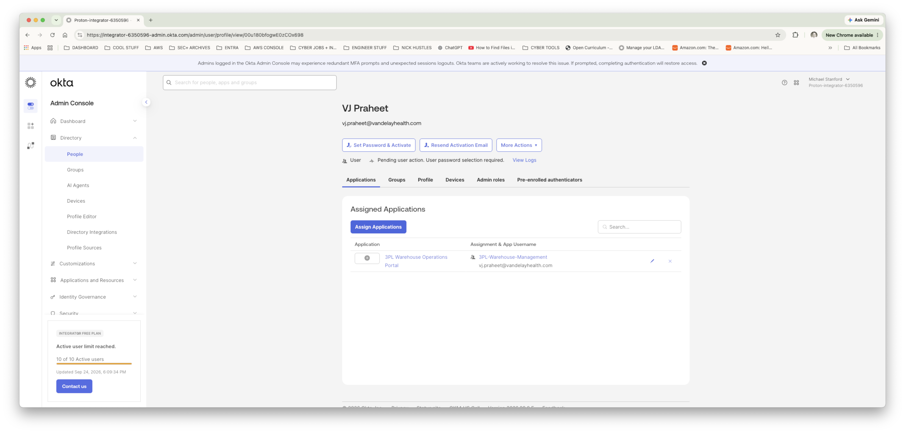
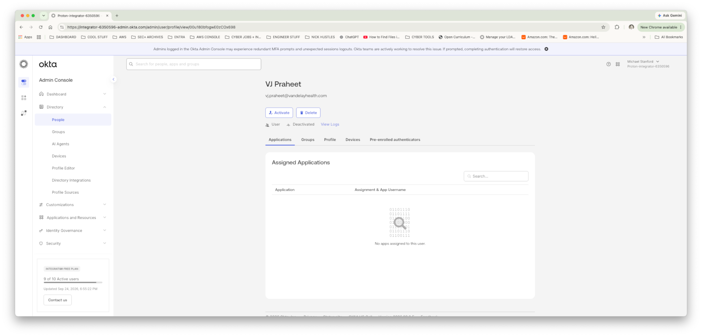

# Vandelay Health — Lab 19: Okta Identity Lifecycle Management — Joiner, Mover & Leaver

## Project Overview

Vandelay Health is a fictional healthcare technology company whose flagship product, the Ninja Sleeper, originated from a federal government contract requiring a silent sleeping solution for military personnel operating in the field. Vandelay Health subsequently adapted the technology for commercial use while retaining as much of the original proprietary design and intellectual property as possible.

Following Vandelay Health's acquisition of its third-party logistics provider (3PL), the IAM team must manage workforce identity lifecycle events in the inherited Okta environment. This lab extends the Okta foundation established in Lab 18 by demonstrating Joiner, Mover, and Leaver (JML) administration using business-role groups and group-based application access.

---

## Business Scenario

VJ Praheet joins the acquired 3PL in Shipping & Receiving. During his time with the organization, VJ transfers into Warehouse Management to become executive assistant to Warehouse Manager Bob Gillespie. VJ later resigns in good standing after receiving a once-in-a-lifetime opportunity to train at the Bagpipe Institute in Charlottetown, Prince Edward Island.

The IAM team must ensure that access follows each business lifecycle event:

- Provision the new workforce identity.
- Grant access through the appropriate business-role group.
- Validate inherited application access.
- Update group membership when the employee changes roles.
- Confirm application access follows the new role rather than relying on direct assignment.
- Deactivate the identity at separation and verify application access is removed.
- Retain the deactivated identity rather than deleting it, preserving the possibility of future rehire.

---

## Environment

- Okta Workforce Identity
- Okta Integrator Free Plan
- Okta Universal Directory
- Okta Groups
- Group-based application assignment
- 3PL Warehouse Operations Portal

---

## Joiner — VJ Praheet

A new Okta workforce identity was created for **VJ Praheet**.

VJ joined the 3PL's Shipping & Receiving team and was added to:

`3PL-Shipping-Receiving`

The 3PL Warehouse Operations Portal was already assigned to this business-role group. As a result, VJ inherited application access through group membership rather than through a direct user assignment.

The Applications view was reviewed to validate both the portal assignment and its group-based assignment source.

**Access path:**

**VJ Praheet → 3PL-Shipping-Receiving → 3PL Warehouse Operations Portal**

---

## Mover — Warehouse Management

VJ subsequently transferred from Shipping & Receiving to Warehouse Management to become executive assistant to Warehouse Manager **Bob Gillespie**.

His old role membership was removed and his new business-role membership was established through:

`3PL-Warehouse-Management`

Group membership was validated by confirming VJ and Bob Gillespie in the same Warehouse Management group.

The 3PL Warehouse Operations Portal remained available to VJ, but the assignment source changed automatically from the Shipping & Receiving group to the Warehouse Management group.

This demonstrated that access followed VJ's business role without requiring a direct application assignment.

**Updated access path:**

**VJ Praheet → 3PL-Warehouse-Management → 3PL Warehouse Operations Portal**

---

## Leaver — Voluntary Separation

VJ later resigned in good standing to pursue training at the Bagpipe Institute in Charlottetown, Prince Edward Island.

His Okta identity was **deactivated rather than deleted**.

Post-deactivation validation confirmed:

- VJ's status changed to **Deactivated**.
- No applications remained assigned to the user.
- The active-user count decreased from 10 to 9.
- The identity record remained available for potential future reactivation.

This models a clean voluntary-separation workflow while preserving identity history and the possibility of rehire.

---

## IAM Concepts Demonstrated

- Joiner, Mover, Leaver (JML) lifecycle administration
- Workforce identity provisioning
- Business-role group membership
- Group-based application assignment
- Role-change access administration
- Validation of application assignment source
- Deprovisioning through identity deactivation
- Application-access removal
- Identity retention for possible rehire
- Least-privilege and role-based access principles

---

## Evidence

### 01 — Joiner: Shipping & Receiving Group Membership

VJ added to the Shipping & Receiving business-role group.

### 02 — Joiner: Portal Access via Group

3PL Warehouse Operations Portal inherited through the Shipping & Receiving group.

### 03 — Mover: Warehouse Management Group

VJ's new Warehouse Management group membership.

### 04 — Mover: Bob and VJ in Management Group

Bob Gillespie and VJ validated in the same Warehouse Management group.

### 05 — Mover: Portal Access via Management Group

Portal assignment source updated to the Warehouse Management group.

### 06 — Leaver: Deactivation and Access Removal

VJ deactivated and application access removed.

No passwords, recovery secrets, authentication secrets, or enrollment codes are included in the repository evidence.

---

## Outcome

Vandelay Health completed a full Okta workforce identity lifecycle for VJ Praheet.

The Joiner event demonstrated provisioning and group-based application access. The Mover event demonstrated role-driven access change as VJ transferred from Shipping & Receiving into Warehouse Management. The Leaver event demonstrated identity deactivation and removal of application access while retaining the identity record for potential future rehire.

The lab demonstrates practical Okta JML administration and shows how business-role groups can keep application access aligned with workforce lifecycle changes without relying on direct per-user application assignments.
