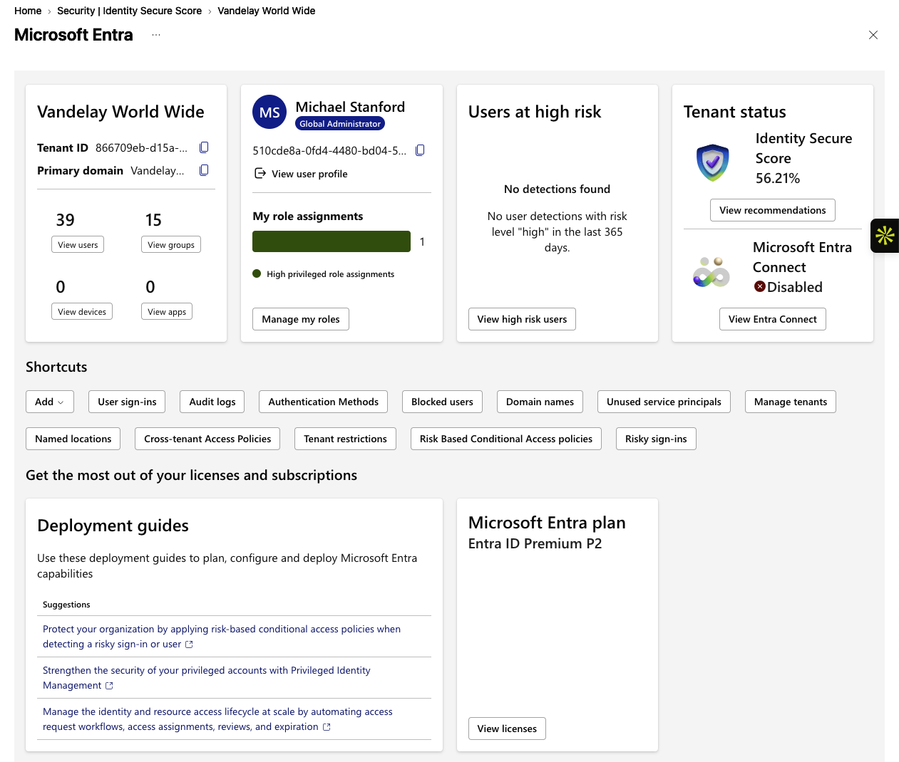
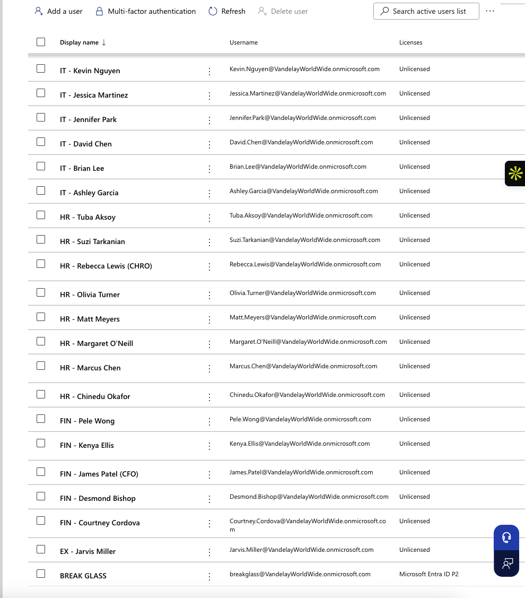
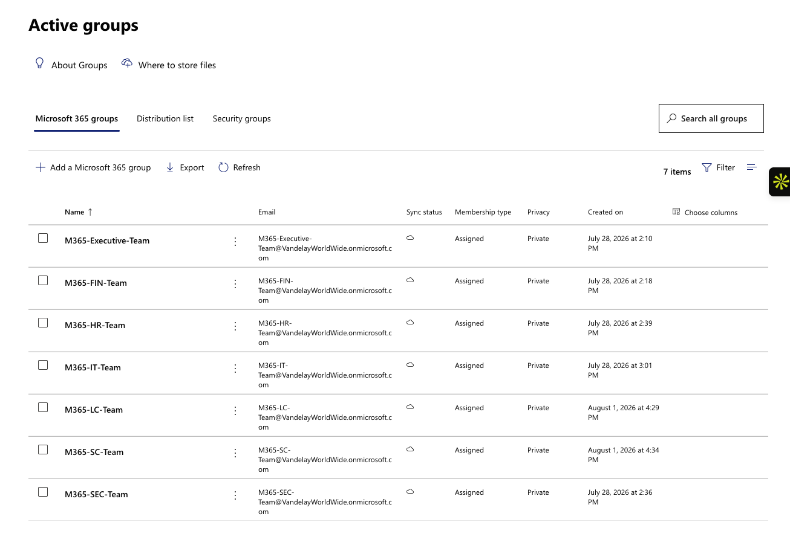
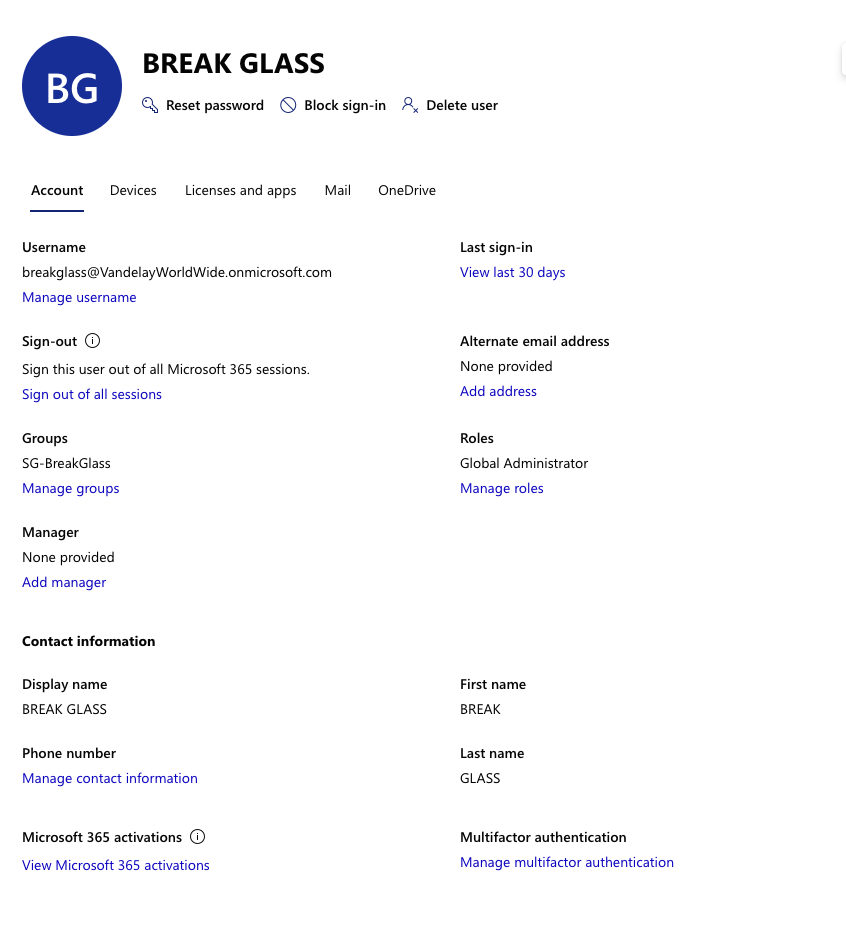

# Lab 01 — Microsoft Entra ID Tenant & Identity Foundation

## Overview

This lab establishes the baseline Microsoft Entra ID environment for the Vandelay World Wide / Vandelay Health IAM portfolio. The objective is to build and document a realistic tenant structure before introducing authentication, Conditional Access, lifecycle management, governance, and access-certification controls in later labs.

The environment includes organizational users, departmental security groups, Microsoft 365 collaboration groups, privileged administration, and a dedicated emergency access account.

## Lab Objectives

- Review the Microsoft Entra tenant and licensing baseline.
- Establish a realistic organizational identity population.
- Organize users into departmental security groups.
- Establish Microsoft 365 collaboration groups.
- Validate executive and administrative identity assignments.
- Separate normal administrative access from emergency access.
- Document the baseline environment for later IAM governance labs.

## Environment Baseline

The tenant contains 39 users and 15 groups. The administrative identity is licensed with Microsoft Entra ID P2 and holds the Global Administrator role. A separate `BREAK GLASS` identity is maintained as an emergency administrative account.

The organizational model includes executive leadership and functional teams across IT, Finance, Human Resources, Information Security, Legal/Compliance, and Supply Chain. Sarah Mitchell serves as CEO, with functional leaders reporting into the executive structure.

## Evidence

### 1. Tenant Overview

The Microsoft Entra tenant overview establishes the starting environment, administrative context, licensing, and Identity Secure Score baseline.



### 2. Identity Population

The active-user inventory demonstrates the populated workforce identity environment across multiple business functions.


### 3. User Properties

User records provide the identity attributes and organizational context that later IAM controls depend on for access decisions, lifecycle management, and governance.



### 4. Departmental Security Groups

Security groups establish a basic role- and department-oriented access model, including groups for Executive, Finance, HR, IT, Legal/Compliance, Supply Chain, Information Security, and emergency access.


### 5. Microsoft 365 Collaboration Groups

Microsoft 365 groups provide collaboration-oriented team membership separate from the security-group access structure.



### 6. Executive Identity

Sarah Mitchell's profile demonstrates an executive identity assigned to the Executive security and Microsoft 365 groups without administrative privileges.


### 7. IAM Administrative Identity

The IAM administrative profile demonstrates a privileged identity with the Global Administrator role and Microsoft Entra ID P2 licensing.


### 8. Emergency Access / Break-Glass Account

A separate `BREAK GLASS` account provides emergency Global Administrator access and is isolated in the `SG-BreakGlass` security group.



### 9. Information Security Group

The `SG-SEC-Users` group demonstrates departmental access organization for the Information Security team, including a designated group owner and six members.


## Organizational Structure

```text
Vandelay World Wide
        |
Sarah Mitchell (CEO)
        |
        +-- David Chen (CIO) -> IT
        +-- James Patel (CFO) -> Finance
        +-- Rebecca Lewis (CHRO) -> Human Resources
        +-- Emily Carter (CISO) -> Information Security
        +-- Joanne Bouchard (CLCO) -> Legal / Compliance
        +-- Arthur Fonzarelli -> Procurement & Supply Chain

Jarvis Miller — Executive Assistant (reports to CEO)
```

## IAM Concepts Demonstrated

- **Identity inventory** — establish who exists in the tenant.
- **Identity attributes** — maintain organizational context for users.
- **Group-based access** — organize access through security groups rather than individual assignments where practical.
- **Collaboration groups** — distinguish Microsoft 365 collaboration membership from security-group access.
- **Privileged access separation** — distinguish standard business identities from administrative identities.
- **Emergency access** — maintain a dedicated break-glass identity for tenant recovery.
- **Least privilege** — executive status does not automatically require administrative privileges.
- **Evidence collection** — preserve screenshots of the configured state for validation and portfolio documentation.

## Control Logic Demonstrated

**Establish tenant → populate identities → define organizational structure → create access groups → assign users → separate privileged access → establish emergency access → validate and document the baseline**

This foundation is important because later IAM controls depend on accurate identities, sensible group structures, known privileged accounts, and documented organizational relationships.

## Key Takeaway

IAM governance starts with knowing **who the identities are, where they belong, what groups provide access, and which identities hold privilege**. A clean tenant foundation makes later controls such as MFA, Conditional Access, Joiner-Mover-Leaver workflows, access reviews, and privileged identity management easier to implement and audit.

## Interview Summary

> I built a Microsoft Entra tenant to model a realistic enterprise identity environment rather than working with isolated test users. I populated functional departments, created security and Microsoft 365 groups, established executive and administrative identities, and separated emergency Global Administrator access into a dedicated break-glass account. The lab gave me a baseline for the later IAM work in the portfolio because lifecycle management and access governance depend on having accurate identities, clear organizational context, and a defined access structure first.
