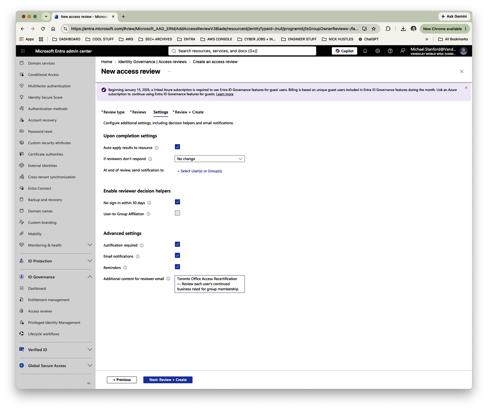
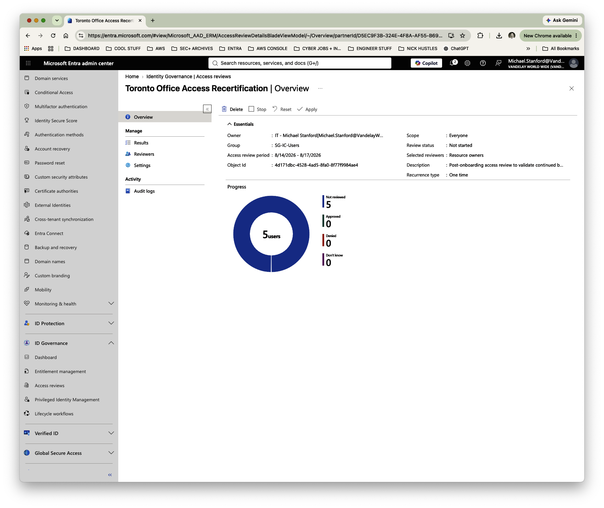
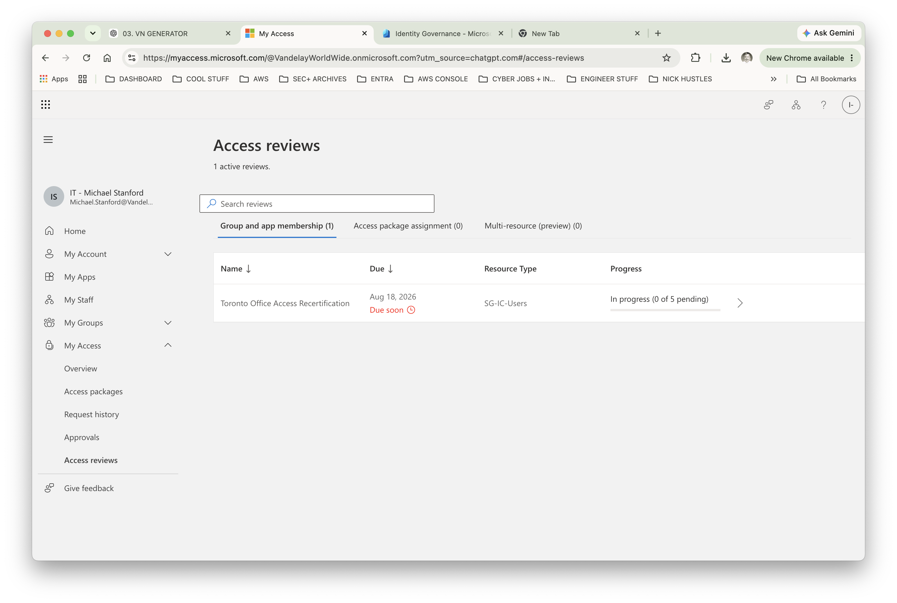
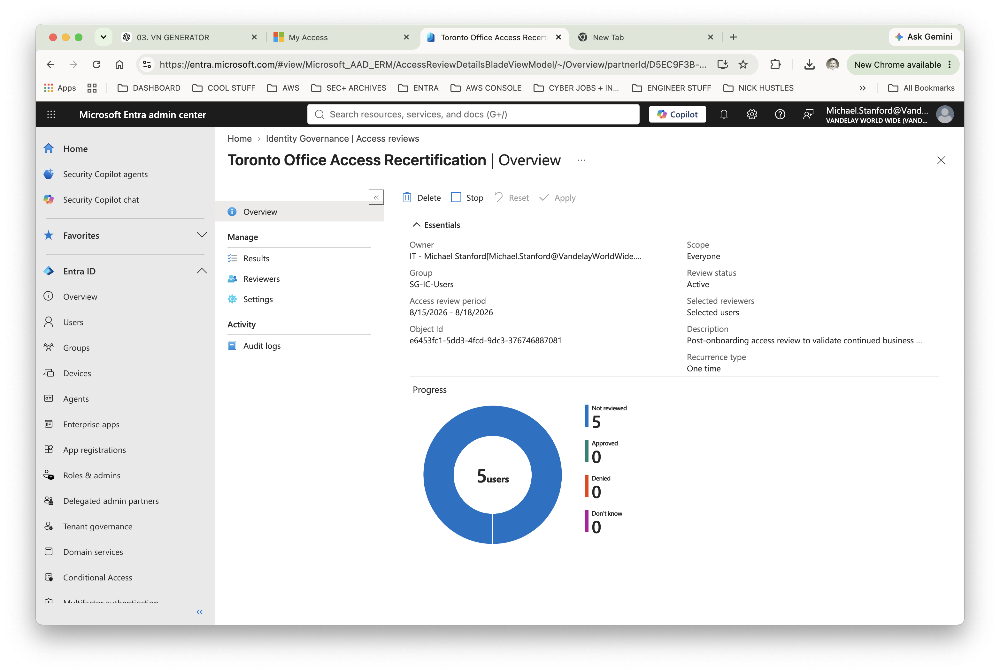
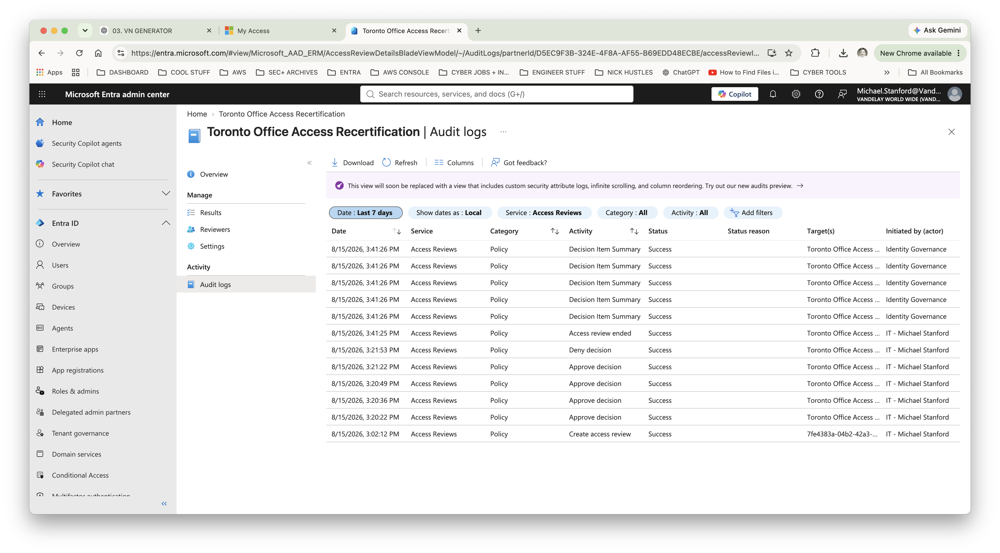
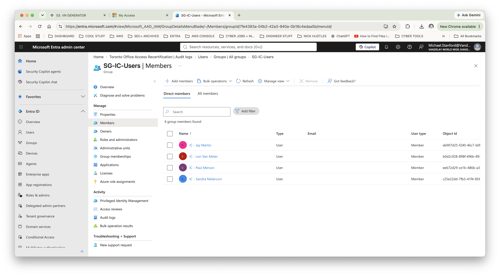

# Lab 06 — Access Review & Access Recertification

## Objective

Configure and execute a Microsoft Entra ID access review to validate continued business need for group membership, document reviewer decisions, remediate unnecessary access, and verify the resulting change.

This lab builds on the Toronto office onboarding scenario by introducing a formal access recertification process.

---

## Scenario

Following the onboarding of the Toronto office, Vandelay Worldwide performs a post-onboarding access review of the Toronto user population.

During the review, Lisa Brock is identified as being on an extended leave of absence to care for an aging family member. Her return date is undetermined.

Lisa's Vandelay identity should remain active because she has not left the organization. However, her current Toronto group access is no longer required while she is on leave.

Rather than manually removing the entitlement, the access change is processed through Microsoft Entra ID Access Reviews, providing a documented and auditable certification decision.

---

## Environment

- Microsoft Entra ID
- Microsoft Entra ID Governance
- Microsoft Entra Access Reviews
- Microsoft My Access
- Security Group: `SG-IC-Users`
- Toronto office identity population

---

## 1. Configure the Access Review

A resource-based access review was created to recertify membership in the Toronto office group.

The review was configured with the following governance controls:

- **Review scope:** All users
- **Reviewer model:** Resource owner
- **Fallback reviewer:** Configured
- **Review duration:** 3 days
- **Review recurrence:** One time
- **Auto-apply results:** Enabled
- **No reviewer response:** No change
- **30-day sign-in inactivity decision helper:** Enabled
- **Reviewer justification:** Required
- **Email notifications:** Enabled
- **Reminders:** Enabled

The review instructions directed the reviewer to evaluate each user's continued business need for group membership.

---

## 2. Establish the Initial Review State

After creation, Microsoft Entra identified five identities within the scope of the access review.

The initial certification state was:

- **5 users requiring review**
- **0 approved**
- **0 denied**
- **5 not reviewed**

This established the pre-certification state against which the completed review and remediation could later be validated.

---

## 3. Establish Reviewer Accountability

The access review was designed around resource-owner accountability, with the group owner responsible for certifying continued access.

During implementation, the target group did not have an available resource owner assigned to perform the review.

Rather than changing the governance model, a fallback reviewer was configured to prevent the certification process from stalling.

This demonstrated an important operational consideration in access governance: a control can be technically configured correctly but still fail operationally if ownership and reviewer accountability are not established.

The fallback reviewer assignment allowed the certification campaign to proceed through Microsoft My Access.

---

## 4. Review the Access Population

The five Toronto group members were presented for certification through Microsoft My Access.

Each identity was evaluated individually to determine whether continued membership in `SG-IC-Users` remained appropriate.

Microsoft Entra also provided sign-in activity information as a reviewer decision helper.

Because the identities in the lab environment did not have recent sign-in activity, Entra recommended **Deny** for the users based on inactivity.

These recommendations were treated as decision-support signals rather than automatic access decisions.

Business context remained the determining factor.

---

## 5. Make Certification Decisions

After evaluating the five identities, the following decisions were recorded:

| User | Decision |
|---|---|
| Jay Martin | Approved |
| Lisa Brock | **Denied** |
| Lori Van Meter | Approved |
| Paul Merson | Approved |
| Sandra Melancon | Approved |

The four users with an ongoing business requirement for Toronto access were approved despite the inactivity recommendation.

Lisa Brock's group access was denied because the entitlement was not required during her extended leave of absence.

Her underlying Entra identity remained intact.

This distinction is important: the governance action removed an unnecessary **entitlement**, not the employee's **identity**.

Reviewer justification was recorded as part of the certification process, providing an auditable business rationale for the decision.

---

## 6. Validate the Completed Certification

The Entra administrative view confirmed completion of all five certification decisions.

Final review results:

- **5 users reviewed**
- **4 approved**
- **1 denied**
- **0 not reviewed**
- **0 don't know**

This provided campaign-level confirmation that the entire population had been evaluated and that no outstanding certification decisions remained.

---

## 7. Review Audit Evidence

Microsoft Entra recorded access-review activity in the audit logs, providing traceability for the governance process.

The audit trail provides evidence that the certification activity occurred within the identity governance platform rather than through an undocumented manual access change.

Audit evidence is an important component of access governance because it supports:

- Accountability
- Control validation
- Compliance reviews
- Investigation of access changes
- Evidence collection for internal and external audits

---

## 8. Verify Access Remediation

Because **Auto apply results to resource** was enabled, the denied certification decision was applied to the target resource.

Membership in `SG-IC-Users` was then independently verified.

The group contained four remaining members:

- Jay Martin
- Lori Van Meter
- Paul Merson
- Sandra Melancon

Lisa Brock was no longer a member of the group.

This confirmed that the governance decision resulted in an actual access change.

Lisa's underlying Entra identity was retained because she remained associated with the organization; only access that was no longer required was removed.

---

## Final Result

The lab demonstrated an end-to-end access recertification workflow:

**Identify access → Establish reviewer accountability → Review business need → Certify access → Document decisions → Remediate unnecessary access → Verify the outcome**

### Certification Outcome

| Metric | Result |
|---|---:|
| Identities reviewed | 5 |
| Access approved | 4 |
| Access denied | 1 |
| Outstanding decisions | 0 |
| Denied access remediated | Yes |
| User identity retained | Yes |
| Audit evidence generated | Yes |

---

## Key IAM Governance Lessons

### Identity and access are separate lifecycle decisions

An employee's identity does not necessarily need to be disabled simply because a particular entitlement is no longer appropriate.

Lisa remained associated with Vandelay Worldwide, but her Toronto group membership was removed because she no longer had a current business requirement for that access.

This demonstrates the distinction between **identity lifecycle management** and **entitlement lifecycle management**.

### Access reviews require accountable ownership

The initial absence of an available resource owner exposed an operational governance gap.

Configuring a fallback reviewer allowed the certification process to continue while preserving the resource-owner review model.

Effective access governance therefore requires not only technical controls, but clearly defined ownership and escalation paths.

### Automated recommendations do not replace business judgment

Microsoft Entra recommended denial based on inactivity for the lab identities.

Rather than automatically accepting those recommendations, the reviewer evaluated each user's actual business requirement.

Four users were approved despite the inactivity signal, while Lisa's access was denied based on her current business circumstances.

This demonstrates the use of identity telemetry as **decision support rather than decision authority**.

### Certification should lead to remediation

An access review provides limited value if inappropriate access is identified but never removed.

Enabling automatic application of review results connected the governance decision directly to remediation.

The final membership verification demonstrated that the denied entitlement had actually been removed.

---

## Skills Demonstrated

- Microsoft Entra ID Governance
- Access Reviews
- Access Recertification
- Identity Lifecycle Management
- Entitlement Lifecycle Management
- Group Access Governance
- Least Privilege
- Reviewer Assignment
- Fallback Reviewer Configuration
- Access Certification
- Reviewer Decision Support
- Access Remediation
- Audit Logging
- Governance Documentation
- Microsoft My Access
